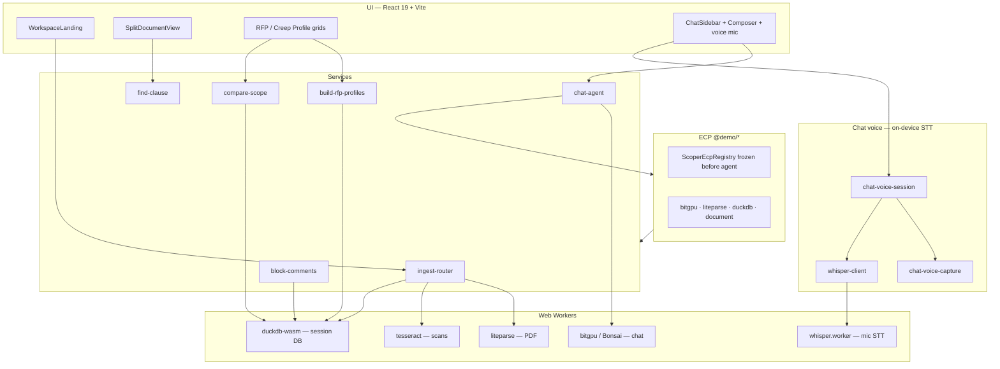

# Architecture summary

Browser Doc Agent Demo is a **static SPA** — no backend, no document upload to remote servers. All parsing, storage, inference, and chat run in the browser via Web Workers and WASM.

## Layer diagram

## Data flow

1. **Upload** — User drops PDF, DOCX, MD, or XLSX. `ingest-router` picks parser, writes `documents` + `blocks` rows to DuckDB (in-memory for the tab session).
2. **Profiles** — RFP mode runs `build_rfp_profiles`; Scope Creep mode tags roles (baseline / change / supporting) and runs `compare_scope` / `flag_creep`.
3. **Citations** — Criteria, flags, and chat tool results emit `CitationRef` objects. `focusCitation()` drives split view: OCR text pane + PDF.js original with bbox highlight.
4. **Chat** — User messages go through ECP-governed `find_clause` (and future tools). bitgpu streams Bonsai 1.7B from jsDelivr; weights cached in Cache Storage (`scoper-model-v1`).
5. **Voice input (optional)** — Mic toggle in the chat composer captures audio locally (`getUserMedia`), resamples to 16 kHz chunks, and transcribes in `whisper.worker` via Transformers.js (WebGPU with WASM fallback). Partial text merges into the **composer draft only**; the user reviews and taps **Send** — same `sendChatPrompt` path as typed chat. Whisper weights load lazily on first mic use; stopping voice or sending chat can `dispose` the Whisper worker to avoid WebGPU contention with Scoper.
6. **Comments** — Block-level review notes stored in DuckDB `comments` table for the session.

## Key modules

| Area | Path |
|------|------|
| Session / mode | `src/store/session-store.ts` |
| Ingest | `src/services/ingest-router.ts`, `*-ingest.ts` |
| RFP profiles | `src/services/build-rfp-profiles.ts` |
| Scope creep | `src/services/compare-scope.ts` |
| ECP | `src/ecp/` — dev: `Scoper.getEcpAgentAuditLog()` / `Scoper.printEcpAgentAuditLog()` on `window` |
| Chat agent | `src/services/chat-agent.ts` |
| Chat voice | `src/services/chat-voice-capture.ts`, `chat-voice-session.ts`, `whisper-client.ts`, `src/workers/whisper.worker.ts` |
| Model cache | `src/lib/scoper-cache.ts` |
| Build / deploy | `vite.config.ts`, `docs/DEPLOY.md` |

## Offline behavior

After first load:

- **App shell + WASM** — served from static host (or dev server); no network required on repeat visits if browser HTTP cache is warm.
- **Model weights** — ~290 MB Bonsai bundle fetched once from CDN; subsequent chat uses Cache Storage when available.
- **User documents** — never leave the device; DuckDB is in-memory and **not** persisted across full page reload (deferred — PRD §15 Q3).
- **Microphone audio** — processed in-browser for speech-to-text; **audio is not uploaded** to any server. Only the user-edited **text** in the composer is sent when they explicitly submit chat (same privacy model as typed messages).

## Related docs

- Product spec: [`PRD.md`](PRD.md)
- Tasks: [`TASK_BREAKDOWN.md`](TASK_BREAKDOWN.md)
- Chat voice (Whisper WebGPU): [`TASK_BREAKDOWN_CHAT_VOICE.md`](TASK_BREAKDOWN_CHAT_VOICE.md)
- Proposal sectional UCW: [`PROPOSAL_CONTEXT_AND_SECTIONS.md`](PROPOSAL_CONTEXT_AND_SECTIONS.md)
- MVP QA: [`QA_SCRIPT.md`](QA_SCRIPT.md) · [`QA_RESULTS.md`](QA_RESULTS.md)
- Full v1 QA: [`QA_V1_SCRIPT.md`](QA_V1_SCRIPT.md) · [`QA_V1_RESULTS.md`](QA_V1_RESULTS.md)
