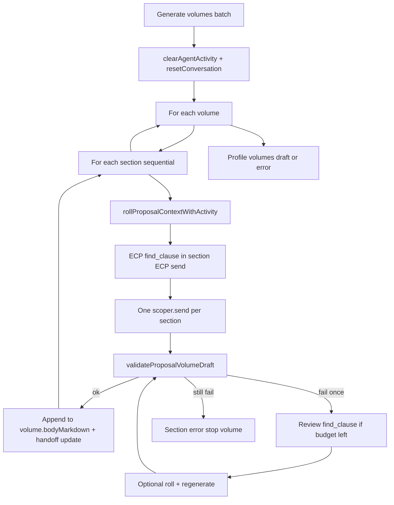
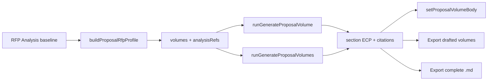

# Proposal context window and sectional generation

**Audience:** Engineers working on proposal mode, ECP, or chat context UX  
**Last updated:** 2026-08-02  
**Implements:** BDA-154, BDA-164, BDA-169–174 (see [`TASK_BREAKDOWN_PROPOSAL_SECTIONAL_UCW.md`](TASK_BREAKDOWN_PROPOSAL_SECTIONAL_UCW.md)); analyze→propose loop BDA-196–218 ([`TASK_BREAKDOWN_ANALYZE_PROPOSE_LOOP.md`](TASK_BREAKDOWN_ANALYZE_PROPOSE_LOOP.md))

This document describes how **Scoper Page** generates proposal volumes in the browser with a **small unified context window (UCW)**—default **8K tokens** on Bonsai 1.7B—and a **section-by-section** pipeline with **mandatory KV rolls** between sections. It contrasts that design with **Scoper Studio** (larger server-side context and Turso-backed rolls).

---

## Why sectional generation exists

A full multi-volume proposal prompt easily exceeds an 8K KV cache. The page app therefore:

1. Derives **sections per volume** (from RFP structure + package kind).
2. Runs **one isolated Scoper `send` per section** after ECP retrieval.
3. **Clears the KV cache** before each section and reinjects a compact **handoff block** so later sections see goal, progress, and failures without replaying entire prior drafts.

Chat proposal generation does **not** set `chatGenerating`; activity appears in the agent column via `agentActivityLog` and the context usage ring ([`ContextUsageSheet`](../src/components/chat/ContextUsageSheet.tsx)).

---

## 8K context policy (page UCW)

Policy lives in [`src/lib/page-context-manager.ts`](../src/lib/page-context-manager.ts). It mirrors Studio **thresholds only**, not server roll persistence or llama.cpp internals.

| Setting | Default (8K) | Notes |
|--------|----------------|-------|
| `contextSize` | `8192` | Tracks effective Scoper `maxSeqLen` after engine load |
| `softRecallThreshold` | `0.55` | Chat path may emit soft-recall activity (trim signal) |
| `hardRollThreshold` | `0.85` | Section prompt assembly throws `ProposalContextOverflowError` if exceeded before send |
| Token estimate | chars ÷ 4 | Same heuristic as Studio for fill % and UI |

**Engine configuration:** [`src/lib/scoper-model.ts`](../src/lib/scoper-model.ts) defaults to **8192**; `VITE_SCOPER_MAX_SEQ_LEN` may force **4096** when WebGPU cannot allocate 8K. UCW config follows the effective value via `getPageContextConfig()`.

**Usage accounting:** [`ProposalContextTracker`](../src/lib/proposal-context-tracker.ts) records segment chars (system, ECP, RFP label, handoff, active turn) per section turn; [`computeContextUsage`](../src/lib/context-usage.ts) drives the Context Usage popup and store snapshot.

---

## Handoff state and roll

### In-memory handoff (`ProposalHandoffState`)

Defined in [`src/lib/proposal-context-roll.ts`](../src/lib/proposal-context-roll.ts):

| Field | Purpose |
|-------|---------|
| `activeGoal` | Batch-level objective (from profile summary) |
| `completedSections` | `{ volumeId, sectionId, title, summary }` — short summaries, not full markdown |
| `pendingSections` | Remaining section refs for this run |
| `topicMemory` | Last **4** section headline lines (`PROPOSAL_TOPIC_MEMORY_MAX`) |
| `packageKind` | `solicitation` / `contract_msa` / etc. from classifier |
| `doNotRepeat` | Validation failures to avoid in later sections |

Session mirror: `proposalHandoffState` on [`session-store`](../src/store/session-store.ts), cleared at each **Generate volumes** batch start.

### Handoff markdown block

`buildProposalHandoffBlock()` emits a Studio-shaped block prepended to the next section user prompt (see managed-llm-session handoff in Studio). Sections:

1. Active goal  
2. Completed sections (no duplication)  
3. Pending sections  
4. Do not repeat  
5. Topic memory  

### Roll (`rollProposalContext`)

A **roll** is **`getScoperClient().resetConversation()`**—dropping KV history. It runs **once per section** at the start of the sectional loop (and optionally before a review-retrieve rewrite). Orchestrator code should use [`rollProposalContextWithActivity`](../src/services/agent-activity-bridge.ts) so the UI shows **Compacting proposal context** and refreshes usage segments.

There is **no** Turso or knowledge-graph persistence of rolls on the page; handoff survives only in Zustand + the injected markdown block.

---

## ECP call budget (per section)

ECP tool: `@demo/document.find_clause` on the **evaluation RFP doc only** (`limit: 6` matches per call).

| Call | When | Counter |
|------|------|---------|
| Primary | Inside [`generateProposalSectionMarkdownViaEcp`](../src/services/proposal-volume-ecp.ts) when no `excerpts` were passed | Counts as 1 unless excerpts pre-supplied |
| Review retrieve | After failed `validateProposalVolumeDraft`, if `ecpFindCount < 2` and no pre-supplied excerpts | +1, then optional roll + regenerate with review excerpts |

**Maximum: 2 `find_clause` invocations per section** (primary + one review). Review query text is built via [`buildSectionReviewFindClauseQuery`](../src/lib/proposal-section-find-clause.ts).

Each ECP call is audited through [`runEcpAgentTool`](../src/ecp/agent-run.ts) (frozen registry before agent/proposal runs).

---

## Sequential sectional pipeline

Entry: [`buildProposalVolumes`](../src/services/build-proposal-volumes.ts) ← store [`runGenerateProposalVolumes`](../src/store/session-store.ts).

**Per-section milestones** (activity log + optional `onSectionActivity`): roll → find_clause → writing → validated (or `section_error`). Emissions: [`agent-activity-bridge.ts`](../src/services/agent-activity-bridge.ts).

**Volume completion:** Volume is `draft` only if every section validates; partial markdown may remain on error. Export gates use [`canExportProposalProfile`](../src/lib/proposal-export-quality.ts) (all volumes draft + quality).

**Chat vs proposal:** Proposal batch sets `proposalGenerating` and `contextPhase: 'generating'`; it does **not** block on `chatGenerating`.

---

## Page (8K UCW) vs Scoper Studio (32K + Turso)

| Aspect | Scoper Page (this repo) | Scoper Studio (reference) |
|--------|-------------------------|---------------------------|
| Runtime | Browser WebGPU + WASM | Server-side llama / managed sessions |
| Typical KV size | **8192** (4096 fallback) | **32768** (product default) |
| Proposal unit | **One section → one send** | Can run larger combined prompts |
| Context between sections | **resetConversation + handoff markdown** | Managed session + optional **Turso/KG roll** persistence |
| Roll storage | None (tab session only) | Durable roll / KG artifacts |
| Threshold policy | 55% soft / 85% hard (ported) | Same policy concept, larger window |
| ECP | In-tab DuckDB blocks, audit log | Server ECP + document store |

Non-goals for the sectional UCW plan: 32K bitgpu in the page app, Turso roll persistence, parallel section workers ([`TASK_BREAKDOWN_PROPOSAL_SECTIONAL_UCW.md`](TASK_BREAKDOWN_PROPOSAL_SECTIONAL_UCW.md) § explicit non-goals).

---

## Analyze → propose loop (BDA-196–218)

Full task list: [`TASK_BREAKDOWN_ANALYZE_PROPOSE_LOOP.md`](TASK_BREAKDOWN_ANALYZE_PROPOSE_LOOP.md).

### RFP Analysis handoff into proposal profile

When the user runs **RFP qualification** before switching to **Proposal**, `evaluationBaselineProfile` criteria are mapped onto proposal volumes during [`buildProposalRfpProfile`](../src/services/build-proposal-rfp-profile.ts) (`analysisRefs` on each volume). Volume rows show criterion chips; clicks call [`focusCitation`](../src/services/citation-bridge.ts). Section user prompts prepend a capped **RFP ANALYSIS FINDINGS** block ([`buildProposalAnalysisRefsBlock`](../src/lib/proposal-prompts.ts)).

### Per-volume generate (without full batch)

[`runGenerateProposalVolume(volumeId)`](../src/store/session-store.ts) calls [`buildProposalVolume`](../src/services/build-proposal-volumes.ts) with **`isolatedVolumeRun: true`**. Only the target volume’s sections are generated; sibling volumes stay in their prior statuses. The same `proposalGenerating` mutex blocks concurrent full-batch and single-volume runs.

**Isolated handoff:** Before generating the target volume, handoff is reset and **sibling volumes already in `draft`** seed `completedSections` via short summaries ([`createIsolatedVolumeProposalHandoff`](../src/services/build-proposal-volumes.ts)), so regeneration does not ignore prior volume context.

### Editable drafts

Users can hand-edit volume markdown in the panel ([`setProposalVolumeBody`](../src/store/session-store.ts)); saves set `edited` / `editedAt`. **Regenerate** on an edited volume prompts for confirmation. Validation warnings from [`validateProposalVolumeDraft`](../src/lib/proposal-export-quality.ts) are non-blocking on save.

### Section citations and export

Each sectional ECP run persists **`citations`** on [`ProposalVolumeSection`](../src/lib/types.ts) ([`generateProposalSectionMarkdownViaEcp`](../src/services/proposal-volume-ecp.ts)). [`assembleProposalMarkdown`](../src/lib/assemble-proposal-markdown.ts) appends a per-volume **Sources** section (page + excerpt).

| Export mode | Gate | Contents |
|-------------|------|----------|
| **Complete** (`exportMode: 'complete'`) | [`canExportProposalProfile`](../src/lib/proposal-export-quality.ts) | All volumes in profile |
| **Drafted only** (`exportMode: 'drafted-only'`) | ≥1 volume `draft` with body | Draft volumes only + partial header note |

UI: **Export drafted volumes** when the full gate fails but drafts exist ([`ProposalGenerationPanel`](../src/components/workspace/ProposalGenerationPanel.tsx)).

### Share pack (proposal snapshot)

Share pack **v2** ([`SHARE_PACK_VERSION`](../src/lib/share-table.ts)) includes DuckDB tables `proposal_profiles`, `proposal_volumes`, `proposal_volume_sections` (bodies, edited flags, analysis refs, section citations). Export syncs the in-memory profile before table export; import hydrates `proposalRequirementsProfile` ([`proposal-share-store.ts`](../src/services/proposal-share-store.ts), [`share-pack-import.ts`](../src/services/share-pack-import.ts)).

---

## Key modules (quick index)

| Concern | Module |
|---------|--------|
| UCW thresholds | `src/lib/page-context-manager.ts` |
| Handoff + roll | `src/lib/proposal-context-roll.ts` |
| Section loop | `src/services/build-proposal-volumes.ts` |
| Single-volume generate | `buildProposalVolume`, `runGenerateProposalVolume` |
| Analysis → volume mapping | `src/services/build-proposal-rfp-profile.ts` |
| Partial / Sources export | `src/lib/assemble-proposal-markdown.ts` |
| Proposal share tables | `src/services/proposal-share-store.ts`, `src/lib/share-table.ts` |
| Section ECP + send | `src/services/proposal-volume-ecp.ts` |
| Fill tracking | `src/lib/proposal-context-tracker.ts`, `src/lib/context-usage.ts` |
| Store generate | `src/store/session-store.ts` → `runGenerateProposalVolumes` |
| Activity + usage UI | `src/services/agent-activity-bridge.ts`, `src/components/chat/AgentActivityMarkers.tsx`, `ContextUsageSheet.tsx` |
| Dev harnesses | `src/services/proposal-dev-harnesses.ts`, `proposal-generation-harness.ts` |

---

## Related docs

- [`ARCHITECTURE.md`](ARCHITECTURE.md) — overall SPA layers  
- [`TASK_BREAKDOWN_PROPOSAL_SECTIONAL_UCW.md`](TASK_BREAKDOWN_PROPOSAL_SECTIONAL_UCW.md) — task IDs BDA-152–180  
- [`TASK_BREAKDOWN_PROPOSAL_MODE.md`](TASK_BREAKDOWN_PROPOSAL_MODE.md) — original proposal mode MVP (monolithic path superseded by BDA-164 for volume bodies)
- [`TASK_BREAKDOWN_ANALYZE_PROPOSE_LOOP.md`](TASK_BREAKDOWN_ANALYZE_PROPOSE_LOOP.md) — per-volume generate, edits, analysis refs, partial export (BDA-196–218)
