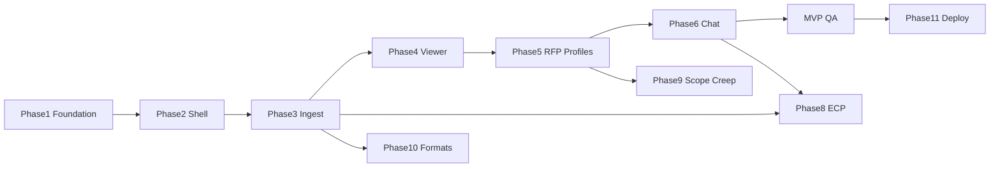

# Browser Doc Agent Demo — Task Breakdown

**Author:** Scoper Page team  
**Date:** 2026-07-27  
**Based on:** [PRD v1.0](PRD.md), [Implementation Plan](/Users/christopherkruger/.cursor/plans/browser_doc_agent_demo_9dbcbc83.plan.md)

**Project Focus:** Standalone browser-only SPA for local RFP qualification (Results Profiles), scope creep analysis, visual citations, and Bonsai chat via bitgpu + LiteParse + DuckDB + ECP.

**Package manager:** pnpm (see `.npmrc`; use `pnpm` for all install/run commands)

**Task ID prefix:** `BDA-###` (Browser Doc Agent)

**MVP scope:** BDA-001 through BDA-053 + BDA-090, BDA-091, BDA-100, BDA-101 (PDF-only RFP, defer BDA-070–073, BDA-080–082, full ECP optional for MVP spike as BDA-060 minimal)

---

## Task dependency graph (summary)

---

## Phase 1: Foundation & Core Infrastructure

> Scaffold, types, state — blocks everything else

### **ID:** BDA-001

**Title:** Scaffold Vite React TypeScript project  
**Status:** Done  
**Dependencies:** None  
**Priority:** Critical  
**Description:** Initialize `scoper_page` with Vite 7, React 19, TypeScript strict mode via **pnpm** (`pnpm create vite`). Set `"packageManager": "pnpm@10.x"` in `package.json`. Create `src/` layout per plan scaffold. Add `dev`, `build`, `preview` scripts. Configure `.gitignore` (include `node_modules`, `pnpm-lock.yaml` tracked). No Scoper repo imports.  
**Completed Changes:**
- ✅ Created Vite 7 + React 19 + TypeScript 5.9 project with pnpm
- ✅ Set `"packageManager": "pnpm@11.17.0"` in package.json
- ✅ Configured tsconfig paths `@/*` → `src/*` and Vite resolve alias
- ✅ Created full `src/` directory layout per plan scaffold (components, lib, services, store, workers, ecp)
- ✅ Added dev/build/preview/lint scripts, `.gitignore`, README, `public/duckdb/`
- ✅ Minimal AppShell placeholder wired via `@/` imports
**Test Strategy:** `pnpm dev` serves app; `pnpm build` succeeds with 0 TS errors.  
**Test Results:**
- ✅ `pnpm dev` ready in 91ms at http://localhost:5173
- ✅ `pnpm build` completes in 274ms, 0 TypeScript errors (strict mode)
- ✅ Build output: 193.66 KB JS (60.82 KB gzipped), 0.36 KB CSS
- ✅ Path alias `@/` resolves in main.tsx and App.tsx
**Assigned:** Completed  
**Context/Artifacts:** PRD §9.1, Plan §Project scaffold, PRD §14 Deliverables  

---

### **ID:** BDA-002

**Title:** Configure Tailwind 4 and base styles  
**Status:** Done  
**Dependencies:** BDA-001  
**Priority:** Critical  
**Description:** Add Tailwind 4 via Vite plugin. Create `src/index.css` with design tokens (light gray canvas, rounded panels, spacing). Match wireframe feel from `docs/main.png`.  
**Completed Changes:**
- ✅ Installed `tailwindcss@4.3.3` and `@tailwindcss/vite@4.3.3`
- ✅ Added Tailwind Vite plugin to `vite.config.ts`
- ✅ Defined `@theme` tokens: canvas, surface, workspace, foreground, borders, radii, shadows
- ✅ Added `@layer base` typography and reset; utility classes for panel radius/shadow
- ✅ Updated `AppShell` preview to use token utilities (~65/35 split per main.png)
**Test Strategy:** Utility classes render; app background matches reference shell.  
**Test Results:**
- ✅ `pnpm build` succeeds; Tailwind CSS output 11 KB (3.15 KB gzip)
- ✅ Token utilities (`bg-canvas`, `bg-workspace`, `bg-surface`, `rounded-panel`) compile
- ✅ AppShell renders two-column shell preview matching wireframe palette
**Assigned:** Completed  
**Context/Artifacts:** PRD §10.1, PRD §10.3 [`main.png`](main.png)  

---

### **ID:** BDA-003

**Title:** Install shadcn ui and MessageScroller  
**Status:** Done  
**Dependencies:** BDA-002  
**Priority:** Critical  
**Description:** Init shadcn. Add components: `message-scroller`, `message`, `tabs`, `badge`, `button`, `card`, `sheet` or `popover` (for upload popup). Verify MessageScrollerProvider renders in isolation.  
**Completed Changes:**
- ✅ `pnpm dlx shadcn@latest init -t vite -b base -p nova -y` → `components.json`, Geist font, shadcn theme CSS
- ✅ Added `message-scroller`, `message`, `tabs`, `badge`, `button`, `card`, `sheet` under `src/components/ui/`
- ✅ Added `src/lib/utils.ts` (`cn` helper)
- ✅ Moved mis-placed `@/` CLI output into `src/` (path alias fix)
- ✅ Created `MessageScrollerDemo` with autoScroll toggle, add-message, jump-to-end button
- ✅ Wired demo into `ChatSidebar` with shadcn Tabs (Agent | History)
**Test Strategy:** Story or test page shows MessageScroller with sample items; autoScroll toggles work.  
**Test Results:**
- ✅ `pnpm build` succeeds (0 TS errors)
- ✅ MessageScrollerProvider renders in chat sidebar with 4 sample messages
- ✅ autoScroll toggle + Add message + MessageScrollerButton compile and run
- ✅ UI components: button, badge, tabs, card, sheet, message-scroller present in `src/components/ui/`
**Assigned:** Completed  
**Context/Artifacts:** PRD §5.7, [MessageScroller docs](https://ui.shadcn.com/docs/components/base/message-scroller), `components.json`  

---

### **ID:** BDA-004

**Title:** Define core TypeScript types and schemas  
**Status:** Done  
**Dependencies:** BDA-001  
**Priority:** Critical  
**Description:** Create `src/lib/types.ts`: `CitationRef`, `CriterionStatus`, `CriterionResult`, `RfpResultsProfile`, `ScopeCreepProfile`, `DocumentMeta`, `WorkspaceMode`. Create `src/lib/schemas.ts` with JSON schema objects for bitgpu `format: { json: { schema } }`.  
**Completed Changes:**
- ✅ Expanded `src/lib/types.ts`: domain types, DuckDB row shapes, ingest/find_clause helpers, verdict labels
- ✅ Aligned with plan: `source_doc_id`, `flag_type` + `evidence` on scope flags
- ✅ Added `blockToCitation()` mapper and `RFP_VERDICT_LABELS` / `SCOPE_CREEP_VERDICT_LABELS`
- ✅ Full bitgpu-compatible schemas in `src/lib/schemas.ts` (`additionalProperties: false` throughout)
- ✅ Schemas: citation, criterion, RFP profiles/requirements, scope creep, find_clause
- ✅ `bitgpuSchemas` registry + `bitgpuJsonFormat()` helper; barrel export `src/lib/index.ts`
**Test Strategy:** Types compile; schemas are valid JSON Schema objects importable by bitgpu client.  
**Test Results:**
- ✅ `pnpm build` — 0 TypeScript errors (strict mode)
- ✅ All schemas use bitgpu-enforceable subset (type, properties, required, enum, items)
- ✅ `bitgpuJsonFormat(bitgpuSchemas.rfpProfiles)` ready for BDA-050 client
**Assigned:** Completed  
**Context/Artifacts:** PRD §9.5, Plan §RFP Results Profiles, Plan §Citation contract, [bitgpu JSON schema](https://github.com/stfurkan/bitgpu#guaranteed-valid-json-format-json)  

---

### **ID:** BDA-005

**Title:** Implement Zustand session store  
**Status:** Done  
**Dependencies:** BDA-004  
**Priority:** Critical  
**Description:** Create `src/store/session-store.ts` with: `mode` (rfp | scope_creep), `documents[]`, `profiles[]`, `creepProfiles[]`, `selectedCitation`, `chatCollapsed`, `workspaceView` (landing | profiles | split), `activeDocId`. Actions for mode switch, doc add/remove, cite selection, chat toggle.  
**Completed Changes:**
- ✅ Installed `zustand@5.0.14`
- ✅ Full `session-store.ts`: state, actions (mode, docs, profiles, citation, chat, view)
- ✅ Selectors: `selectActiveDocument`, `selectVisibleProfiles`, `selectShowLanding`, `selectHasDocuments` + hook wrappers
- ✅ `runSessionStoreHarness()` dev assertions (runs in `App.tsx` when `import.meta.env.DEV`)
- ✅ Wired AppShell: session name, mode toggle, chat collapse/expand; ChatSidebar × → `toggleChatCollapsed`
**Test Strategy:** Unit test or dev harness: dispatch actions, state updates correctly.  
**Test Results:**
- ✅ `pnpm build` — 0 TypeScript errors
- ✅ Dev harness validates setMode, addDocument, selectCitation, toggleChatCollapsed, removeDocument, resetSession
- ✅ UI: × collapses chat; “Open chat” restores sidebar; RFP/Creep mode buttons update workspace copy
**Assigned:** Completed  
**Context/Artifacts:** PRD §5.1, Plan §session-store.ts  

---

---

## Phase 2: UI Shell & Landing

> App chrome and empty-state UX per wireframes

### **ID:** BDA-010

**Title:** Build AppShell two-column layout  
**Status:** To Do  
**Dependencies:** BDA-002, BDA-005  
**Priority:** Critical  
**Description:** `AppShell.tsx`: flex row, workspace flex-1, chat fixed width ~35%. Workspace expands when chat collapsed. Rounded outer container on gray canvas per `main.png`.  
**Completed Changes:**
- 🔄 Layout component
- 🔄 Responsive min-width handling
**Test Strategy:** Toggle chat collapsed → workspace fills width; layout matches wireframe proportions.  
**Test Results:**
- 🔄 Pending
**Assigned:** Unassigned  
**Context/Artifacts:** PRD §5.1, [`main.png`](main.png), Plan §UI layout  

---

### **ID:** BDA-011

**Title:** Build collapsible ChatSidebar shell  
**Status:** To Do  
**Dependencies:** BDA-010, BDA-003  
**Priority:** Critical  
**Description:** `ChatSidebar.tsx`: Agent | History tabs, close `[×]` toggles `chatCollapsed` in store. Placeholder MessageScroller region + composer slot. Persist collapse preference in sessionStorage optional.  
**Completed Changes:**
- 🔄 Tab header matching main.png agent chrome
- 🔄 Collapse animation / width transition
- 🔄 Wire to session store
**Test Strategy:** Click × collapses sidebar; workspace expands; re-open control visible.  
**Test Results:**
- 🔄 Pending
**Assigned:** Unassigned  
**Context/Artifacts:** PRD §5.1, Plan §Shell behaviors  

---

### **ID:** BDA-012

**Title:** Build WorkspaceHeader component  
**Status:** To Do  
**Dependencies:** BDA-010, BDA-005  
**Priority:** High  
**Description:** Session name dropdown, mode toggle (RFP Analysis / Scope Creep), doc tabs when `documents.length > 0`. Doc role badges deferred to BDA-070.  
**Completed Changes:**
- 🔄 Header bar UI
- 🔄 Mode toggle updates store
- 🔄 Doc tabs switch activeDocId
**Test Strategy:** Mode switch changes placeholder copy; tabs appear after mock docs in store.  
**Test Results:**
- 🔄 Pending
**Assigned:** Unassigned  
**Context/Artifacts:** PRD §6.3, Plan §Workspace header  

---

### **ID:** BDA-013

**Title:** Build UploadFab and UploadPopup  
**Status:** To Do  
**Dependencies:** BDA-010, BDA-003  
**Priority:** Critical  
**Description:** Bottom-left FAB (position from `main.png` ? icon). Opens sheet/popover with multi-file drop zone, accept PDF/Word/MD/Excel, file list, remove file, parse progress placeholder. Emit files to ingest pipeline hook (stub until BDA-023).  
**Completed Changes:**
- 🔄 UploadFab fixed position
- 🔄 UploadPopup with react-dropzone or native input
- 🔄 File queue UI with count pill
**Test Strategy:** FAB opens popup; multi-select files listed; cancel closes without side effects.  
**Test Results:**
- 🔄 Pending
**Assigned:** Unassigned  
**Context/Artifacts:** PRD §5.2, [`main.png`](main.png), Plan §UploadFab  

---

### **ID:** BDA-014

**Title:** Build WorkspaceLanding and QuickActionCards  
**Status:** To Do  
**Dependencies:** BDA-010, BDA-005  
**Priority:** Critical  
**Description:** Centered greeting, fanned cards: Analyse RFP, Check scope creep, Upload docs. Card click sets mode and triggers upload flow (open BDA-013 or focus command input). Reference [`Screenshot 2026-07-27 at 2.51.53 PM.png`](Screenshot%202026-07-27%20at%202.51.53%E2%80%AFPM.png).  
**Completed Changes:**
- 🔄 WorkspaceLanding layout
- 🔄 QuickActionCards with icons/labels
- 🔄 Actions wired to store + upload popup
**Test Strategy:** Each card sets correct mode; Upload docs opens popup; landing hides when `workspaceView !== landing`.  
**Test Results:**
- 🔄 Pending
**Assigned:** Unassigned  
**Context/Artifacts:** PRD §5.2, PRD §6.3, Plan §Landing  

---

### **ID:** BDA-015

**Title:** Build CommandInputCard with file stack  
**Status:** To Do  
**Dependencies:** BDA-014, BDA-013  
**Priority:** Critical  
**Description:** Large rounded input card: stacked doc thumbnails, `"N files"` pill, textarea, paperclip (upload), settings popover (mode, model stub, OCR toggle stub), model dropdown stub, send button. Placeholder varies by mode. Reference [`Screenshot 2026-07-27 at 2.49.33 PM.png`](Screenshot%202026-07-27%20at%202.49.33%E2%80%AFPM.png).  
**Completed Changes:**
- 🔄 CommandInputCard UI
- 🔄 File stack preview from pending uploads
- 🔄 Send triggers `onSubmit` callback (wire to ingest in BDA-024)
**Test Strategy:** Attach files → stack visible; send fires callback with files + prompt text.  
**Test Results:**
- 🔄 Pending
**Assigned:** Unassigned  
**Context/Artifacts:** PRD §5.2, Plan §Command input card  

---

---

## Phase 3: Document Ingest & Storage

> LiteParse, OCR, DuckDB — PDF MVP path

### **ID:** BDA-020

**Title:** DuckDB WASM worker and schema  
**Status:** To Do  
**Dependencies:** BDA-001  
**Priority:** Critical  
**Description:** Worker bootstraps `@duckdb/duckdb-wasm` (eh variant). Copy wasm assets to `public/duckdb/`. Create tables: documents, blocks, results_profiles, profile_criteria, scope_flags, comments. Expose query/insert via message protocol. Client wrapper `duckdb-client.ts`.  
**Completed Changes:**
- 🔄 duckdb.worker.ts
- 🔄 duckdb-client.ts with typed API
- 🔄 Schema DDL on init
- 🔄 Build script or vite config for wasm assets
**Test Strategy:** Worker starts; `INSERT` document + block; `SELECT` returns row.  
**Test Results:**
- 🔄 Pending
**Assigned:** Unassigned  
**Context/Artifacts:** PRD §5.3, Plan §DuckDB schema, [DuckDB WASM deploy](https://duckdb.org/docs/lts/clients/wasm/deploying_duckdb_wasm)  

---

### **ID:** BDA-021

**Title:** LiteParse WASM worker for PDF parse  
**Status:** To Do  
**Dependencies:** BDA-001  
**Priority:** Critical  
**Description:** Worker: `init()` from `@llamaindex/liteparse-wasm`, `LiteParse({ ocrEnabled: false, outputFormat: 'json' })`, parse `Uint8Array` → pages with textItems. Return normalized blocks with bbox. Configure vite for WASM/top-level await.  
**Completed Changes:**
- 🔄 liteparse.worker.ts
- 🔄 liteparse-client.ts
- 🔄 Vite wasm plugin config
**Test Strategy:** Parse sample PDF bytes; returns pages.length > 0 and textItems with coordinates.  
**Test Results:**
- 🔄 Pending
**Assigned:** Unassigned  
**Context/Artifacts:** PRD §5.3, [LiteParse browser usage](https://developers.llamaindex.ai/liteparse/guides/browser-usage/)  

---

### **ID:** BDA-022

**Title:** OCR worker and LiteParse ocrEngine bridge  
**Status:** To Do  
**Dependencies:** BDA-021  
**Priority:** High  
**Description:** `ocr.worker.ts` with tesseract.js. Implement `ocrEngine.recognize(imageData, w, h, lang)` returning `{ text, bbox, confidence }[]`. Wire into LiteParse when `ocrEnabled: true` (settings toggle from BDA-015).  
**Completed Changes:**
- 🔄 ocr.worker.ts
- 🔄 ocrEngine adapter in liteparse worker
- 🔄 Settings toggle passes ocrEnabled flag
**Test Strategy:** Parse scanned PDF sample; blocks populated where text layer empty.  
**Test Results:**
- 🔄 Pending
**Assigned:** Unassigned  
**Context/Artifacts:** PRD §5.3, Plan §OCR path  

---

### **ID:** BDA-023

**Title:** Ingest router and mime dispatch  
**Status:** To Do  
**Dependencies:** BDA-021, BDA-020  
**Priority:** Critical  
**Description:** `ingest-router.ts`: detect mime → PDF via LiteParse (MVP); stub handlers for docx/md/xlsx until Phase 10. Generate stable `doc_id`, `block_id`. Return ingest result summary.  
**Completed Changes:**
- 🔄 Router function `ingestFile(file: File)`
- 🔄 PDF path calls liteparse + duckdb insert
- 🔄 Error handling per file
**Test Strategy:** Upload PDF through router → document + blocks rows in DuckDB.  
**Test Results:**
- 🔄 Pending
**Assigned:** Unassigned  
**Context/Artifacts:** PRD §5.3, Plan §Ingest  

---

### **ID:** BDA-024

**Title:** Wire upload UI to ingest pipeline  
**Status:** To Do  
**Dependencies:** BDA-013, BDA-015, BDA-023, BDA-005  
**Priority:** Critical  
**Description:** Connect UploadPopup, CommandInputCard send, and quick actions to `ingest-router`. Update store with documents. Transition `workspaceView` from landing → profiles or split on success. Show parse progress in popup.  
**Completed Changes:**
- 🔄 onUpload handler in App
- 🔄 Progress states: idle | parsing | done | error
- 🔄 Store documents after ingest
**Test Strategy:** Drop PDF via FAB → parse completes → store has doc; landing hidden.  
**Test Results:**
- 🔄 Pending
**Assigned:** Unassigned  
**Context/Artifacts:** PRD §6.1 step 1–2, PRD §6.3  

---

---

## Phase 4: Visual Citation Viewer

> Split pane OCR | original with synced highlights

### **ID:** BDA-030

**Title:** PDF.js DocumentViewer with canvas  
**Status:** To Do  
**Dependencies:** BDA-023  
**Priority:** Critical  
**Description:** `DocumentViewer.tsx`: load PDF from uploaded bytes, render page to canvas, page prev/next controls. Integrate pdfjs-dist worker.  
**Completed Changes:**
- 🔄 DocumentViewer component
- 🔄 Page navigation
- 🔄 Loading/error states
**Test Strategy:** Open ingested PDF; page 1 renders; navigate pages works.  
**Test Results:**
- 🔄 Pending
**Assigned:** Unassigned  
**Context/Artifacts:** PRD §5.4, Plan §DocumentViewer  

---

### **ID:** BDA-031

**Title:** ExtractedTextPane block list  
**Status:** To Do  
**Dependencies:** BDA-023, BDA-005  
**Priority:** Critical  
**Description:** `ExtractedTextPane.tsx`: list blocks for active doc from DuckDB or store cache; scrollable; click block selects citation; highlight selected block.  
**Completed Changes:**
- 🔄 Block list UI grouped by page
- 🔄 Selection state synced with store
**Test Strategy:** Blocks match parsed text; click selects block_id.  
**Test Results:**
- 🔄 Pending
**Assigned:** Unassigned  
**Context/Artifacts:** PRD §5.4, Plan §SplitDocumentView  

---

### **ID:** BDA-032

**Title:** SplitDocumentView layout  
**Status:** To Do  
**Dependencies:** BDA-030, BDA-031  
**Priority:** Critical  
**Description:** Two-column split: light left (ExtractedTextPane) | dark right (DocumentViewer) per [`Screenshot 2026-07-27 at 2.50.23 PM.png`](Screenshot%202026-07-27%20at%202.50.23%E2%80%AFPM.png). Optional tabs Extract | Original | Profiles. Status footer pill + CTA stub.  
**Completed Changes:**
- 🔄 SplitDocumentView container
- 🔄 Resizable or 50/50 split
- 🔄 Footer status component
**Test Strategy:** Both panes visible; switches to split view from store.  
**Test Results:**
- 🔄 Pending
**Assigned:** Unassigned  
**Context/Artifacts:** PRD §10.2, Plan §Split preview pattern  

---

### **ID:** BDA-033

**Title:** Bbox highlight overlay and focusCitation  
**Status:** To Do  
**Dependencies:** BDA-030, BDA-031, BDA-004  
**Priority:** Critical  
**Description:** Draw semi-transparent overlay on PDF canvas from `CitationRef.bbox` (scale dpi/72). `citation-bridge.ts`: `focusCitation(ref)` scrolls text pane to block, scrolls PDF to page, draws highlight. Sync both panes.  
**Completed Changes:**
- 🔄 Canvas overlay layer
- 🔄 focusCitation implementation
- 🔄 Clear highlight on deselect
**Test Strategy:** Call focusCitation with known block → both panes show highlight at correct region.  
**Test Results:**
- 🔄 Pending
**Assigned:** Unassigned  
**Context/Artifacts:** PRD §9.5, [LiteParse visual citations](https://developers.llamaindex.ai/liteparse/guides/visual-citations/)  

---

### **ID:** BDA-034

**Title:** Wire profile and chat clicks to viewer  
**Status:** To Do  
**Dependencies:** BDA-033, BDA-005  
**Priority:** High  
**Description:** On criterion row click or citation chip click: set `workspaceView` to split, call `focusCitation`. Ensure active doc tab switches to cited doc_id.  
**Completed Changes:**
- 🔄 Click handlers on CriterionRow (BDA-041)
- 🔄 Citation chip handler in chat (BDA-052)
**Test Strategy:** Click criterion → split view opens with highlight (integration after BDA-041/052).  
**Test Results:**
- 🔄 Pending
**Assigned:** Unassigned  
**Context/Artifacts:** PRD §6.1 step 6–7, Plan §Citation contract  

---

---

## Phase 5: RFP Results Profiles

> Structured qualification cards — MVP centerpiece

### **ID:** BDA-040

**Title:** ResultsProfileCard and CriterionRow UI  
**Status:** To Do  
**Dependencies:** BDA-003, BDA-004  
**Priority:** Critical  
**Description:** Card: verdict badge (likely/might/unlikely), subject name/role/location, criteria list with pass/warn/fail icons, summary footer. CriterionRow clickable when citation present. Match dark qualification mock aesthetic.  
**Completed Changes:**
- 🔄 ResultsProfileCard component
- 🔄 CriterionRow with status icons
- 🔄 onCriterionClick callback
**Test Strategy:** Render with mock `RfpResultsProfile`; badges and icons correct; click fires callback.  
**Test Results:**
- 🔄 Pending
**Assigned:** Unassigned  
**Context/Artifacts:** PRD §5.5, PRD §10.3 RFP results mock  

---

### **ID:** BDA-041

**Title:** ResultsProfileGrid workspace view  
**Status:** To Do  
**Dependencies:** BDA-040, BDA-010, BDA-005  
**Priority:** Critical  
**Description:** Horizontal scroll or 3-column grid of ResultsProfileCard. Shown when `workspaceView === profiles` and mode === rfp. Empty state when no profiles.  
**Completed Changes:**
- 🔄 ResultsProfileGrid layout
- 🔄 Bind to store profiles[]
**Test Strategy:** Mock 3 profiles render in grid; responsive at narrow widths.  
**Test Results:**
- 🔄 Pending
**Assigned:** Unassigned  
**Context/Artifacts:** PRD §5.5, Plan §ResultsProfileGrid  

---

### **ID:** BDA-042

**Title:** build_rfp_profiles pipeline stub  
**Status:** To Do  
**Dependencies:** BDA-023, BDA-004, BDA-050  
**Priority:** Critical  
**Description:** Service function: given ingested docs, retrieve blocks, call bitgpu JSON schema extract (or rule-based stub for dev), produce `RfpResultsProfile[]`, persist to DuckDB + store. Map criteria to block citations where possible.  
**Completed Changes:**
- 🔄 build_rfp_profiles.ts service
- 🔄 DuckDB insert results_profiles + profile_criteria
- 🔄 Store update after build
**Test Strategy:** After PDF ingest + run analysis → ≥1 profile in store with criteria array.  
**Test Results:**
- 🔄 Pending
**Assigned:** Unassigned  
**Context/Artifacts:** PRD §6.1 step 3–4, Plan §build_rfp_profiles  

---

---

## Phase 6: Agent & Chat (bitgpu)

> Local LLM streaming in MessageScroller sidebar

### **ID:** BDA-050

**Title:** bitgpu worker and engine client  
**Status:** To Do  
**Dependencies:** BDA-001  
**Priority:** Critical  
**Description:** `bitgpu.worker.ts`: createEngine Bonsai-1.7B, createChat, load progress, generate/stream. `bitgpu-client.ts`: postMessage protocol, WebGPU check, Cache Storage for weights, `WebGPUUnavailableError` banner data. Options: kvCache q8, overflow sinks.  
**Completed Changes:**
- 🔄 bitgpu.worker.ts
- 🔄 bitgpu-client.ts
- 🔄 WebGPU availability check in App
**Test Strategy:** Load model → progress events; simple prompt returns streamed tokens in worker test harness.  
**Test Results:**
- 🔄 Pending
**Assigned:** Unassigned  
**Context/Artifacts:** PRD §5.7, [bitgpu](https://github.com/stfurkan/bitgpu), Plan §bitgpu  

---

### **ID:** BDA-051

**Title:** MessageScroller chat transcript integration  
**Status:** To Do  
**Dependencies:** BDA-011, BDA-003, BDA-050  
**Priority:** Critical  
**Description:** Wire ChatSidebar: MessageScrollerProvider with autoScroll, scrollAnchor on user messages, defaultScrollPosition last-anchor. Map chat turns to MessageScrollerItem. Stream assistant tokens into growing message.  
**Completed Changes:**
- 🔄 Chat message state in store or local hook
- 🔄 Streaming append to assistant message
- 🔄 MessageScrollerButton jump-to-latest
**Test Strategy:** Send message → user row anchors; assistant streams without scroll jump when at live edge.  
**Test Results:**
- 🔄 Pending
**Assigned:** Unassigned  
**Context/Artifacts:** PRD §5.7, PRD §8.3 chat stream metric  

---

### **ID:** BDA-052

**Title:** ChatComposer and citation chips  
**Status:** To Do  
**Dependencies:** BDA-051, BDA-033  
**Priority:** Critical  
**Description:** Composer: "Ask the agent…", send, optional @ mention doc names. Render citation chips on assistant messages from `CitationRef[]`; click → focusCitation.  
**Completed Changes:**
- 🔄 ChatComposer component
- 🔄 CitationChip subcomponent
- 🔄 Wire to bitgpu send + agent response parsing
**Test Strategy:** Assistant message with cite chip → click opens split view highlight.  
**Test Results:**
- 🔄 Pending
**Assigned:** Unassigned  
**Context/Artifacts:** PRD §6.1, Plan §Chat sidebar  

---

### **ID:** BDA-053

**Title:** find_clause tool and basic agent loop  
**Status:** To Do  
**Dependencies:** BDA-050, BDA-023, BDA-033  
**Priority:** Critical  
**Description:** Implement agent loop: user message → retrieve relevant blocks (DuckDB search) → bitgpu tool call `find_clause` → return CitationRef[]. MVP: keyword search + LLM summary without full ECP if BDA-060 delayed. Wire tool results to chat + viewer.  
**Completed Changes:**
- 🔄 document.search over blocks
- 🔄 find_clause returns CitationRef[]
- 🔄 Agent orchestration in agent.ts
**Test Strategy:** Ask "find indemnification" on sample PDF → response includes cite chip; highlight works.  
**Test Results:**
- 🔄 Pending
**Assigned:** Unassigned  
**Context/Artifacts:** PRD §6.1 step 5–6, Plan §Tools find_clause  

---

---

## Phase 7: ECP Browser Runtime

> Policy-governed tools — full v1; minimal for MVP optional

### **ID:** BDA-060

**Title:** ECP environment bootstrap  
**Status:** To Do  
**Dependencies:** BDA-001  
**Priority:** High  
**Description:** `ecp/environment.ts`: bind browser runtime, registry-control policy (`allowedExtensionNamespaces: ['@demo/*']`), createEcp, freezeRegistry before first agent run.  
**Completed Changes:**
- 🔄 Install @executioncontrolprotocol/browser, policies, core
- 🔄 environment.ts per plan
- 🔄 Init on app ready before first chat
**Test Strategy:** ECP init succeeds; registry frozen throws on late extension register.  
**Test Results:**
- 🔄 Pending
**Assigned:** Unassigned  
**Context/Artifacts:** PRD §5.7, [ECP browser policy](https://github.com/GuillaumeCleme/executioncontrolprotocol/blob/development/docs/ecp-browser-review-policy.md)  

---

### **ID:** BDA-061

**Title:** Implement @demo star extensions  
**Status:** To Do  
**Dependencies:** BDA-060, BDA-050, BDA-021, BDA-020  
**Priority:** High  
**Description:** Extensions: `@demo/bitgpu`, `@demo/liteparse`, `@demo/duckdb`, `@demo/document` with capabilities listed in plan. Document extension composes parse, search, build_rfp_profiles, find_clause, compare_scope, flag_creep.  
**Completed Changes:**
- 🔄 ecp/extensions/*.ts
- 🔄 Register at boot
- 🔄 Capability handlers delegate to services
**Test Strategy:** Agent tool call routed through ECP → same result as direct service call.  
**Test Results:**
- 🔄 Pending
**Assigned:** Unassigned  
**Context/Artifacts:** Plan §ECP + bitgpu extensions table  

---

### **ID:** BDA-062

**Title:** Wire agent loop through ECP  
**Status:** To Do  
**Dependencies:** BDA-061, BDA-053  
**Priority:** High  
**Description:** Replace direct agent.ts calls with ECP harness run. Validate tool params before execute; audit deny paths.  
**Completed Changes:**
- 🔄 agent.ts uses ECP run API
- 🔄 Validation errors surfaced in chat
**Test Strategy:** Invalid tool params rejected with message; valid find_clause executes.  
**Test Results:**
- 🔄 Pending
**Assigned:** Unassigned  
**Context/Artifacts:** PRD §14 ECP checklist  

---

---

## Phase 8: Scope Creep Mode

> Full v1 — post-MVP

### **ID:** BDA-070

**Title:** Document role tagging UI  
**Status:** To Do  
**Dependencies:** BDA-012, BDA-024  
**Priority:** High  
**Description:** Per-doc badge/dropdown: baseline | change_request | supporting | unknown. Required before scope analysis in creep mode. Persist role on documents table.  
**Completed Changes:**
- 🔄 Role selector in doc tab or upload flow
- 🔄 DuckDB update documents.role
**Test Strategy:** Tag two docs baseline + change; roles persist in store/DB.  
**Test Results:**
- 🔄 Pending
**Assigned:** Unassigned  
**Context/Artifacts:** PRD §5.6, PRD §6.2 step 1  

---

### **ID:** BDA-071

**Title:** CreepProfileGrid and flag cards  
**Status:** To Do  
**Dependencies:** BDA-040, BDA-004, BDA-070  
**Priority:** High  
**Description:** `CreepProfileGrid.tsx` + cards showing verdict (aligned/possible_creep/creep), flags with severity, summary. Same card pattern as RFP profiles.  
**Completed Changes:**
- 🔄 ScopeCreepProfile UI components
- 🔄 Grid layout in workspace
**Test Strategy:** Mock creep profile renders flags with severity badges.  
**Test Results:**
- 🔄 Pending
**Assigned:** Unassigned  
**Context/Artifacts:** PRD §5.6, Plan §Scope Creep Profiles  

---

### **ID:** BDA-072

**Title:** compare_scope and flag_creep tools  
**Status:** To Do  
**Dependencies:** BDA-070, BDA-061, BDA-042  
**Priority:** High  
**Description:** Implement cross-doc extract comparison; produce ScopeCreepProfile with evidence CitationRefs. Persist scope_flags table. Heuristics: new deliverables, shall/must shifts, timeline/budget gaps.  
**Completed Changes:**
- 🔄 compare_scope service
- 🔄 flag_creep service
- 🔄 DuckDB scope_flags insert
**Test Strategy:** Baseline + change PDF pair → ≥1 flag with evidence cites.  
**Test Results:**
- 🔄 Pending
**Assigned:** Unassigned  
**Context/Artifacts:** PRD §6.2, Plan §Creep heuristics  

---

### **ID:** BDA-073

**Title:** Scope creep History tab markers  
**Status:** To Do  
**Dependencies:** BDA-072, BDA-051  
**Priority:** Medium  
**Description:** Render scope flags as MessageScroller markers (group chat pattern) in History tab. Click marker → focusCitation on evidence doc.  
**Completed Changes:**
- 🔄 History tab content
- 🔄 MessageScrollerItem scrollAnchor on markers
**Test Strategy:** After creep analysis, History shows markers; click navigates viewer.  
**Test Results:**
- 🔄 Pending
**Assigned:** Unassigned  
**Context/Artifacts:** Plan §MessageScroller group chat  

---

---

## Phase 9: Multi-Format & Comments

> Full v1 extensions — post-MVP

### **ID:** BDA-080

**Title:** Word docx parser via mammoth  
**Status:** To Do  
**Dependencies:** BDA-023  
**Priority:** Medium  
**Description:** `ingest/docx.ts`: mammoth → HTML/text → blocks with section_path anchors (no bbox). Register in ingest router.  
**Completed Changes:**
- 🔄 docx parser module
- 🔄 Router branch for word mime types
**Test Strategy:** Upload .docx → blocks in DuckDB with section_path.  
**Test Results:**
- 🔄 Pending
**Assigned:** Unassigned  
**Context/Artifacts:** PRD §5.3, Plan §Ingest table  

---

### **ID:** BDA-081

**Title:** Markdown and Excel parsers  
**Status:** To Do  
**Dependencies:** BDA-023  
**Priority:** Medium  
**Description:** `markdown.ts`: split by headings. `xlsx.ts`: SheetJS → cell-range blocks. Wire into router.  
**Completed Changes:**
- 🔄 markdown + xlsx modules
- 🔄 Router branches
**Test Strategy:** Upload .md and .xlsx samples → blocks ingested.  
**Test Results:**
- 🔄 Pending
**Assigned:** Unassigned  
**Context/Artifacts:** PRD §2.2 secondary goals  

---

### **ID:** BDA-082

**Title:** Block comments UI and persistence  
**Status:** To Do  
**Dependencies:** BDA-033, BDA-020  
**Priority:** Medium  
**Description:** Comment popover on selected block in split view. Save to DuckDB comments table. Show comment indicator on blocks with comments.  
**Completed Changes:**
- 🔄 CommentPopover component
- 🔄 Insert/select comments API
**Test Strategy:** Add comment on block → reload session → comment still listed (same session DB).  
**Test Results:**
- 🔄 Pending
**Assigned:** Unassigned  
**Context/Artifacts:** PRD §6.1 step 8, PRD §14 comments checklist  

---

---

## Phase 10: Build, Deploy & Documentation

### **ID:** BDA-090

**Title:** Vite production build and WASM assets  
**Status:** To Do  
**Dependencies:** BDA-021, BDA-020, BDA-050  
**Priority:** High  
**Description:** Finalize vite.config for workers, wasm, optional COOP/COEP. Copy DuckDB wasm to public. Bundle size check. Lazy-load bitgpu worker.  
**Completed Changes:**
- 🔄 vite.config.ts workers + assets
- 🔄 pnpm build succeeds
- 🔄 preview serves workers correctly
**Test Strategy:** `pnpm build && pnpm preview` — upload PDF flow works from preview server.  
**Test Results:**
- 🔄 Pending
**Assigned:** Unassigned  
**Context/Artifacts:** PRD §9.4, Plan §Deploy  

---

### **ID:** BDA-091

**Title:** README and sample PDF corpus  
**Status:** To Do  
**Dependencies:** BDA-090  
**Priority:** High  
**Description:** README: prerequisites (WebGPU Chrome, pnpm via Corepack), `pnpm install` / `pnpm dev` / `pnpm build`, deploy static host, MIME notes. Add `sample/` with 1 RFP + 2 bidder PDF placeholders or redacted samples.  
**Completed Changes:**
- 🔄 README.md
- 🔄 sample/ directory
**Test Strategy:** New developer follows README → dev server runs in <15 min.  
**Test Results:**
- 🔄 Pending
**Assigned:** Unassigned  
**Context/Artifacts:** PRD §14, PRD §12.2 assumptions  

---

### **ID:** BDA-092

**Title:** Static deploy configuration  
**Status:** To Do  
**Dependencies:** BDA-090  
**Priority:** Medium  
**Description:** Document deploy to GitHub Pages / Cloudflare Pages. Verify `.wasm` Content-Type. Optional GitHub Actions workflow (defer if manual deploy OK).  
**Completed Changes:**
- 🔄 Deploy docs in README
- 🔄 Optional CI workflow
**Test Strategy:** Deployed URL loads app; WASM fetches 200 with correct MIME.  
**Test Results:**
- 🔄 Pending
**Assigned:** Unassigned  
**Context/Artifacts:** PRD §13 M5, Plan §Deploy  

---

---

## Phase 11: QA & PRD Verification

### **ID:** BDA-100

**Title:** MVP manual QA script execution  
**Status:** To Do  
**Dependencies:** BDA-053, BDA-034, BDA-041, BDA-091  
**Priority:** Critical  
**Description:** Execute manual test script covering PRD §14 MVP checklist: landing, upload PDF, profiles, split cite, chat stream, collapsible chat, no network upload of file bytes. Record results in this doc or `docs/QA_RESULTS.md`.  
**Completed Changes:**
- 🔄 QA script document
- 🔄 Run and record pass/fail
**Test Strategy:** All MVP success criteria pass on Chrome desktop with WebGPU.  
**Test Results:**
- 🔄 Pending
**Assigned:** Unassigned  
**Context/Artifacts:** PRD §8.1, PRD §14 Features MVP checklist  

---

### **ID:** BDA-101

**Title:** Full v1 PRD deliverables verification  
**Status:** To Do  
**Dependencies:** BDA-072, BDA-062, BDA-081, BDA-082, BDA-100  
**Priority:** Critical  
**Description:** Verify full v1 checklist: scope creep mode, all formats, ECP freeze, comments, offline after cache. Sign off against PRD §14 full v1 items.  
**Completed Changes:**
- 🔄 Full checklist run
- 🔄 Gaps filed as follow-up tasks
**Test Strategy:** PRD §14 all boxes checked or explicitly deferred with rationale.  
**Test Results:**
- 🔄 Pending
**Assigned:** Unassigned  
**Context/Artifacts:** PRD §14, Plan §Success criteria  

---

---

## MVP task list (recommended sprint order)

| Order | ID | Title | Est. |
|-------|-----|-------|------|
| 1 | BDA-001 | Scaffold Vite React TS | 2h |
| 2 | BDA-002 | Tailwind 4 base styles | 1h |
| 3 | BDA-004 | Core types and schemas | 2h |
| 4 | BDA-005 | Zustand session store | 2h |
| 5 | BDA-003 | shadcn + MessageScroller | 2h |
| 6 | BDA-010 | AppShell layout | 2h |
| 7 | BDA-011 | Collapsible ChatSidebar shell | 2h |
| 8 | BDA-012 | WorkspaceHeader | 1.5h |
| 9 | BDA-013 | UploadFab + UploadPopup | 3h |
| 10 | BDA-014 | WorkspaceLanding + QuickActionCards | 3h |
| 11 | BDA-015 | CommandInputCard | 3h |
| 12 | BDA-020 | DuckDB worker + schema | 4h |
| 13 | BDA-021 | LiteParse WASM worker | 4h |
| 14 | BDA-023 | Ingest router PDF | 2h |
| 15 | BDA-024 | Wire upload to ingest | 2h |
| 16 | BDA-030 | PDF.js DocumentViewer | 4h |
| 17 | BDA-031 | ExtractedTextPane | 2h |
| 18 | BDA-032 | SplitDocumentView | 2h |
| 19 | BDA-033 | Bbox highlight + focusCitation | 4h |
| 20 | BDA-040 | ResultsProfileCard + CriterionRow | 3h |
| 21 | BDA-041 | ResultsProfileGrid | 2h |
| 22 | BDA-050 | bitgpu worker client | 6h |
| 23 | BDA-042 | build_rfp_profiles pipeline | 4h |
| 24 | BDA-051 | MessageScroller integration | 4h |
| 25 | BDA-052 | ChatComposer + citation chips | 3h |
| 26 | BDA-053 | find_clause agent loop | 4h |
| 27 | BDA-034 | Wire clicks to viewer | 2h |
| 28 | BDA-090 | Production build | 3h |
| 29 | BDA-091 | README + samples | 2h |
| 30 | BDA-100 | MVP QA | 4h |

**MVP total:** ~75 hours (~9–10 dev days)

**Post-MVP:** BDA-060–062 (ECP), BDA-070–073 (scope creep), BDA-080–082 (formats + comments), BDA-101 (full sign-off)

---

## Traceability matrix (PRD goals → tasks)

| PRD goal | Tasks |
|----------|-------|
| Browser-only processing | BDA-023, BDA-050, BDA-100 (network audit) |
| RFP Results Profiles | BDA-040, BDA-041, BDA-042 |
| Visual citations | BDA-030–034, BDA-052 |
| Local AI chat | BDA-050–053, BDA-051 |
| Scope creep multi-doc | BDA-070–073 |
| Landing UX | BDA-014, BDA-015 |
| Collapsible chat | BDA-011 |
| ECP governance | BDA-060–062 |

---

## Document metadata

**Related documents:**
- [PRD.md](PRD.md)
- [PRD_TEMPLATE.md](PRD_TEMPLATE.md)
- [Implementation plan](/Users/christopherkruger/.cursor/plans/browser_doc_agent_demo_9dbcbc83.plan.md)
- Wireframes: [`docs/main.png`](main.png), Screenshot refs in `docs/`

**Change log:**

| Version | Date | Changes |
|---------|------|---------|
| v1.0 | 2026-07-27 | Initial atomic breakdown from PRD + plan |
