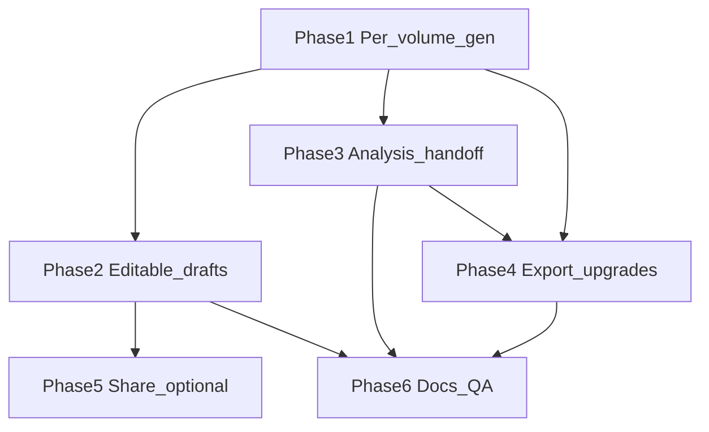

# Analyze → Propose Loop — Task Breakdown

**Author:** Scoper Page team  
**Date:** 2026-08-02  
**Based on:** [Analyze → propose loop (unified plan)](/Users/christopherkruger/.cursor/plans/close_analyze_propose_loop_2fb4e81f.plan.md), [TASK_BREAKDOWN_TEMPLATE.md](TASK_BREAKDOWN_TEMPLATE.md), [TASK_BREAKDOWN_PROPOSAL_MODE.md](TASK_BREAKDOWN_PROPOSAL_MODE.md), [PROPOSAL_CONTEXT_AND_SECTIONS.md](PROPOSAL_CONTEXT_AND_SECTIONS.md)

**Project Focus:** Close the loop from **RFP Analysis** to **Generate Complete Proposal**: per-volume generation (without full reruns), editable drafts, feed analysis criteria/citations into sectional generation, and export partial drafts with source traceability. Builds on sectional ECP (BDA-152–180).

**Package manager:** pnpm

**Task ID prefix:** `BDA-196`–`BDA-218` (continues after BDA-195 chat voice)

**Explicit non-goals:** Parallel multi-volume jobs; per-section generate buttons; `.docx` export (separate plan).

---

## Gating rules (unchanged unless noted)

- **Generate / Regenerate (any volume or full):** `readyToGenerate` — RFP selected, responder context quality OK, proposal profile built ([`proposal-readiness.ts`](../src/lib/proposal-readiness.ts)).
- **Export complete .md:** [`canExportProposalProfile`](../src/lib/proposal-export-quality.ts) — all volumes `draft` with passing body quality (BDA-176).
- **Export drafted volumes (new):** At least one volume `draft`; does not require full-profile gate (BDA-214).

## Cross-cutting decisions

| Topic | Choice |
|-------|--------|
| Single-volume Scoper turn | Isolated — `resetConversation()`, handoff pending refs for target volume only |
| Sibling drafts | Seed handoff `completedSections` with `summarizeSectionMarkdown` from other volumes’ sections |
| Concurrency | One job — shared `proposalGenerating`; disable per-volume + full-run while busy |
| No baseline profile | Proposal-from-landing: no `analysisRefs`; behavior matches today |

---

## Task dependency graph

**Recommended ship order:** Phase 1 → 2 → 3 → 4 → 6. Phase 5 before production edit/share if users persist hand-edited prose.

---

## Phase 1: Per-volume generation

> **Purpose:** Refactor sectional pipeline for one volume; store action + row UI; preserve full batch via delegation

### **ID:** BDA-196

**Title:** Extract buildProposalVolume service  
**Status:** Done  
**Dependencies:** None  
**Priority:** Critical  
**Description:** In [`build-proposal-volumes.ts`](../src/services/build-proposal-volumes.ts), extract the per-volume loop body (~349–541) into **`buildProposalVolume(profile, volumeId, options)`** returning updated `ProposalRequirementsProfile`. Resolve volume by id; error if missing. Lazy-derive sections for that volume only (`deriveProposalSectionsForVolume` + blocks). Patch only the target volume via existing `patchProposalVolume` / `patchProposalVolumeSection`. Export **`BuildProposalVolumeOptions`** (same callbacks as full build).  
**Completed Changes:**
- ✅ Exported **`buildProposalVolume`**, **`BuildProposalVolumeOptions`**, **`BuildProposalVolumeBatchState`**, **`BuildProposalVolumeCallbacks`**
- ✅ **`ensureVolumeSections`** lazy-derives sections for one volume when missing
- ✅ Shared batch handoff/chunk index/context tracker via **`BuildProposalVolumeBatchState`**
**Test Strategy:** `pnpm exec tsc --noEmit`; existing `runProposalGenerationHarness` still passes before wrapper refactor.  
**Test Results:**
- ✅ `pnpm exec tsc --noEmit`
- ✅ `pnpm run qa:proposal`
**Assigned:** Completed  
**Context/Artifacts:** Unified plan Phase 1; BDA-164 sectional loop  

---

### **ID:** BDA-197

**Title:** buildProposalVolumes delegates loop  
**Status:** Done  
**Dependencies:** BDA-196  
**Priority:** Critical  
**Description:** Refactor **`buildProposalVolumes`** to: enrich all volumes with sections once (current behavior), then `for (v) profile = await buildProposalVolume(profile, v.id, opts)`. Full-run handoff/activity semantics unchanged vs pre-refactor (regression-safe).  
**Completed Changes:**
- ✅ **`enrichProfileVolumeSections`** + loop delegating to **`buildProposalVolume`**
**Test Strategy:** `proposal-generation-harness.ts` + `proposal-store-generate-harness.ts`; compare volume count and statuses to baseline on MSA slice.  
**Test Results:**
- ✅ `pnpm run qa:proposal`
**Assigned:** Completed  
**Context/Artifacts:** [`build-proposal-volumes.ts`](../src/services/build-proposal-volumes.ts)  

---

### **ID:** BDA-198

**Title:** Sibling handoff seeding  
**Status:** To Do  
**Dependencies:** BDA-196  
**Priority:** High  
**Description:** When **`buildProposalVolume`** runs (single-volume entry), after `createEmptyProposalHandoff` for the target volume, seed **`completedSections`** from sibling volumes with `status === 'draft'` using **`summarizeSectionMarkdown`** on section bodies (summaries only, not full markdown). Full **`buildProposalVolumes`** batch may use per-volume isolated handoff inside each `buildProposalVolume` call — document whether batch run clears sibling seed per volume (only prior volumes in same batch count) vs session drafts from earlier runs. Prefer: seed from **current profile state** so mixed batch + single-volume workflows stay consistent.  
**Completed Changes:**
- 🔄 Handoff seed helper; unit-style assert in harness  
**Test Strategy:** Harness: two volumes draft, regenerate third — handoff block includes sibling summaries (dev log or exported handoff snapshot in harness).  
**Test Results:**
- 🔄 Pending  
**Assigned:** Unassigned  
**Context/Artifacts:** [`proposal-context-roll.ts`](../src/lib/proposal-context-roll.ts), unified plan cross-cutting table  

---

### **ID:** BDA-199

**Title:** runGenerateProposalVolume store action  
**Status:** To Do  
**Dependencies:** BDA-196, BDA-198  
**Priority:** Critical  
**Description:** Add **`runGenerateProposalVolume(volumeId: string)`** to [`session-store.ts`](../src/store/session-store.ts). Mirror **`runGenerateProposalVolumes`**: `readyToGenerate`, `assessProposalContextQuality`, block if `proposalGenerating` or `chatGenerating`, set `proposalGenerating` + `contextPhase`, clear agent activity, `ensureScoperEcpReadyBeforeAgentRun()`, **`resetConversation()`**, call **`buildProposalVolume`**, `onProfileUpdate` patches. Set **`proposalGenerationError`** with volume title on failure. Do not set `chatGenerating`.  
**Completed Changes:**
- 🔄 Store method + type on `SessionState`  
**Test Strategy:** `proposal-store-generate-harness.ts` calls new action for one id.  
**Test Results:**
- 🔄 Pending  
**Assigned:** Unassigned  
**Context/Artifacts:** BDA-132 store batch; ECP table in TASK_BREAKDOWN_PROPOSAL_MODE.md  

---

### **ID:** BDA-200

**Title:** Volume row Generate Regenerate UI  
**Status:** To Do  
**Dependencies:** BDA-199  
**Priority:** High  
**Description:** [`ProposalVolumeRow.tsx`](../src/components/workspace/ProposalVolumeRow.tsx): props `onGenerate?`, `generateDisabled?`, `generateDisabledReason?`. Compact outline button: **Generate** when `pending`, **Regenerate** when `draft` or `error`; hide/disable when `generating`. Do not attach to chevron/title expand. Respect `muted` when `!readyToGenerate`.  
**Completed Changes:**
- 🔄 Row action + a11y labels  
**Test Strategy:** Manual: setup complete → Generate one row; busy state disables all generate actions.  
**Test Results:**
- 🔄 Pending  
**Assigned:** Unassigned  
**Context/Artifacts:** BDA-168 row; unified plan sequence diagram  

---

### **ID:** BDA-201

**Title:** Wire panel to single-volume generate  
**Status:** To Do  
**Dependencies:** BDA-200  
**Priority:** High  
**Description:** [`ProposalGenerationPanel.tsx`](../src/components/workspace/ProposalGenerationPanel.tsx): pass `onGenerate={() => runGenerateProposalVolume(volume.id)}`; `generateDisabled={!setup.readyToGenerate || proposalGenerating || buildingProfile}`. Keep **Generate complete proposal** unchanged; shared `proposalGenerating`.  
**Completed Changes:**
- 🔄 Panel wiring  
**Test Strategy:** Static QA (BDA-202); manual full + single paths.  
**Test Results:**
- 🔄 Pending  
**Assigned:** Unassigned  
**Context/Artifacts:** BDA-130 panel  

---

### **ID:** BDA-202

**Title:** Phase 1 harness and static QA  
**Status:** To Do  
**Dependencies:** BDA-201  
**Priority:** High  
**Description:** Extend [`proposal-generation-harness.ts`](../src/services/proposal-generation-harness.ts) or [`proposal-store-generate-harness.ts`](../src/services/proposal-store-generate-harness.ts): after profile build, **`runGenerateProposalVolume(oneId)`** — assert only that volume leaves `pending`, others unchanged. Add [`run-proposal-qa-static.mjs`](../scripts/run-proposal-qa-static.mjs) asserts: `runGenerateProposalVolume`, panel/`ProposalVolumeRow` `onGenerate`.  
**Completed Changes:**
- 🔄 Harness + static script  
**Test Strategy:** `pnpm qa:proposal`; `pnpm exec tsc --noEmit`.  
**Test Results:**
- 🔄 Pending  
**Assigned:** Unassigned  
**Context/Artifacts:** BDA-179 QA patterns  

---

## Phase 2: Editable drafts

> **Purpose:** Salvage model output without full reroll; guard overwrite on regenerate

### **ID:** BDA-203

**Title:** Edited flags on volume types  
**Status:** To Do  
**Dependencies:** None  
**Priority:** High  
**Description:** Add optional **`edited?: boolean`** and **`editedAt?: string`** to **`ProposalVolume`** and **`ProposalVolumeSection`** in [`types.ts`](../src/lib/types.ts). No runtime behavior yet.  
**Completed Changes:**
- 🔄 Type fields  
**Test Strategy:** `tsc --noEmit`.  
**Test Results:**
- 🔄 Pending  
**Assigned:** Unassigned  
**Context/Artifacts:** Unified plan Phase 2  

---

### **ID:** BDA-204

**Title:** setProposalVolumeBody store action  
**Status:** To Do  
**Dependencies:** BDA-203  
**Priority:** High  
**Description:** **`setProposalVolumeBody(volumeId, markdown)`** in session store: patch `proposalRequirementsProfile` volume `bodyMarkdown`, `status: 'draft'`, `edited: true`, `editedAt` ISO, clear `errorMessage`. Optional: sync concatenated body if sections exist (v1: volume-level edit only unless sections are empty).  
**Completed Changes:**
- 🔄 Store patch helper  
**Test Strategy:** Dev harness or unit assert: edit updates profile immutably.  
**Test Results:**
- 🔄 Pending  
**Assigned:** Unassigned  
**Context/Artifacts:** [`session-store.ts`](../src/store/session-store.ts)  

---

### **ID:** BDA-205

**Title:** Inline markdown edit preview  
**Status:** To Do  
**Dependencies:** BDA-204  
**Priority:** High  
**Description:** [`ProposalVolumeMarkdownPreview.tsx`](../src/components/workspace/ProposalVolumeMarkdownPreview.tsx): **Edit** toggles `Streamdown` ↔ **`Textarea`** with Save/Cancel. Save calls **`setProposalVolumeBody`**; run **`validateProposalVolumeDraft`** and show **`reasons`** as non-blocking warnings. Update pending placeholder copy to mention per-volume Generate (not only complete proposal).  
**Completed Changes:**
- 🔄 Edit mode UI  
**Test Strategy:** Manual: edit draft, save, reload preview; warnings show for short/placeholder text but save succeeds.  
**Test Results:**
- 🔄 Pending  
**Assigned:** Unassigned  
**Context/Artifacts:** BDA-134 preview  

---

### **ID:** BDA-206

**Title:** Edited badge and regenerate confirm  
**Status:** To Do  
**Dependencies:** BDA-200, BDA-205  
**Priority:** Medium  
**Description:** **Edited** badge on [`ProposalVolumeRow`](../src/components/workspace/ProposalVolumeRow.tsx) when `volume.edited`. Before **Regenerate**, if `edited`, confirm dialog (browser confirm or app dialog) explaining overwrite.  
**Completed Changes:**
- 🔄 Badge + confirm  
**Test Strategy:** Manual: edit → Regenerate → cancel keeps text; confirm runs generate.  
**Test Results:**
- 🔄 Pending  
**Assigned:** Unassigned  
**Context/Artifacts:** Unified plan Phase 2  

---

## Phase 3: Analysis → proposal handoff

> **Purpose:** Use RFP Analysis criteria/citations during profile build and sectional prompts

### **ID:** BDA-207

**Title:** ProposalAnalysisRef type  
**Status:** To Do  
**Dependencies:** None  
**Priority:** High  
**Description:** Add **`ProposalAnalysisRef`** (`criterionId`, `label`, `status`, optional `citation`) and **`analysisRefs?: ProposalAnalysisRef[]`** on **`ProposalVolume`** in [`types.ts`](../src/lib/types.ts).  
**Completed Changes:**
- 🔄 Types  
**Test Strategy:** `tsc --noEmit`.  
**Test Results:**
- 🔄 Pending  
**Assigned:** Unassigned  
**Context/Artifacts:** [`RfpResultsProfile`](../src/lib/types.ts) / `CriterionResult`  

---

### **ID:** BDA-208

**Title:** Map baseline criteria to volumes  
**Status:** To Do  
**Dependencies:** BDA-207  
**Priority:** High  
**Description:** [`build-proposal-rfp-profile.ts`](../src/services/build-proposal-rfp-profile.ts): extend options with **`baselineProfile?: RfpResultsProfile | null`**. After `deriveVolumesForPackage`, assign each criterion to best-matching volume by keyword overlap on title + `requirementSummary`; unmatched attach to closest volume or catch-all **`vol-complete-proposal`**. Extend **`buildProfileSummary`** with fail/warn count when baseline present. Add **`runBuildProposalRfpProfile`* harness case with mock baseline.  
**Completed Changes:**
- 🔄 Mapping helper + profile fields  
**Test Strategy:** Harness: MSA + baseline with insurance criterion → insurance volume gets ref.  
**Test Results:**
- 🔄 Pending  
**Assigned:** Unassigned  
**Context/Artifacts:** BDA-117 profile build  

---

### **ID:** BDA-209

**Title:** Pass baseline on profile build  
**Status:** To Do  
**Dependencies:** BDA-208  
**Priority:** High  
**Description:** **`runProposalRequirementsProfile`** passes **`evaluationBaselineProfile: state.evaluationBaselineProfile`** into **`buildProposalRfpProfile`**. Null baseline: no `analysisRefs` (landing-only proposal).  
**Completed Changes:**
- 🔄 Store one-liner  
**Test Strategy:** Manual: run RFP qualification → switch proposal → rebuild profile → volumes show refs.  
**Test Results:**
- 🔄 Pending  
**Assigned:** Unassigned  
**Context/Artifacts:** [`selectCanSwitchToProposalMode`](../src/store/session-store.ts)  

---

### **ID:** BDA-210

**Title:** Analysis block in section prompt  
**Status:** To Do  
**Dependencies:** BDA-207, BDA-208  
**Priority:** High  
**Description:** [`proposal-prompts.ts`](../src/lib/proposal-prompts.ts) **`buildSectionUserPrompt`**: when volume has **`analysisRefs`**, prepend capped block (~3 items, fail before warn, then pass only if empty): label, status, truncated citation excerpt. Protect 8K budget — reuse existing handoff/excerpt caps pattern.  
**Completed Changes:**
- 🔄 Prompt block + prompt harness assert string present  
**Test Strategy:** `runProposalPromptsHarness` or extend existing prompt tests in dev.  
**Test Results:**
- 🔄 Pending  
**Assigned:** Unassigned  
**Context/Artifacts:** BDA-162 section prompts  

---

### **ID:** BDA-211

**Title:** Analysis criterion chips on rows  
**Status:** To Do  
**Dependencies:** BDA-209  
**Priority:** Medium  
**Description:** [`ProposalVolumeRow.tsx`](../src/components/workspace/ProposalVolumeRow.tsx): compact chips for linked **`analysisRefs`** (status color/icon). Click → **`selectCitation`** / document focus via [`citation-bridge.ts`](../src/services/citation-bridge.ts) or existing **`focusCitation`** path.  
**Completed Changes:**
- 🔄 Chips UI  
**Test Strategy:** Manual: chip opens split/doc highlight.  
**Test Results:**
- 🔄 Pending  
**Assigned:** Unassigned  
**Context/Artifacts:** Chat citation chips UX  

---

## Phase 4: Export upgrades

> **Purpose:** Traceability and partial deliverables before all volumes pass quality

### **ID:** BDA-212

**Title:** Persist section citations from ECP  
**Status:** To Do  
**Dependencies:** BDA-196  
**Priority:** High  
**Description:** [`proposal-volume-ecp.ts`](../src/services/proposal-volume-ecp.ts): **`generateProposalSectionMarkdownViaEcp`** returns **`{ markdown, citations: CitationRef[] }`** from find_clause matches (not only excerpt strings). Thread through sectional build in **`build-proposal-volumes.ts`**; store **`citations?: CitationRef[]`** on **`ProposalVolumeSection`**. Aggregate to volume level optional for assemble.  
**Completed Changes:**
- 🔄 Return type + patch section  
**Test Strategy:** Harness: after generate, at least one section has citations when ECP returns matches.  
**Test Results:**
- 🔄 Pending  
**Assigned:** Unassigned  
**Context/Artifacts:** [`excerptsFromFindClauseResult`](../src/services/proposal-volume-ecp.ts)  

---

### **ID:** BDA-213

**Title:** Assemble Sources and export modes  
**Status:** To Do  
**Dependencies:** BDA-212  
**Priority:** High  
**Description:** [`assemble-proposal-markdown.ts`](../src/lib/assemble-proposal-markdown.ts): **`exportMode: 'complete' | 'drafted-only'`** on options; skip `pending` volumes in drafted-only; header note partial draft. Append per-volume **Sources** from section citations (page + excerpt). Extend **`runAssembleProposalMarkdownHarness`**.  
**Completed Changes:**
- 🔄 Assemble options  
**Test Strategy:** Harness partial export omits pending; Sources section non-empty when citations exist.  
**Test Results:**
- 🔄 Pending  
**Assigned:** Unassigned  
**Context/Artifacts:** BDA-135 export  

---

### **ID:** BDA-214

**Title:** Export drafted volumes button  
**Status:** To Do  
**Dependencies:** BDA-213  
**Priority:** High  
**Description:** [`ProposalGenerationPanel.tsx`](../src/components/workspace/ProposalGenerationPanel.tsx): when **`canExportProposalProfile`** fails but ≥1 volume `draft`, show **Export drafted volumes** (outline) using **`drafted-only`** assemble. Keep full **Export .md** gated on BDA-176.  
**Completed Changes:**
- 🔄 Second export path  
**Test Strategy:** Manual: one draft, nine pending → partial download works.  
**Test Results:**
- 🔄 Pending  
**Assigned:** Unassigned  
**Context/Artifacts:** BDA-176 gate unchanged  

---

## Phase 5: Share-pack persistence (optional)

> **Purpose:** Prevent loss of generated/edited proposal state on share import

### **ID:** BDA-215

**Title:** Proposal share table registry  
**Status:** To Do  
**Dependencies:** BDA-203, BDA-207, BDA-212  
**Priority:** Medium  
**Description:** Add DuckDB/share tables for proposal profile snapshot (manifest or rows): volumes, sections, bodies, citations, edited flags. Extend [`share-table.ts`](../src/lib/share-table.ts) registry + [`share-pack-duckdb.ts`](../src/services/share-pack-duckdb.ts) export/import order. Version bump **`SHARE_PACK_VERSION`** if shape changes.  
**Completed Changes:**
- 🔄 Registry + export SQL  
**Test Strategy:** `validateShareTableRegistry()`; export round-trip in share harness stub.  
**Test Results:**
- 🔄 Pending  
**Assigned:** Unassigned  
**Context/Artifacts:** BDA-142 share pack  

---

### **ID:** BDA-216

**Title:** Import proposal profile on share load  
**Status:** To Do  
**Dependencies:** BDA-215  
**Priority:** Medium  
**Description:** [`share-pack-import.ts`](../src/services/share-pack-import.ts): hydrate **`proposalRequirementsProfile`** from tables instead of forcing `null`. [`share-pack-export.ts`](../src/services/share-pack-export.ts): include proposal tables when mode `proposal`. Update **`runSharePackProposalCompatHarness`**.  
**Completed Changes:**
- 🔄 Import/export wiring  
**Test Strategy:** Share pack with drafts → import → panel shows same volume statuses.  
**Test Results:**
- 🔄 Pending  
**Assigned:** Unassigned  
**Context/Artifacts:** Unified plan Phase 5  

---

## Phase 6: Documentation and QA sign-off

> **Purpose:** Traceability and regression gates for the full loop

### **ID:** BDA-217

**Title:** Document analyze propose loop  
**Status:** To Do  
**Dependencies:** BDA-202  
**Priority:** Medium  
**Description:** Add section to [`PROPOSAL_CONTEXT_AND_SECTIONS.md`](PROPOSAL_CONTEXT_AND_SECTIONS.md) or [`TASK_BREAKDOWN_PROPOSAL_MODE.md`](TASK_BREAKDOWN_PROPOSAL_MODE.md): per-volume generate, sibling handoff, analysis refs, partial export. Link this breakdown from [`TASK_BREAKDOWN.md`](TASK_BREAKDOWN.md). Optional one paragraph in [`ARCHITECTURE.md`](ARCHITECTURE.md) workspace modes.  
**Completed Changes:**
- 🔄 Docs links  
**Test Strategy:** Peer read; links resolve.  
**Test Results:**
- 🔄 Pending  
**Assigned:** Unassigned  
**Context/Artifacts:** Unified plan Docs section  

---

### **ID:** BDA-218

**Title:** Full loop harness and manual QA  
**Status:** To Do  
**Dependencies:** BDA-202, BDA-206, BDA-211, BDA-214  
**Priority:** Critical  
**Description:** Consolidate harness coverage: single-volume mutate only; edited body survives sibling regenerate; profile with baseline has **`analysisRefs`**; partial export + Sources. Document manual script in this file (analyze → chips → generate one → edit → partial export → full export when ready). Extend **`pnpm qa:proposal`** static checks for BDA-204, BDA-208, BDA-213 as string asserts.  
**Completed Changes:**
- 🔄 Harness + QA appendix below  
**Test Strategy:** `pnpm qa:proposal`; manual checklist pass.  
**Test Results:**
- 🔄 Pending  
**Assigned:** Unassigned  
**Context/Artifacts:** BDA-180 manual QA pattern  

#### Manual UI checklist (BDA-218)

| Step | Action | Expected |
|------|--------|----------|
| 1 | RFP Analysis: run qualification on sample RFP | Baseline profile with criteria |
| 2 | Switch to Proposal; build profile | Volumes show analysis chips where mapped |
| 3 | Generate one volume | Only that row → draft; footer stepper export row updates |
| 4 | Edit volume markdown; save | Edited badge; warnings optional |
| 5 | Regenerate different volume | Edited volume unchanged |
| 6 | Export drafted volumes | .md contains drafted volumes + Sources |
| 7 | Complete all volumes with quality pass | Full Export .md enabled |

---

## Task index (quick reference)

| ID | Phase | Title |
|----|-------|-------|
| BDA-196 | 1 | Extract buildProposalVolume service |
| BDA-197 | 1 | buildProposalVolumes delegates loop |
| BDA-198 | 1 | Sibling handoff seeding |
| BDA-199 | 1 | runGenerateProposalVolume store action |
| BDA-200 | 1 | Volume row Generate Regenerate UI |
| BDA-201 | 1 | Wire panel to single-volume generate |
| BDA-202 | 1 | Phase 1 harness and static QA |
| BDA-203 | 2 | Edited flags on volume types |
| BDA-204 | 2 | setProposalVolumeBody store action |
| BDA-205 | 2 | Inline markdown edit preview |
| BDA-206 | 2 | Edited badge and regenerate confirm |
| BDA-207 | 3 | ProposalAnalysisRef type |
| BDA-208 | 3 | Map baseline criteria to volumes |
| BDA-209 | 3 | Pass baseline on profile build |
| BDA-210 | 3 | Analysis block in section prompt |
| BDA-211 | 3 | Analysis criterion chips on rows |
| BDA-212 | 4 | Persist section citations from ECP |
| BDA-213 | 4 | Assemble Sources and export modes |
| BDA-214 | 4 | Export drafted volumes button |
| BDA-215 | 5 | Proposal share table registry |
| BDA-216 | 5 | Import proposal profile on share load |
| BDA-217 | 6 | Document analyze propose loop |
| BDA-218 | 6 | Full loop harness and manual QA |

---

## Revision history

| Version | Date | Notes |
|---------|------|-------|
| v1.0 | 2026-08-02 | Initial breakdown from unified analyze→propose plan (BDA-196–218) |
