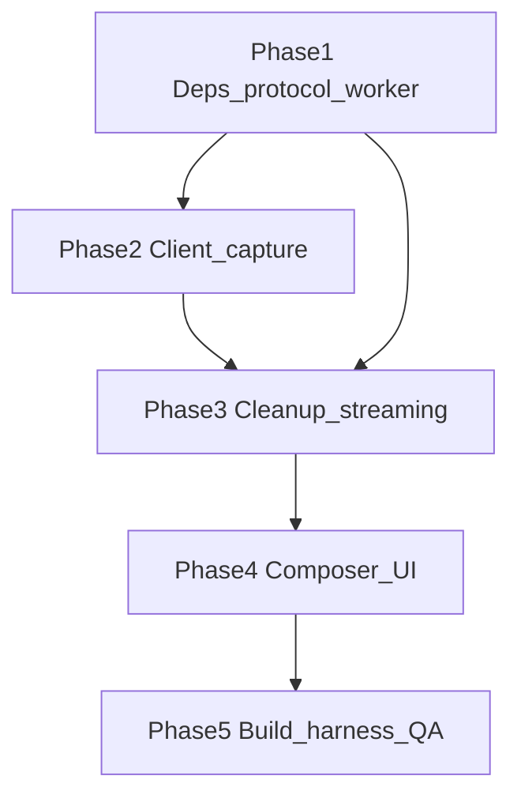

# Chat Voice Input — On-Device Whisper WebGPU

**Author:** Scoper Page team  
**Date:** 2026-07-31  
**Based on:** [chat_voice_input plan](/Users/christopherkruger/.cursor/plans/chat_voice_input_17ca4c3b.plan.md), [TASK_BREAKDOWN_TEMPLATE.md](TASK_BREAKDOWN_TEMPLATE.md), [TASK_BREAKDOWN.md](TASK_BREAKDOWN.md) (BDA-050–053 chat), [ARCHITECTURE.md](ARCHITECTURE.md)

**Project Focus:** Cursor-style **toggle mic** in the chat composer: on-device **Whisper** (Transformers.js + WebGPU) in a dedicated worker, **streaming partial transcripts** into the composer draft; user **reviews and taps Send** (no auto-send). Optional **filler-word cleanup** (um/uh/ah). Audio stays in-browser; only text enters [`runChatAgentTurn`](../src/services/chat-agent.ts).

**Package manager:** pnpm

**Task ID prefix:** `BDA-181`–`BDA-194` (continues after BDA-180 sectional UCW)

**Reference (not embedded):** [Xenova realtime-whisper-webgpu](https://huggingface.co/spaces/Xenova/realtime-whisper-webgpu)

**Explicit non-goals (this pass):** Auto-send on silence; TTS for assistant replies; voice in proposal company-context field; non-English without model swap; cloud STT; LLM disfluency pass.

---

## Task dependency graph

**Build order:** deps/vite → protocol → worker → client → capture → cleanup → streaming → UI → bundle/harness/docs/QA.

---

## Gating rules (acceptance reference)

- **Mic visible/enabled** only when `probeWebGpu()` succeeds (same bar as chat); otherwise hidden or disabled with tooltip → [`WebGpuBanner`](../src/components/layout/WebGpuBanner.tsx).
- **Mic disabled** when `chatGenerating`, `proposalGenerating`, markdown ingest, or Whisper model loading (same as composer textarea busy states).
- **No `chatGenerating`** during voice capture/transcription (voice is input-only; send still uses existing `sendChatPrompt`).
- **Composer-only send:** stopping mic leaves text in draft; user must tap Send.

---

## 🏗️ Phase 1: Dependencies, protocol, and Whisper worker

> **Purpose:** Transformers.js + isolated worker with lazy WebGPU ASR load

### **ID:** BDA-181

**Title:** Add Transformers.js dependency  
**Status:** Done  
**Dependencies:** None  
**Priority:** Critical  
**Description:** Add `@huggingface/transformers` for Whisper pipeline. Update [`vite.config.ts`](../vite.config.ts): `optimizeDeps.exclude` (like `bitgpu`); confirm COOP/COEP headers remain for WASM/threading. Document model id `Xenova/whisper-tiny.en` and ~40 MB first-fetch in plan notes. Do not eager-import in main bundle.  
**Completed Changes:**
- ✅ `pnpm add @huggingface/transformers@^4.2.0`
- ✅ [`vite.config.ts`](../vite.config.ts) — `optimizeDeps.exclude` includes `@huggingface/transformers`
- ✅ [`src/lib/whisper-model.ts`](../src/lib/whisper-model.ts) — `WHISPER_ASR_MODEL_ID`, 16 kHz constant (worker import in BDA-183)
**Test Strategy:** `pnpm build` passes; main entry chunk size unchanged vs pre-voice baseline (no transformers in index chunk).  
**Test Results:**
- ✅ `tsc -b` + `vite build` + `check-bundle-size` pass
- ✅ Main entry chunk ~1.26 MB (unchanged; transformers not in app graph yet)
- ℹ️ `pnpm install` may warn on ignored optional builds (`onnxruntime-node`, `sharp`); browser path uses WASM/WebGPU in worker (BDA-183)
**Assigned:** Completed  
**Context/Artifacts:** Plan § Dependencies; [`scripts/check-bundle-size.mjs`](../scripts/check-bundle-size.mjs)

---

### **ID:** BDA-182

**Title:** Whisper worker protocol types  
**Status:** Done  
**Dependencies:** BDA-181  
**Priority:** Critical  
**Description:** Add [`src/lib/whisper-protocol.ts`](../src/lib/whisper-protocol.ts): command types `load`, `transcribe`, `reset`, `dispose`; outbound `progress`, `partial`, `segment`, `error`; typed payloads for Float32 audio buffers (transferable). Mirror patterns from [`scoper-protocol.ts`](../src/lib/scoper-protocol.ts).  
**Completed Changes:**
- ✅ Command/event discriminated unions + RPC request/response types
- ✅ `whisperTranscribeTransferables`, `resolveWhisperSampleRateHz`, error classes
- ✅ `runWhisperProtocolHarness` registered in `runProposalUnitHarnesses`
**Test Strategy:** TypeScript strict compile; no runtime yet.  
**Test Results:**
- ✅ `pnpm exec tsc -b` pass
- ✅ Dev harness exhaustiveness check on load
**Assigned:** Completed  
**Context/Artifacts:** [`scoper-client.ts`](../src/services/scoper-client.ts), [`scoper.worker.ts`](../src/workers/scoper.worker.ts)

---

### **ID:** BDA-183

**Title:** Whisper worker WebGPU pipeline  
**Status:** Done  
**Dependencies:** BDA-182  
**Priority:** Critical  
**Description:** Add [`src/workers/whisper.worker.ts`](../src/workers/whisper.worker.ts): lazy `pipeline('automatic-speech-recognition', 'Xenova/whisper-tiny.en', { device: 'webgpu' })` (fallback log if WebGPU fails). Handle `load`, `transcribe` on 16 kHz mono Float32Array, `reset`, `dispose`. Emit load progress and partial/segment text. Configure remote model allow + browser cache consistent with [`scoper-cache.ts`](../src/lib/scoper-cache.ts) story.  
**Completed Changes:**
- ✅ Worker message loop (RPC + progress/partial/segment/error events)
- ✅ WebGPU → WASM fallback; `env.allowRemoteModels` + `useBrowserCache`
- ✅ [`whisper-worker-harness.ts`](../src/services/whisper-worker-harness.ts) + dev chain in [`App.tsx`](../src/App.tsx)
**Test Strategy:** Dev-only manual postMessage or BDA-192 harness: load + transcribe silence/noise chunk without throwing when WebGPU available.  
**Test Results:**
- ✅ `tsc -b` + `vite build` — `whisper.worker-*.js` ~526 KB (lazy via harness; main index unchanged)
- ✅ `runWhisperWorkerHarness` on dev load when WebGPU available (downloads model on first run)
**Assigned:** Completed  
**Context/Artifacts:** Plan § Architecture; Xenova space reference

---

## 🔌 Phase 2: Whisper client and audio capture

> **Purpose:** Main-thread client and microphone → 16 kHz chunks

### **ID:** BDA-184

**Title:** Whisper client singleton  
**Status:** Done  
**Dependencies:** BDA-183  
**Priority:** Critical  
**Description:** Add [`src/services/whisper-client.ts`](../src/services/whisper-client.ts): spawn worker via Vite `?worker` URL; `ensureLoaded()`, `transcribeChunk()`, `reset()`, `dispose()`; state `idle | loading | ready | transcribing | error`; listeners for progress/partials/errors. Singleton export `getWhisperClient()` like [`getScoperClient()`](../src/services/scoper-client.ts).  
**Completed Changes:**
- ✅ `WhisperClient` + `getWhisperClient()` — lazy worker, RPC map, event fan-out
- ✅ `ensureLoaded`, `transcribeChunk` (transferable PCM), `reset`, `dispose`, `probeEnvironment`
- ✅ `runWhisperClientHarness`; dev chain uses client harness (worker harness delegates)
**Test Strategy:** Harness calls `ensureLoaded` when WebGPU ok; skips gracefully when not.  
**Test Results:**
- ✅ `tsc -b` pass
- ✅ `runWhisperClientHarness` on dev load when WebGPU available
**Assigned:** Completed  
**Context/Artifacts:** BDA-183, BDA-192

---

### **ID:** BDA-185

**Title:** Microphone capture and resample  
**Status:** Done  
**Dependencies:** None  
**Priority:** High  
**Description:** Add [`src/services/chat-voice-capture.ts`](../src/services/chat-voice-capture.ts): `startCapture(onChunk)`, `stopCapture()`; `getUserMedia({ audio: true })`; `AudioContext` resample to **16 kHz mono** Float32; fixed-duration chunks (1–2 s) with overlap per Xenova streaming pattern. Clean up tracks/context on stop. Permission-denied errors as typed result.  
**Completed Changes:**
- ✅ `startChatVoiceCapture` / `stopChatVoiceCapture` / `isChatVoiceCaptureActive`
- ✅ 16 kHz mono resample + 1.5 s chunks with 0.25 s overlap; permission typed errors
- ✅ `runChatVoiceCaptureHarness` (resample + lifecycle) in unit harnesses
**Test Strategy:** Manual: permission prompt; chunks fire while speaking; stop releases mic indicator in OS.  
**Test Results:**
- ✅ `tsc -b` + `runChatVoiceCaptureHarness` on dev load
- 👤 Manual mic prompt / OS indicator — verify in browser
**Assigned:** Completed  
**Context/Artifacts:** Plan § Architecture (audio on main thread)

---

### **ID:** BDA-186

**Title:** Speech transcript disfluency cleanup  
**Status:** Done  
**Dependencies:** None  
**Priority:** Medium  
**Description:** Add [`src/lib/speech-transcript-cleanup.ts`](../src/lib/speech-transcript-cleanup.ts): `cleanSpeechTranscript(text)` — strip whole-word fillers (`um`, `uh`, `ah`, `er`, `hm`, `hmm`, `mmm`); collapse whitespace; preserve substrings (`umbrella`, `aha moment`). Add `runSpeechTranscriptCleanupHarness()` in same file or dedicated harness module.  
**Completed Changes:**
- ✅ `cleanSpeechTranscript` with word-boundary filler removal + whitespace normalize
- ✅ `runSpeechTranscriptCleanupHarness` registered in `runProposalUnitHarnesses`
**Test Strategy:** Harness via `runProposalUnitHarnesses` or new `runChatVoiceUnitHarnesses`; `pnpm build`.  
**Test Results:**
- ✅ `tsc -b`; harness cases pass on dev load
**Assigned:** Completed  
**Context/Artifacts:** Plan § Disfluency cleanup

---

## 🔄 Phase 3: Streaming integration

> **Purpose:** Chunk queue, cleanup on emit, GPU mutex

### **ID:** BDA-187

**Title:** Streaming transcribe queue  
**Status:** Done  
**Dependencies:** BDA-184, BDA-185  
**Priority:** High  
**Description:** Extend whisper-client (or thin [`src/services/chat-voice-session.ts`](../src/services/chat-voice-session.ts)): while listening, queue capture chunks → serial/controlled parallel transcribe; merge segment text; emit `onPartial(text)` to UI. Call `reset` on mic start; `dispose` optional on mic stop to free GPU before chat send. Avoid transcribing while `chatGenerating || proposalGenerating`.  
**Completed Changes:**
- ✅ [`chat-voice-session.ts`](../src/services/chat-voice-session.ts) — serial queue, overlap merge, `cleanSpeechTranscript` on emit
- ✅ `startChatVoiceSession` / `stopChatVoiceSession`; blocks when agent/proposal busy; Whisper `reset` on start
- ✅ `runChatVoiceSessionMergeHarness` + `runChatVoiceSessionHarness` (queued silence chunks)
**Test Strategy:** Manual partial text updates in composer during long utterance.  
**Test Results:**
- ✅ `tsc -b`; merge + queue harnesses on dev load
- 👤 Manual long utterance in composer (BDA-189+)
**Assigned:** Completed  
**Context/Artifacts:** Plan § GPU contention

---

### **ID:** BDA-188

**Title:** Wire cleanup into whisper emissions  
**Status:** Done  
**Dependencies:** BDA-186, BDA-187  
**Priority:** Medium  
**Description:** Apply `cleanSpeechTranscript` to every partial/final string before UI callback (default on). Export option `cleanTranscript?: boolean` for future toggle.  
**Completed Changes:**
- ✅ [`whisper-client.ts`](../src/services/whisper-client.ts) — `WhisperClientOptions.cleanTranscript` (default on); `whisperEmitText`; partial/segment listeners + `transcribeChunk` result
- ✅ `setCleanTranscript` / `getCleanTranscript` for runtime toggle
- ✅ `runWhisperClientCleanupHarness` in unit harnesses
**Test Strategy:** Harness + manual: spoken “um find the clause” → composer shows without leading fillers.  
**Test Results:**
- ✅ Sync harness (`um find the clause` → `find the clause`)
- 👤 Manual composer (BDA-189+)
**Assigned:** Completed  
**Context/Artifacts:** BDA-186, BDA-189

---

## 🎨 Phase 4: Composer UI

> **Purpose:** Cursor-like mic control and draft merge

### **ID:** BDA-189

**Title:** ChatVoiceButton component  
**Status:** Done  
**Dependencies:** BDA-187  
**Priority:** High  
**Description:** Add [`src/components/chat/ChatVoiceButton.tsx`](../src/components/chat/ChatVoiceButton.tsx): mic toggle; states idle / loading model / listening; `aria-pressed`, `aria-label`; tooltip strings (Loading…, Start voice input, Stop listening, WebGPU required). Visual recording state (icon variant or ring).  
**Completed Changes:**
- ✅ [`ChatVoiceButton.tsx`](../src/components/chat/ChatVoiceButton.tsx) — session start/stop, WebGPU probe, agent busy + prop disable
- ✅ Red ring + `aria-pressed` while listening; spinner while starting/stopping
- ✅ `runChatVoiceButtonLabelsHarness` for tooltip/aria strings
**Test Strategy:** Keyboard focus + screen reader labels; toggle starts/stops capture.  
**Test Results:**
- ✅ Label harness on dev load
- 👤 Manual toggle + SR (mount in composer BDA-190)
**Assigned:** Completed  
**Context/Artifacts:** Plan § UX table; shadcn Button patterns

---

### **ID:** BDA-190

**Title:** ChatComposer voice draft merge  
**Status:** Done  
**Dependencies:** BDA-189, BDA-188  
**Priority:** Critical  
**Description:** Integrate in [`ChatComposer.tsx`](../src/components/chat/ChatComposer.tsx): mount `ChatVoiceButton` in footer cluster (left of [`ContextUsageComposerCluster`](../src/components/chat/ContextUsageSheet.tsx) / paperclip). **Draft merge:** preserve pre-mic text; replace/update trailing voice segment while listening; placeholder “Listening…” when active; voice errors near `dropError`. Do not call `sendChatPrompt` on mic stop. Expand `isBusy` to include voice loading/listening as needed.  
**Completed Changes:**
- ✅ [`chat-composer-voice-draft.ts`](../src/lib/chat-composer-voice-draft.ts) — `mergeComposerVoiceDraft` + harness
- ✅ `ChatComposer` — mic left of attachments; pre-mic snapshot on load; partial merge; `voiceError`; focus on stop
- ✅ `isBusy` / send gated during voice load+listen; placeholders Listening… / Loading speech model…
**Test Strategy:** Type text → start mic → speak → stop → pre-mic + transcript intact; Send still manual.  
**Test Results:**
- ✅ Merge harness on dev load
- 👤 Manual mic flow in browser
**Assigned:** Completed  
**Context/Artifacts:** BDA-052 composer; plan § Draft merge rule

---

### **ID:** BDA-191

**Title:** WebGPU and agent busy gating  
**Status:** Done  
**Dependencies:** BDA-189  
**Priority:** High  
**Description:** Hide or disable mic when `probeWebGpu()` false. Stop capture if user sends chat while listening. Disable mic during `chatGenerating`, `proposalGenerating`, markdown ingest. Optional: stop voice session when `sendChatPrompt` fires. Align with [`WebGpuBanner`](../src/components/layout/WebGpuBanner.tsx) messaging.  
**Completed Changes:**
- ✅ [`webgpu-user-messages.ts`](../src/lib/webgpu-user-messages.ts) + banner uses shared fallback
- ✅ Mic hidden when WebGPU false; disabled while probing / busy / markdown ingest
- ✅ Auto-stop on agent/proposal busy (store subscribe) + markdown ingest; send stops session + `disposeWhisper`
- ✅ [`chat-voice-gating.ts`](../src/lib/chat-voice-gating.ts) harness
**Test Strategy:** Generate chat → mic disabled; proposal batch → mic disabled; no dual GPU contention errors in console.  
**Test Results:**
- ✅ Gating harness on dev load
- 👤 Manual GPU contention check in browser
**Assigned:** Completed  
**Context/Artifacts:** Plan § GPU contention; BDA-180 chatGenerating checks

---

## 🧪 Phase 5: Build, harness, docs, QA

> **Purpose:** Bundle limits, dev harnesses, architecture, sign-off

### **ID:** BDA-192

**Title:** Whisper worker bundle limit  
**Status:** Done  
**Dependencies:** BDA-183  
**Priority:** High  
**Description:** Extend [`scripts/check-bundle-size.mjs`](../scripts/check-bundle-size.mjs): new row for `whisper.worker-*.js` max bytes (set after first green build, separate from main chunk). Ensure lazy worker chunk does not blow main `index-*.js` limit.  
**Completed Changes:**
- ✅ `whisper worker` row — `whisper.worker-*.js`, max **600 KB** uncompressed (~526 KB observed at BDA-183; lazy chunk, main index unchanged)
**Test Strategy:** `pnpm build` + check-bundle-size pass.  
**Test Results:**
- 👤 Run locally: `pnpm build` → `[check-bundle-size] ok whisper worker: …`
**Assigned:** Completed  
**Context/Artifacts:** BDA-090 pattern

---

### **ID:** BDA-193

**Title:** Register voice dev harnesses  
**Status:** Done  
**Dependencies:** BDA-184, BDA-186  
**Priority:** Medium  
**Description:** Add [`src/services/whisper-client-harness.ts`](../src/services/whisper-client-harness.ts); register in [`App.tsx`](../src/App.tsx) dev chain or new `runChatVoiceUnitHarnesses()` called alongside proposal harnesses. Cleanup harness always runs; whisper load/transcribe skips when WebGPU unavailable (no `[dev-harness]` throw).  
**Completed Changes:**
- ✅ [`whisper-client-harness.ts`](../src/services/whisper-client-harness.ts) — async WebGPU smoke (moved from client)
- ✅ [`chat-voice-dev-harnesses.ts`](../src/services/chat-voice-dev-harnesses.ts) — `runChatVoiceUnitHarnesses` + `runChatVoiceAsyncHarnesses`
- ✅ [`App.tsx`](../src/App.tsx) — unit after proposal unit; async after Scoper (GPU handoff order)
- ✅ Voice harnesses removed from [`proposal-dev-harnesses.ts`](../src/services/proposal-dev-harnesses.ts)
**Test Strategy:** `pnpm dev` console clean; intentional fail logs `[dev-harness]`.  
**Test Results:**
- ✅ `tsc -b`; skip logs when WebGPU off
- 👤 `pnpm dev` console check
**Assigned:** Completed  
**Context/Artifacts:** [`proposal-dev-harnesses.ts`](../src/services/proposal-dev-harnesses.ts) pattern

---

### **ID:** BDA-194

**Title:** Architecture doc voice section  
**Status:** Done  
**Dependencies:** BDA-190  
**Priority:** Low  
**Description:** Update [`docs/ARCHITECTURE.md`](ARCHITECTURE.md): workers diagram row for whisper worker; data flow bullet (mic → worker → composer text only); privacy note (audio not uploaded). Link this breakdown doc from Related documents.  
**Completed Changes:**
- ✅ Mermaid: `whisper.worker`, voice services, composer mic path
- ✅ Data flow §5 + module table + offline privacy bullet for mic audio
- ✅ Related docs link to this breakdown
**Test Strategy:** Markdown links resolve.  
**Test Results:**
- ✅ Links relative to `docs/`
**Assigned:** Completed  
**Context/Artifacts:** Plan § Error handling and privacy

---

### **ID:** BDA-195

**Title:** Manual QA chat voice sign-off  
**Status:** To Do  
**Dependencies:** BDA-190, BDA-191, BDA-193  
**Priority:** Critical  
**Description:** Execute manual script: Chrome + WebGPU; mic toggle → partials in composer → stop → edit → Send → agent responds; fillers reduced; mic disabled during generation; permission denied handled; `@` mentions still work when not listening. Run `pnpm build` + `pnpm qa:proposal` (extend static script optionally: `ChatVoiceButton` import in composer). Record results appendix below.  
**Completed Changes:**
- 🔄 Manual checklist appendix
- 🔄 Automated QA green
**Test Strategy:** All manual steps recorded; automated QA green.  
**Test Results:**
- 🔄 Pending implementation  
**Assigned:** Unassigned  
**Context/Artifacts:** [BDA-151 baseline](TASK_BREAKDOWN_PROPOSAL_MODE.md#qa-results-bda-151); plan § Testing

#### Manual UI checklist (BDA-195)

| Step | Expected | Record |
|------|----------|--------|
| First mic click | Model load progress; then listening state | |
| Speak with fillers (“um find section L”) | Composer updates; fillers stripped heuristically | |
| Stop mic | Text remains; focus in textarea; no auto-send | |
| Send | Normal agent turn; mic disabled while generating | |
| WebGPU off / unsupported | Mic hidden or disabled + clear tooltip | |
| Deny mic permission | Inline error; composer still typable | |
| DevTools on load | No uncaught `[dev-harness]` from voice harnesses | |

---

## Recommended sprint order

| Order | ID | Title | Est. |
|-------|-----|-------|------|
| 1 | BDA-181 | Transformers.js + Vite | 1h |
| 2 | BDA-182 | Whisper protocol | 0.5h |
| 3 | BDA-183 | Whisper worker | 3h |
| 4 | BDA-184 | Whisper client | 2h |
| 5 | BDA-186 | Transcript cleanup | 1h |
| 6 | BDA-185 | Voice capture | 2h |
| 7 | BDA-187 | Streaming queue | 2h |
| 8 | BDA-188 | Cleanup wire | 0.5h |
| 9 | BDA-189 | ChatVoiceButton | 1.5h |
| 10 | BDA-190 | Composer merge | 2h |
| 11 | BDA-191 | WebGPU/busy gates | 1h |
| 12 | BDA-192 | Bundle limit | 0.5h |
| 13 | BDA-193 | Dev harnesses | 1h |
| 14 | BDA-194 | Architecture doc | 0.5h |
| 15 | BDA-195 | Manual QA | 1.5h |

**Estimated total:** ~19 hours (~2.5 dev days)

---

## Traceability (plan → tasks)

| Plan section / todo | Tasks |
|---------------------|-------|
| whisper-protocol-worker | BDA-182, BDA-183 |
| whisper-client | BDA-184, BDA-187, BDA-188 |
| voice-capture | BDA-185, BDA-187 |
| composer-ui | BDA-189, BDA-190, BDA-191 |
| disfluency-cleanup | BDA-186, BDA-188 |
| build-harness-docs | BDA-181, BDA-192, BDA-193, BDA-194, BDA-195 |

---

## Document metadata

**Related documents:**

- [chat_voice_input plan](/Users/christopherkruger/.cursor/plans/chat_voice_input_17ca4c3b.plan.md)
- [TASK_BREAKDOWN.md](TASK_BREAKDOWN.md) (BDA chat BDA-050–053)
- [TASK_BREAKDOWN_TEMPLATE.md](TASK_BREAKDOWN_TEMPLATE.md)
- [ARCHITECTURE.md](ARCHITECTURE.md)

**Change log:**

| Version | Date | Changes |
|---------|------|---------|
| v1.0 | 2026-07-31 | Atomic breakdown BDA-181–195 from chat voice plan |
