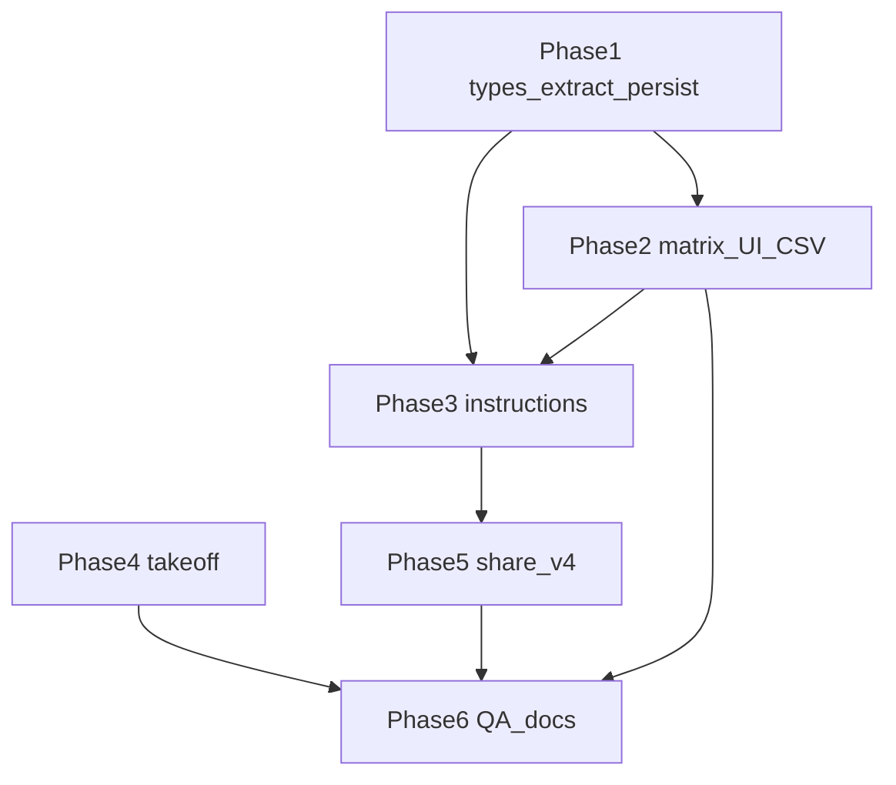

# Compliance Matrix, Instructions Card, Stamp Takeoff — Task Breakdown

**Author:** Scoper Page team  
**Date:** 2026-08-21  
**Based on:** [compliance_matrix_takeoff plan](plans/compliance_matrix_takeoff.md), [TASK_BREAKDOWN_TEMPLATE.md](TASK_BREAKDOWN_TEMPLATE.md), [PRD.md](PRD.md) §16, [TASK_BREAKDOWN.md](TASK_BREAKDOWN.md) (BDA-001–053 RFP profiles)

**Project Focus:** Three Scoper-native deliverables without becoming Loopio or Bluebeam: a **shall/compliance matrix** with CSV, an **Instructions card** (due date, Q&A, page limits, volumes), and a **stamp takeoff** list with CSV. Local, cited, exportable.

**Package manager:** pnpm

**Task ID prefix:** `BDA-259`–`BDA-276` (continues after BDA-258 mark voice notation)

**Status:** **To Do** — not implemented

**Sequence:** Matrix first, then instructions, then takeoff. Share pack **v4** lands when new tables land (matrix + solicitation meta). Takeoff alone does not bump share version.

**Explicit non-goals (v1):** bitgpu / LLM shall extract (`rfpRequirementsResponseSchema` unused until a later pass); Section L structured parser; Excel-formatted matrix; custom criteria template library; SAM.gov; content library; realtime markup; Scribe-style capture; extending [`VoiceNotationPanel`](../src/components/workspace/voice-notation-panel.tsx) (page-scoped, voice-note-filtered).

---

## Product rules (cross-cutting)

| Rule | Behavior |
|------|----------|
| **Stay Scoper** | Cited rows, local DuckDB, CSV download. No content library or cloud RFP product. |
| **Leave existing cards** | 3-rule `CriterionResult` cards and contract-checklist path stay unchanged. |
| **No invented dates** | Missing solicitation fields stay “Not found”. |
| **Heuristic extract** | Shall + instructions are regex / keyword on baseline blocks. Do not call bitgpu in v1. |
| **PDF blocks have no `section_path`** | Instructions match body text + existing `PROPOSAL_SECTION_HINT` / “instructions to offerors” signals. |
| **Voice panel is page-scoped** | Takeoff is a **new** doc-wide sheet. Do not extend `VoiceNotationPanel`. |
| **User override wins** | `rfp_requirement_scores.status` / `note` persist; heuristic score only seeds empty rows. |
| **Share pack** | Bump [`SHARE_PACK_VERSION`](../src/lib/share-table.ts) to **4** only when `rfp_requirements`, `rfp_requirement_scores`, and `rfp_solicitation_meta` are registered. Raw drawing marks already ship in v3. |

---

## Task dependency graph

**Recommended ship order:** Phase 1 → 2 → 3 (CSV preamble after matrix CSV) → 4 (parallel with 3 after Phase 1) → 5 → 6.

---

## 🏗️ Phase 1: Types, shall extract, persist

> **Purpose:** Wire unused requirement types, heuristic shall extract, DuckDB + qualification hook — no matrix UI yet

### **ID:** BDA-259

**Title:** Wire RfpRequirement and score types  
**Status:** Done  
**Dependencies:** None (types already exist unused)  
**Priority:** Critical  
**Description:** Confirm and extend [`RfpRequirement`](../src/lib/types.ts) / `RfpRequirementsExtract` so they can persist extracted shalls. Add score types used by the matrix (do not invent a parallel requirement model). Expected deliverables: `RfpRequirementScore` (`requirement_id`, `profile_id`, `status`, `note`, optional `source: 'heuristic' | 'user'`) and a small status union (`met` / `partial` / `gap` / `unknown`). Keep `rfpRequirementsResponseSchema` unused — do not call bitgpu. Re-export from [`lib/index.ts`](../src/lib/index.ts) if that is the existing pattern.  
**Completed Changes:**
- ✅ Confirmed existing `RfpRequirement` fields (`id`, `label`, `category?`, `citation?`) are the persist shape — JSDoc only, no parallel model
- ✅ Added `RfpRequirementScoreStatus`, `RfpRequirementScoreSource`, `RfpRequirementScore` + JSDoc (user override wins)
- ✅ Re-exported new types from [`lib/index.ts`](../src/lib/index.ts); `rfpRequirementsResponseSchema` left unused; no UI
**Test Strategy:** `pnpm exec tsc -b`; no breaking changes to `CriterionResult` / `RfpResultsProfile`.  
**Test Results:**
- ✅ `pnpm exec tsc -b` passes
- ✅ `CriterionResult` / `RfpResultsProfile` unchanged
**Assigned:** Completed  
**Context/Artifacts:** [plans/compliance_matrix_takeoff.md](plans/compliance_matrix_takeoff.md); [`types.ts`](../src/lib/types.ts) ~381; [`schemas.ts`](../src/lib/schemas.ts) `rfpRequirementsResponseSchema`; `.github/copilot-instructions.md` §Types

---

### **ID:** BDA-260

**Title:** Heuristic shall extractor + harness  
**Status:** Done  
**Dependencies:** BDA-259  
**Priority:** Critical  
**Description:** New service (e.g. [`src/services/extract-rfp-requirements.ts`](../src/services/extract-rfp-requirements.ts)) scans **baseline** blocks with the existing obligation pattern from [`compare-scope.ts`](../src/services/compare-scope.ts) (`shall` / `must` / `will provide` / `required to`). Cap + de-dupe near-duplicate sentences; skip ToC / heading-only noise. Reuse `findMatchingBlock`-style scoring from [`build-rfp-profiles.ts`](../src/services/build-rfp-profiles.ts) to attach `citation` (`block_id`, page). Extract `OBLIGATION_PATTERN` to a shared module **or** import a named export from `compare-scope` — do not fork a second regex. Do **not** change the 3-rule profile builder or contract-checklist path.  
**Completed Changes:**
- ✅ Shared obligation pattern in [`obligation-pattern.ts`](../src/lib/obligation-pattern.ts); `compare-scope` uses `countObligationMatches` (no forked regex)
- ✅ `extractRfpRequirements(blocks) → RfpRequirementsExtract` with `blockToCitation` via findMatchingBlock-style score
- ✅ Cap 48, exact/containment de-dupe, skip ToC / heading-only noise
- ✅ `runExtractRfpRequirementsHarness` — known shall + citation, ToC-only / empty → `[]`; wired in `App.tsx` unit chain
**Test Strategy:** Dev harness or `src/lib/*.test.ts` if that is the project pattern; `pnpm exec tsc -b`. Known phrase present; empty / ToC-only input returns `[]` or empty extract without throw.  
**Test Results:**
- ✅ `pnpm exec tsc -b` passes
- ✅ 3-rule `build-rfp-profiles` and contract-checklist paths unchanged
**Assigned:** Completed  
**Context/Artifacts:** [`obligation-pattern.ts`](../src/lib/obligation-pattern.ts); [`extract-rfp-requirements.ts`](../src/services/extract-rfp-requirements.ts); [`parse-contract-checklist.ts`](../src/services/parse-contract-checklist.ts) (do not merge)

---

### **ID:** BDA-261

**Title:** DuckDB requirements and scores tables  
**Status:** Done  
**Dependencies:** BDA-259  
**Priority:** Critical  
**Description:** Add tables in [`duckdb-schema.ts`](../src/lib/duckdb-schema.ts) + `DUCKDB_MIGRATION_STATEMENTS` (`CREATE TABLE IF NOT EXISTS` / `ADD COLUMN IF NOT EXISTS` as the existing pattern):

- `rfp_requirements` — extracted shalls from the baseline doc (`requirement_id`, `doc_id`, `label`, `category`, citation fields / `block_id`, `created_at`)
- `rfp_requirement_scores` — `(requirement_id, profile_id, status, note, source)` per bidder

Fresh install CREATE TABLE must include the same columns. Schema harness asserts both tables after init.  
**Completed Changes:**
- ✅ CREATE TABLE for `rfp_requirements` + `rfp_requirement_scores` (shared SQL in schema + migrations)
- ✅ `CREATE TABLE IF NOT EXISTS` in `DUCKDB_MIGRATION_STATEMENTS` for existing sessions
- ✅ `runRfpRequirementsSchemaHarness` — DESCRIBE columns, smoke insert/select, `results_profiles` / `profile_criteria` still present; wired after `runDuckdbHarness`
**Test Strategy:** Dev app load runs schema harness; existing sessions migrate without dropping `results_profiles` / `profile_criteria`.  
**Test Results:**
- ✅ `pnpm exec tsc -b` passes
**Assigned:** Completed  
**Context/Artifacts:** [`duckdb-schema.ts`](../src/lib/duckdb-schema.ts); [`rfp-requirements-schema-harness.ts`](../src/services/rfp-requirements-schema-harness.ts); BDA-221 / BDA-243 migration pattern

---

### **ID:** BDA-262

**Title:** Persist requirements and seed scores  
**Status:** Done  
**Dependencies:** BDA-260, BDA-261  
**Priority:** Critical  
**Description:** New service (e.g. [`src/services/rfp-requirements.ts`](../src/services/rfp-requirements.ts)): replace-on-reextract for `rfp_requirements` for the baseline `doc_id`; upsert scores. **Initial score:** token overlap of requirement `label` against that bidder’s blocks (`met` / `partial` / `gap` / `unknown`). If a score row already has `source = 'user'`, do not overwrite status or note.  
**Completed Changes:**
- ✅ INSERT/SELECT/DELETE replace-on-reextract in [`rfp-requirements.ts`](../src/services/rfp-requirements.ts)
- ✅ Upsert scores; rematch `source: 'user'` by id or normalized label so status/note survive re-seed
- ✅ `scoreRequirementAgainstBlocks` JSDoc (coverage ≥0.5 met, ≥0.25 partial, empty unknown, else gap)
- ✅ `runRfpRequirementsCrudHarness` — extract → persist → fetch → user override survives re-seed; wired after schema harness
**Test Strategy:** `runRfpRequirementsCrudHarness` (name TBD); `pnpm exec tsc -b`.  
**Test Results:**
- ✅ `pnpm exec tsc -b` passes
**Assigned:** Completed  
**Context/Artifacts:** [`pdf-drawing-annotations.ts`](../src/services/pdf-drawing-annotations.ts) CRUD pattern; [`rfp-profile-store.ts`](../src/services/rfp-profile-store.ts)

---

### **ID:** BDA-263

**Title:** Hook extract into runRfpQualification  
**Status:** To Do  
**Dependencies:** BDA-262  
**Priority:** Critical  
**Description:** In [`session-store.ts`](../src/store/session-store.ts) `runRfpQualification`, after existing 3-rule profile build: run shall extract on baseline blocks, persist requirements, seed/update scores for loaded bidder profiles. Expose read selectors (requirements + scores) the matrix will use. Failure of extract must **not** fail qualification cards (log + continue).  
**Completed Changes:**
- 🔄 Call extract + persist from `runRfpQualification`
- 🔄 Store fields / getters for matrix
- 🔄 Isolate errors from existing profile path
**Test Strategy:** Load sample RFP pack → profiles still appear; store has requirement rows when baseline text contains shall/must. `pnpm exec tsc -b`.  
**Test Results:**
- 🔄 Pending implementation
**Assigned:** Unassigned  
**Context/Artifacts:** [`session-store.ts`](../src/store/session-store.ts) `runRfpQualification`; [`load-sample-documents.ts`](../src/services/load-sample-documents.ts)

---

## 🎨 Phase 2: Compliance matrix UI and CSV

> **Purpose:** User-facing matrix on the evaluation panel; editable scores; CSV download

### **ID:** BDA-264

**Title:** ComplianceMatrix on evaluation panel  
**Status:** To Do  
**Dependencies:** BDA-263  
**Priority:** High  
**Description:** New [`ComplianceMatrix`](../src/components/workspace/ComplianceMatrix.tsx) rendered in [`RfpEvaluationPanel`](../src/components/workspace/RfpEvaluationPanel.tsx) as a sibling of baseline “Requirements extracted” — **not** a new Profiles-grid column. Columns: #, requirement, citation, one status chip per loaded bidder profile, note. Citation click uses existing `focusCitation` / [`citation-bridge.ts`](../src/lib/citation-bridge.ts). Reuse chip / row patterns from [`CriterionRow`](../src/components/workspace/CriterionRow.tsx). Empty extract: short “No shall/must lines found” empty state, not a spinner forever.  
**Completed Changes:**
- 🔄 `ComplianceMatrix` component
- 🔄 Mount in `RfpEvaluationPanel` only (no `ResultsProfileGrid` column)
- 🔄 Citation → `focusCitation`
- 🔄 Empty state
**Test Strategy:** Sample RFP → matrix lists extracted shalls; click citation focuses the baseline viewer. Existing 3 criterion cards unchanged.  
**Test Results:**
- 🔄 Pending implementation
**Assigned:** Unassigned  
**Context/Artifacts:** [`RfpEvaluationPanel.tsx`](../src/components/workspace/RfpEvaluationPanel.tsx); [`CriterionRow.tsx`](../src/components/workspace/CriterionRow.tsx); [`ResultsProfileGrid.tsx`](../src/components/workspace/ResultsProfileGrid.tsx) (do not add column)

---

### **ID:** BDA-265

**Title:** Editable matrix status and notes  
**Status:** To Do  
**Dependencies:** BDA-264  
**Priority:** High  
**Description:** Status chip and note field blur-save to `rfp_requirement_scores` with `source = 'user'`. Optimistic UI; persist via the BDA-262 service. Re-run qualification must not clobber user edits (already required in BDA-262 — this task verifies from UI).  
**Completed Changes:**
- 🔄 Status control + note input
- 🔄 Blur / commit persist
- 🔄 Reload / re-qualify keeps overrides
**Test Strategy:** Change a chip + note → refresh or re-run Qualify → values remain.  
**Test Results:**
- 🔄 Pending implementation
**Assigned:** Unassigned  
**Context/Artifacts:** BDA-262 user-override rule

---

### **ID:** BDA-266

**Title:** Compliance matrix CSV export  
**Status:** To Do  
**Dependencies:** BDA-264  
**Priority:** High  
**Description:** New [`src/services/export-rfp-compliance-csv.ts`](../src/services/export-rfp-compliance-csv.ts) + [`beginBlobSave`](../src/lib/download-blob.ts). Columns: requirement, page, excerpt, per-bidder status, notes. Button on `RfpEvaluationPanel` (optional second entry on footer Export later — not required). Filename includes session / baseline hint if that matches other exports.  
**Completed Changes:**
- 🔄 Pure CSV builder (testable)
- 🔄 `beginBlobSave` download
- 🔄 Button on evaluation panel
- 🔄 Harness: CSV string contains a known requirement phrase
**Test Strategy:** Export from sample RFP; open CSV; known shall phrase + bidder columns present. `pnpm exec tsc -b`.  
**Test Results:**
- 🔄 Pending implementation
**Assigned:** Unassigned  
**Context/Artifacts:** [`download-blob.ts`](../src/lib/download-blob.ts); proposal CSV pattern in [`ProposalGenerationPanel.tsx`](../src/components/workspace/ProposalGenerationPanel.tsx)

---

## 📋 Phase 3: Instructions card

> **Purpose:** Solicitation meta (dates, Q&A, page limits, volumes) on evaluation + proposal panels

### **ID:** BDA-267

**Title:** Solicitation meta type, extract, persist  
**Status:** To Do  
**Dependencies:** BDA-261 (schema style), BDA-263 (qualification hook)  
**Priority:** High  
**Description:** Add `RfpInstructionsProfile` (name TBD) next to requirement types in [`types.ts`](../src/lib/types.ts): due / closing, Q&A / questions due, page limit, volume headings, each with optional `CitationRef`. Extractor (e.g. [`src/services/extract-rfp-instructions.ts`](../src/services/extract-rfp-instructions.ts)) on the same baseline block pass: dates near `due` / `closing` / `submit`; `Q&A` / `questions due`; `page limit` / `not to exceed N pages`; `Volume I` / `Section L`. Use `PROPOSAL_SECTION_HINT` from [`build-proposal-rfp-profile.ts`](../src/services/build-proposal-rfp-profile.ts) where useful. Persist `rfp_solicitation_meta` (`doc_id`, JSON fields, `block_ids`). Missing fields stay unset — **never invent dates**. Hook into `runRfpQualification` with the same isolate-on-error rule as BDA-263.  
**Completed Changes:**
- 🔄 `RfpInstructionsProfile` type
- 🔄 Heuristic extract + unit harness (fixture with due date + page limit)
- 🔄 Table + migration + persist/fetch
- 🔄 Qualification hook; missing = empty / “Not found” later in UI
**Test Strategy:** Fixture with “proposals due March 1” + “not to exceed 15 pages” → both fields + block ids; fixture without dates → no fabricated ISO date. Schema harness includes table.  
**Test Results:**
- 🔄 Pending implementation
**Assigned:** Unassigned  
**Context/Artifacts:** [`build-proposal-rfp-profile.ts`](../src/services/build-proposal-rfp-profile.ts) `PROPOSAL_SECTION_HINT`; LiteParse blocks have no `section_path`

---

### **ID:** BDA-268

**Title:** InstructionsCard on evaluation and proposal  
**Status:** To Do  
**Dependencies:** BDA-267  
**Priority:** High  
**Description:** New [`InstructionsCard`](../src/components/workspace/InstructionsCard.tsx) modeled on [`ResultsProfileCard`](../src/components/workspace/ResultsProfileCard.tsx). **Primary:** [`RfpEvaluationPanel`](../src/components/workspace/RfpEvaluationPanel.tsx) above/beside “Requirements extracted” (baseline already excluded from bidder cards). **Secondary:** [`ProposalGenerationPanel`](../src/components/workspace/ProposalGenerationPanel.tsx) above volume rows so page limits sit next to draft volumes. Solicitation volumes ≠ responder `ProposalVolume` — label copy must not imply they are the same. Click a field → `focusCitation`. Empty fields: “Not found”.  
**Completed Changes:**
- 🔄 `InstructionsCard` UI
- 🔄 Mount evaluation (primary) + proposal (secondary)
- 🔄 Citation click
- 🔄 “Not found” for missing fields
**Test Strategy:** Sample RFP with instruction language shows card; click due-date cite focuses viewer; proposal panel shows same meta above volumes.  
**Test Results:**
- 🔄 Pending implementation
**Assigned:** Unassigned  
**Context/Artifacts:** [`ResultsProfileCard.tsx`](../src/components/workspace/ResultsProfileCard.tsx); [`ProposalGenerationPanel.tsx`](../src/components/workspace/ProposalGenerationPanel.tsx)

---

### **ID:** BDA-269

**Title:** Instructions preamble on matrix CSV  
**Status:** To Do  
**Dependencies:** BDA-266, BDA-267  
**Priority:** Medium  
**Description:** Prepend a short Instructions block to the matrix CSV (due, Q&A, page limit, volumes — “Not found” when empty). Does not replace BDA-266 columns.  
**Completed Changes:**
- 🔄 Preamble rows or comment lines in CSV builder
- 🔄 Harness asserts known due-date or “Not found” present
**Test Strategy:** Export CSV after sample qualify; preamble appears above requirement rows.  
**Test Results:**
- 🔄 Pending implementation
**Assigned:** Unassigned  
**Context/Artifacts:** BDA-266 `export-rfp-compliance-csv.ts`

---

## 📐 Phase 4: Stamp takeoff

> **Purpose:** Doc-wide stamp list + CSV from existing `pdf_drawing_annotations` — no new table

### **ID:** BDA-270

**Title:** Shared markKindLabel and takeoff helper  
**Status:** To Do  
**Dependencies:** None (marks + `voice_note` already persist; BDA-244)  
**Priority:** High  
**Description:** Dedup `markKindLabel` (today duplicated in [`voice-notation-panel.tsx`](../src/components/workspace/voice-notation-panel.tsx) and [`export-annotated-pdf.ts`](../src/services/export-annotated-pdf.ts)) into a shared helper. New [`src/lib/drawing-takeoff.ts`](../src/lib/drawing-takeoff.ts): group doc-wide rows from [`fetchPdfDrawingAnnotationsForDoc`](../src/services/pdf-drawing-annotations.ts); default filter `geometry.kind === 'stamp'`. Columns for UI/CSV: mark label, color, page, voice note, count.  
**Completed Changes:**
- 🔄 Shared `markKindLabel`
- 🔄 `aggregateDrawingTakeoff(annotations, { kinds?: ... })`
- 🔄 Unit harness: two window stamps page 1 + one note → counts / pages / note
**Test Strategy:** Pure function tests; voice panel + PDF export still compile against shared label.  
**Test Results:**
- 🔄 Pending implementation
**Assigned:** Unassigned  
**Context/Artifacts:** [`pdf-drawing-annotations.ts`](../src/services/pdf-drawing-annotations.ts); `drawingMarkCount` in [`SplitDocumentView.tsx`](../src/components/workspace/SplitDocumentView.tsx)

---

### **ID:** BDA-271

**Title:** DrawingTakeoffPanel sheet and jump-to-mark  
**Status:** To Do  
**Dependencies:** BDA-270  
**Priority:** High  
**Description:** New `DrawingTakeoffPanel` sheet opened from [`SplitDocumentView`](../src/components/workspace/SplitDocumentView.tsx) when `drawingMarkCount > 0`, same sheet pattern as voice notation. Click row → set page + select mark in [`DocumentViewer`](../src/components/workspace/DocumentViewer.tsx). Do **not** extend `VoiceNotationPanel`. Optional footer pill `N window marks` beside existing `"N blocks · filename"` status.  
**Completed Changes:**
- 🔄 `DrawingTakeoffPanel` sheet
- 🔄 Open control from split view when marks exist
- 🔄 Click row → page + selection
- 🔄 Optional footer count
**Test Strategy:** Windows_Drawing (or any stamped PDF): open takeoff, click a stamp row, viewer goes to that page with mark selected. Voice notes sheet still page-scoped only.  
**Test Results:**
- 🔄 Pending implementation
**Assigned:** Unassigned  
**Context/Artifacts:** [`voice-notation-panel.tsx`](../src/components/workspace/voice-notation-panel.tsx) (do not extend); [`DocumentViewer.tsx`](../src/components/workspace/DocumentViewer.tsx) selection API

---

### **ID:** BDA-272

**Title:** Export takeoff CSV from Drawing marks menu  
**Status:** To Do  
**Dependencies:** BDA-270  
**Priority:** High  
**Description:** “Export takeoff CSV” under the existing rose **Drawing marks** section in `SplitDocumentViewFooter`, via [`beginBlobSave`](../src/lib/download-blob.ts). Columns match BDA-270. PDF export stays as-is (vectors + hover comments). Share pack already includes raw annotation rows — **no v4 bump for takeoff alone**.  
**Completed Changes:**
- 🔄 CSV builder (or reuse takeoff helper → CSV)
- 🔄 Menu item in rose Drawing marks Export
- 🔄 Harness: CSV contains stamp label + page
**Test Strategy:** Stamped doc → Export takeoff CSV → file lists stamps; annotated PDF export unchanged.  
**Test Results:**
- 🔄 Pending implementation
**Assigned:** Unassigned  
**Context/Artifacts:** [`SplitDocumentView.tsx`](../src/components/workspace/SplitDocumentView.tsx) Drawing marks menu; [`download-blob.ts`](../src/lib/download-blob.ts)

---

## 📦 Phase 5: Share pack v4

> **Purpose:** Round-trip new tables; takeoff needs no new table

### **ID:** BDA-273

**Title:** Register new tables in share pack v4  
**Status:** To Do  
**Dependencies:** BDA-261, BDA-267  
**Priority:** High  
**Description:** Bump [`SHARE_PACK_VERSION`](../src/lib/share-table.ts) from **3** to **4**. Add `ShareTableId` + registry entries for `rfp_requirements`, `rfp_requirement_scores`, `rfp_solicitation_meta` with correct `importOrder` (documents/profiles before scores). Update export/import if they key off the registry only (prefer registry-only). Import of v3 packs must still succeed (missing tables = empty).  
**Completed Changes:**
- 🔄 `SHARE_PACK_VERSION = 4`
- 🔄 Three registry entries + column lists
- 🔄 Share harness: v4 round-trip requirements + scores + meta; v3 pack still imports
**Test Strategy:** Export after qualify → import in fresh session → matrix + instructions card populate; old v3 fixture still loads.  
**Test Results:**
- 🔄 Pending implementation
**Assigned:** Unassigned  
**Context/Artifacts:** [`share-table.ts`](../src/lib/share-table.ts); [`share-pack-export.ts`](../src/services/share-pack-export.ts); [`share-pack-import.ts`](../src/services/share-pack-import.ts)

---

## 🧪 Phase 6: QA and documentation

> **Purpose:** Harness chain, PRD check-off, manual sign-off

### **ID:** BDA-274

**Title:** Harness chain and static QA script  
**Status:** To Do  
**Dependencies:** BDA-260, BDA-266, BDA-267, BDA-270, BDA-273  
**Priority:** High  
**Description:** Wire extract / CSV / solicitation / takeoff / share harnesses into the existing dev-harness chain (mirror BDA-257). Add or extend a `pnpm` QA script if drawing-markup has a dedicated one — only if that is the repo convention; otherwise console harness + `pnpm exec tsc -b` is enough.  
**Completed Changes:**
- 🔄 Harnesses registered in dev chain
- 🔄 Optional `package.json` script
- 🔄 `tsc -b` clean
**Test Strategy:** `pnpm exec tsc -b`; `pnpm dev` → no uncaught `[dev-harness]` failures for the new harnesses.  
**Test Results:**
- 🔄 Pending implementation
**Assigned:** Unassigned  
**Context/Artifacts:** BDA-257 pattern in drawing-markup QA; `package.json` scripts

---

### **ID:** BDA-275

**Title:** PRD §16 and related-doc links  
**Status:** To Do  
**Dependencies:** BDA-274  
**Priority:** Medium  
**Description:** Update [PRD.md](PRD.md) §16: check off / promote **matrix CSV**, **instructions card**, and **takeoff list** as shipped (or move them out of “future” into a current-goal bullet). Keep templates, SAM, realtime markup as non-goals. Link this breakdown from [TASK_BREAKDOWN.md](TASK_BREAKDOWN.md) Related documents (and ARCHITECTURE if that doc lists feature breakdowns).  
**Completed Changes:**
- 🔄 PRD §16 wording
- 🔄 Related-docs links
**Test Strategy:** Docs review only; no product code.  
**Test Results:**
- 🔄 Pending implementation
**Assigned:** Unassigned  
**Context/Artifacts:** [PRD.md](PRD.md) §16; [TASK_BREAKDOWN.md](TASK_BREAKDOWN.md); [ARCHITECTURE.md](ARCHITECTURE.md)

---

### **ID:** BDA-276

**Title:** Manual QA checklist and sign-off  
**Status:** To Do  
**Dependencies:** BDA-264, BDA-268, BDA-271, BDA-272, BDA-274, BDA-275  
**Priority:** Critical  
**Description:** Peer manual QA on sample RFP pack (matrix + instructions + CSV) and Windows_Drawing (or equivalent stamped PDF) for takeoff + takeoff CSV. Fill the checklist below; update this file’s status to Implemented when automated + manual pass.  
**Completed Changes:**
- 🔄 Manual checklist executed
- 🔄 Sign-off table filled
- 🔄 Breakdown status → Implemented
**Test Strategy:** Checklist in **Manual QA** below.  
**Test Results:**
- 🔄 Pending implementation
**Assigned:** Unassigned  
**Context/Artifacts:** Sample RFP pack; drawing PDF fixture used for BDA-241 / BDA-258

---

## Manual QA checklist (BDA-276)

| Step | Command / action | Expected |
|------|------------------|----------|
| Types + build | `pnpm exec tsc -b` | Exit 0 |
| Runtime harness | `pnpm dev` → DevTools console | No uncaught `[dev-harness]` from requirements / instructions / takeoff / share v4 |
| Qualify sample RFP | Load sample pack → Qualify | 3-rule cards unchanged; matrix has shall rows if text matches |

**Manual UI (peer sign-off):**

1. [ ] **Matrix rows** — sample RFP shows numbered shall/must lines with citations.
2. [ ] **Citation click** — matrix cite focuses baseline viewer on the source block.
3. [ ] **Edit score** — change bidder status + note; re-run Qualify; override remains.
4. [ ] **Matrix CSV** — download contains requirement phrase, page, per-bidder status; instructions preamble present (or “Not found”).
5. [ ] **Instructions card (evaluation)** — due / Q&A / page limit / volumes; missing = “Not found”; no invented dates.
6. [ ] **Instructions card (proposal)** — same meta above volume rows; copy does not equate solicitation volumes to draft `ProposalVolume`.
7. [ ] **Instructions cite** — click a found field focuses the cited block.
8. [ ] **Empty extract** — baseline without shall/must shows empty state, not an error.
9. [ ] **Takeoff sheet** — stamped drawing, `drawingMarkCount > 0`, open takeoff; voice panel still page-only.
10. [ ] **Jump to mark** — click takeoff row → correct page + mark selected.
11. [ ] **Takeoff CSV** — rose Drawing marks → Export takeoff CSV lists stamp label, color, page, voice note, count.
12. [ ] **PDF export unchanged** — annotated PDF still burns stamps; voice notes stay comments.
13. [ ] **Share v4** — export → import → matrix scores, instructions meta, and marks survive; a v3 pack still imports.
14. [ ] **Non-regression** — contract checklist + 3 keyword profile cards behave as before.

**Sign-off**

| Field | Value |
|-------|-------|
| Task | BDA-276 |
| Automated | `pnpm exec tsc -b` + dev harness chain |
| Manual UI | Pending peer on sample RFP + stamped drawing |
| Executor | — |
| Date | — |

---

## Task index (quick reference)

| ID | Title | Phase |
|----|-------|-------|
| BDA-259 | Wire RfpRequirement and score types | 1 |
| BDA-260 | Heuristic shall extractor + harness | 1 |
| BDA-261 | DuckDB requirements and scores tables | 1 |
| BDA-262 | Persist requirements and seed scores | 1 |
| BDA-263 | Hook extract into runRfpQualification | 1 |
| BDA-264 | ComplianceMatrix on evaluation panel | 2 |
| BDA-265 | Editable matrix status and notes | 2 |
| BDA-266 | Compliance matrix CSV export | 2 |
| BDA-267 | Solicitation meta type, extract, persist | 3 |
| BDA-268 | InstructionsCard on evaluation and proposal | 3 |
| BDA-269 | Instructions preamble on matrix CSV | 3 |
| BDA-270 | Shared markKindLabel and takeoff helper | 4 |
| BDA-271 | DrawingTakeoffPanel sheet and jump-to-mark | 4 |
| BDA-272 | Export takeoff CSV from Drawing marks menu | 4 |
| BDA-273 | Register new tables in share pack v4 | 5 |
| BDA-274 | Harness chain and static QA script | 6 |
| BDA-275 | PRD §16 and related-doc links | 6 |
| BDA-276 | Manual QA checklist and sign-off | 6 |

---

## Document metadata

**Related documents:**
- [plans/compliance_matrix_takeoff.md](plans/compliance_matrix_takeoff.md)
- [TASK_BREAKDOWN_TEMPLATE.md](TASK_BREAKDOWN_TEMPLATE.md)
- [TASK_BREAKDOWN.md](TASK_BREAKDOWN.md) (RFP profiles BDA-001–053)
- [TASK_BREAKDOWN_MARK_VOICE_NOTATION.md](TASK_BREAKDOWN_MARK_VOICE_NOTATION.md) (BDA-242–258 — takeoff reads `voice_note`, does not extend the page panel)
- [TASK_BREAKDOWN_DRAWING_PDF_MARKUP.md](TASK_BREAKDOWN_DRAWING_PDF_MARKUP.md) (BDA-220–241)
- [ARCHITECTURE.md](ARCHITECTURE.md)
- [PRD.md](PRD.md) §16

**Change log:**

| Version | Date | Changes |
|---------|------|---------|
| v1.4 | 2026-08-21 | BDA-262 implemented: persist requirements + seed scores |
| v1.3 | 2026-08-21 | BDA-261 implemented: rfp_requirements + scores DuckDB tables |
| v1.2 | 2026-08-21 | BDA-260 implemented: heuristic shall extract + harness |
| v1.1 | 2026-08-21 | BDA-259 implemented: score types + persist-shape JSDoc |
| v1.0 | 2026-08-21 | Initial breakdown BDA-259–276 from matrix / takeoff / instructions plan |
