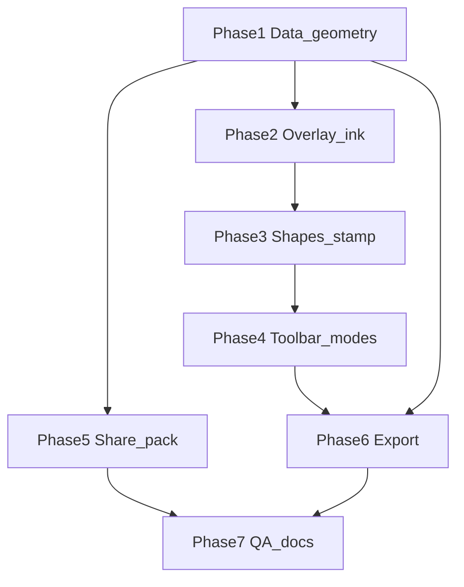

# Drawing PDF Markup — Task Breakdown

**Author:** Scoper Page team  
**Date:** 2026-08-03  
**Based on:** [Drawing PDF markup plan](/Users/christopherkruger/.cursor/plans/drawing_pdf_markup_6e60b292.plan.md), [TASK_BREAKDOWN_TEMPLATE.md](TASK_BREAKDOWN_TEMPLATE.md), [PRD.md](PRD.md)

**Project Focus:** On-brand **Mark drawing** mode on PDF preview: pen, highlighter, eraser, rectangle, ellipse, text, window stamp; persist in DuckDB; round-trip via share pack; merge **burned-in** drawing vectors into annotated PDF export — for architectural/drawing PDFs (e.g. window locations on plans).

**Package manager:** pnpm

**Task ID prefix:** `BDA-220`–`BDA-241` (continues after BDA-218 analyze→propose loop; BDA-219 reserved)

**Explicit non-goals (v1):** AI window detection; multi-user realtime; full Acrobat ink compatibility; markup on non-PDF document types; arbitrary color wheel; native PDF Ink annotations for drawing layer (burned-in primary).

---

## UX / mode rules (cross-cutting)

| Mode | Drawing tools | Block citation drag |
|------|---------------|---------------------|
| **View** | Off | Off (unless citation selected → Adjust block) |
| **Mark** | On | **Disabled** |
| **Adjust block** | Off | On (existing) |

Toggle: segmented **View | Mark** in [`PdfViewerToolbar`](../src/components/workspace/PdfViewerToolbar.tsx). Toolbar row 2 (Mark only): tools, brand color swatches, stroke `2 | 4 | 8` px.

---

## Task dependency graph

**Recommended ship order:** Phase 1 → 2 → 4 (partial: overlay before full toolbar) → 3 → 4 (complete) → 5 → 6 → 7.

---

## Phase 1: Data model, geometry & persistence

> **Purpose:** Types, DuckDB table, normalized coordinates, CRUD service — no UI yet

### **ID:** BDA-220

**Title:** PdfDrawingAnnotation types  
**Status:** Done  
**Dependencies:** None  
**Priority:** Critical  
**Description:** Add `PdfDrawingAnnotation` and a **geometry discriminated union** to [`types.ts`](../src/lib/types.ts): tools `pen | highlighter | rect | ellipse | text | stamp`; fields aligned with plan (`color`, `stroke_width`, `opacity`, `geometry_json`, optional `text_body`, `author_initials`, timestamps). Document `stampKind: 'window'` for stamp tool. Export types consumed by services and overlay.  
**Completed Changes:**
- ✅ `PdfDrawingTool`, `PdfDrawingStampKind`, `PdfDrawingNormalizedPoint`
- ✅ Geometry union: `stroke` (pen/highlighter), `rect`, `ellipse`, `text`, `stamp` (`stampKind: 'window'`)
- ✅ `PdfDrawingAnnotation` + `PdfDrawingAnnotationRecord` (DB row with `geometry_json`)
- ✅ [`pdf-drawing-annotations.ts`](../src/services/pdf-drawing-annotations.ts) — parse/serialize + record ↔ domain mappers
- ✅ Re-exports in [`lib/index.ts`](../src/lib/index.ts)
**Test Strategy:** `pnpm exec tsc --noEmit`; types imported from a stub service file without circular deps.  
**Test Results:**
- ✅ `pnpm exec tsc --noEmit`
**Assigned:** Completed  
**Context/Artifacts:** Plan §Data model; [`types.ts`](../src/lib/types.ts)

---

### **ID:** BDA-221

**Title:** DuckDB pdf_drawing_annotations schema  
**Status:** Done  
**Dependencies:** BDA-220  
**Priority:** Critical  
**Description:** Add table `pdf_drawing_annotations` to [`duckdb-schema.ts`](../src/lib/duckdb-schema.ts) with columns: `annotation_id`, `doc_id`, `page_num`, `tool`, `color`, `stroke_width`, `opacity`, `geometry_json`, `text_body`, `author_initials`, `created_at`, `updated_at`. Ensure init/migration path matches existing comment tables.  
**Completed Changes:**
- ✅ `CREATE TABLE pdf_drawing_annotations` in `DUCKDB_SCHEMA_STATEMENTS` (worker bootstrap on init)
- ✅ `runPdfDrawingAnnotationsSchemaHarness` — DESCRIBE columns + insert/select/delete smoke
- ✅ Dev harness chain in [`App.tsx`](../src/App.tsx) after `runBlockCommentsHarness`
**Test Strategy:** App boot / harness opens DB; `DESCRIBE` or insert smoke via annotation service (BDA-223).  
**Test Results:**
- ✅ `pnpm exec tsc --noEmit`
- ✅ Schema harness runs on dev app load (after DuckDB init)
**Assigned:** Completed  
**Context/Artifacts:** Plan §Data model; [`duckdb-schema.ts`](../src/lib/duckdb-schema.ts)

---

### **ID:** BDA-222

**Title:** Normalized page geometry helpers  
**Status:** Done  
**Dependencies:** BDA-220  
**Priority:** Critical  
**Description:** Create [`pdf-drawing-geometry.ts`](../src/lib/pdf-drawing-geometry.ts): normalize/denormalize between viewport pixels and **0–1 page media box** coordinates; reuse viewport helpers from [`citation-bbox.ts`](../src/lib/citation-bbox.ts) where applicable. Add **eraser hit-test** (distance to polyline / shape bounds). Unit-testable pure functions.  
**Completed Changes:**
- ✅ `normalizePoint`, `denormalizePoint`, `viewportSizeFromPageViewport`
- ✅ `normalizedStrokeBounds`, `normalizedGeometryBounds`, `distancePointToSegmentPx`
- ✅ `hitTestStroke`, `hitTestNormalizedRect`, `hitTestNormalizedEllipse`, `hitTestPdfDrawingGeometry`
- ✅ `runPdfDrawingGeometryHarness` in drawing markup unit harness chain
**Test Strategy:** Small Node/vitest or dev harness: round-trip a point at multiple zoom scales; hit-test known segment.  
**Test Results:**
- ✅ `pnpm exec tsc --noEmit`
- ✅ `runPdfDrawingGeometryHarness` (dev load via `runDrawingMarkupUnitHarnesses`)
**Assigned:** Completed  
**Context/Artifacts:** Plan §Canvas overlay; [`citation-bbox.ts`](../src/lib/citation-bbox.ts)

---

### **ID:** BDA-223

**Title:** Annotation CRUD service + harness  
**Status:** Done  
**Dependencies:** BDA-221, BDA-222  
**Priority:** Critical  
**Description:** Implement [`pdf-drawing-annotations.ts`](../src/services/pdf-drawing-annotations.ts): insert, update, delete, list by `doc_id`, list by `doc_id` + `page_num`. Optional: delete-last for undo (or defer stack to BDA-227). Add dev harness (mirror [`block-comments`](../src/services/block-comments.ts) patterns) proving create → list → delete.  
**Completed Changes:**
- ✅ `insertPdfDrawingAnnotation`, `updatePdfDrawingAnnotation`, `deletePdfDrawingAnnotation`
- ✅ `fetchPdfDrawingAnnotationById`, `fetchPdfDrawingAnnotationsForDoc`, `fetchPdfDrawingAnnotationsForPage`
- ✅ `runPdfDrawingAnnotationsCrudHarness` + dev chain in [`App.tsx`](../src/App.tsx)
- ✅ Schema harness refactored to use `insertPdfDrawingAnnotation`
**Test Strategy:** Run harness; `pnpm exec tsc --noEmit`.  
**Test Results:**
- ✅ `pnpm exec tsc --noEmit`
- ✅ `runPdfDrawingAnnotationsCrudHarness` on dev app load
**Assigned:** Completed  
**Context/Artifacts:** Plan §Services; [`block-comments.ts`](../src/services/block-comments.ts)

---

## Phase 2: SVG overlay & ink tools

> **Purpose:** Render annotations; pen, highlighter, eraser; undo/redo

### **ID:** BDA-224

**Title:** PdfDrawingOverlay SVG shell  
**Status:** Done  
**Dependencies:** BDA-222, BDA-223  
**Priority:** Critical  
**Description:** New [`PdfDrawingOverlay.tsx`](../src/components/workspace/PdfDrawingOverlay.tsx): SVG layer above PDF canvas; map stored normalized geometry to screen via BDA-222; render paths, rects, ellipses, text, stamps from props `annotations`. No tools yet — read-only render pass.  
**Completed Changes:**
- ✅ `PdfDrawingOverlay` + per-geometry SVG renderers (stroke, rect, ellipse, text, window stamp)
- ✅ Denormalize via [`pdf-drawing-geometry`](../src/lib/pdf-drawing-geometry.ts); `pointer-events-none` by default
- ✅ Optional `drawingAnnotations` on [`PdfPageCanvas`](../src/components/workspace/PdfPageCanvas.tsx)
**Test Strategy:** Story/dev: load fixture annotations on a page; visual check at 100% and 150% zoom.  
**Test Results:**
- ✅ `pnpm exec tsc --noEmit`
- 🔄 Manual: pass `drawingAnnotations` from DocumentViewer when wired (BDA-232)
**Assigned:** Completed  
**Context/Artifacts:** Plan §Components; [`PdfPageCanvas.tsx`](../src/components/workspace/PdfPageCanvas.tsx)

---

### **ID:** BDA-225

**Title:** Pen tool capture and commit  
**Status:** Done  
**Dependencies:** BDA-224  
**Priority:** High  
**Description:** Pointer down/move/up on overlay for **pen**: accumulate normalized points; on pointer up call `onCommit` → persist via BDA-223. Respect active color and stroke width from toolbar state (stub props until BDA-231).  
**Completed Changes:**
- ✅ Pen pointer capture + draft preview + `PdfDrawingPenCommit` on pointer up
- ✅ [`usePdfDrawingAnnotations`](../src/hooks/use-pdf-drawing-annotations.ts) → `insertPdfDrawingAnnotation`
- ✅ [`DocumentViewer`](../src/components/workspace/DocumentViewer.tsx) + [`PdfPageCanvas`](../src/components/workspace/PdfPageCanvas.tsx) wiring; `pdfMarkDrawingMode` on session store
- ✅ Dev: `Scoper.setPdfMarkDrawingMode(true)` in [`scoper-dev-tools.ts`](../src/lib/scoper-dev-tools.ts)
**Test Strategy:** Mark mode manual: draw line; reload page; line reappears from DB.  
**Test Results:**
- ✅ `pnpm exec tsc --noEmit`
- 🔄 Manual: `Scoper.setPdfMarkDrawingMode(true)` → draw on Original PDF → change page and return
**Assigned:** Completed  
**Context/Artifacts:** Plan §Architecture sequence diagram

---

### **ID:** BDA-226

**Title:** Highlighter and eraser tools  
**Status:** Done  
**Dependencies:** BDA-225  
**Priority:** High  
**Description:** **Highlighter:** same as pen with default opacity ~0.35 and wider default width. **Eraser:** pointer hit-test (BDA-222) against page annotations; delete matched row(s).  
**Completed Changes:**
- ✅ Highlighter stroke commit (`opacity` 0.35, min width 8px) + render
- ✅ Eraser drag/delete via `findPdfDrawingAnnotationAtPointer` + `deletePdfDrawingAnnotation`
- ✅ `pdfMarkTool` session state; dev `Scoper.setPdfMarkTool("highlighter"|"eraser")`
**Test Strategy:** Draw highlighter over plan; erase segment; DB count decreases.  
**Test Results:**
- ✅ `pnpm exec tsc --noEmit`
- ✅ Geometry harness covers annotation hit lookup
- 🔄 Manual: mark mode + highlighter/eraser via Scoper dev globals
**Assigned:** Completed  
**Context/Artifacts:** Plan §Toolbar layout

---

### **ID:** BDA-227

**Title:** Undo and redo stack  
**Status:** Done  
**Dependencies:** BDA-223, BDA-225  
**Priority:** Medium  
**Description:** Per doc/session undo/redo: stack of mutation ops (insert/delete ids) or soft-delete pattern; wire keyboard shortcuts if workspace already has pattern. Cap stack depth (e.g. 50) per plan risk table.  
**Completed Changes:**
- ✅ [`pdf-drawing-history.ts`](../src/lib/pdf-drawing-history.ts) — per-`doc_id` undo/redo stacks (cap 50)
- ✅ `restorePdfDrawingAnnotation` + history recording on insert/erase in hook
- ✅ `undoDrawingMark` / `redoDrawingMark` on `usePdfDrawingAnnotations`
- ✅ Mark mode ⌘/Ctrl+Z and ⇧+Z in [`DocumentViewer`](../src/components/workspace/DocumentViewer.tsx)
- ✅ `runPdfDrawingAnnotationsUndoHarness` (dev chain)
**Test Strategy:** Draw 3 strokes → undo twice → redo once → DB matches.  
**Test Results:**
- ✅ `pnpm exec tsc --noEmit`
- ✅ `runPdfDrawingAnnotationsUndoHarness`
- 🔄 Manual: mark mode + keyboard undo/redo after strokes
**Assigned:** Completed  
**Context/Artifacts:** Plan §Risks (cap undo stack)

---

## Phase 3: Shapes, text & window stamp

> **Purpose:** Non-ink markup tools

### **ID:** BDA-228

**Title:** Rectangle and ellipse tools  
**Status:** Done  
**Dependencies:** BDA-224  
**Priority:** High  
**Description:** Drag to define normalized bounding box / ellipse from corner drag; commit on pointer up. Render SVG `rect` / `ellipse` with stroke from active color/width.  
**Completed Changes:**
- ✅ `normalizedBoundsFromCorners` / `isNormalizedBoundsLargeEnough` in `pdf-drawing-geometry.ts`
- ✅ `PdfDrawingOverlay`: drag-create draft + `onShapeCommit` for `rect` | `ellipse`
- ✅ `usePdfDrawingAnnotations.commitShape`; `DocumentViewer` + `PdfPageCanvas` wiring
- ✅ Dev `Scoper.setPdfMarkTool("rect"|"ellipse")`; sky `#0EA5E9` shape color
- ✅ CRUD harness rect geometry round-trip
**Test Strategy:** Draw rect on plan; export preview in overlay matches drag bounds after zoom change.  
**Test Results:**
- ✅ Unit harnesses (geometry + CRUD rect); manual: mark mode + rect/ellipse drag persists after zoom  
**Assigned:** Unassigned  
**Context/Artifacts:** Plan §In scope v1

---

### **ID:** BDA-229

**Title:** Text label tool  
**Status:** Done  
**Dependencies:** BDA-224  
**Priority:** Medium  
**Description:** Click to place text anchor; capture `text_body` (inline input or small popover); store in annotation row. Render SVG `<text>` with readable size scaled by zoom.  
**Completed Changes:**
- ✅ Click-to-place inline label editor on `PdfDrawingOverlay` (`onTextCommit`)
- ✅ `usePdfDrawingAnnotations.commitText` persists `text_body` + `{ kind: 'text', x, y }`
- ✅ `DocumentViewer` / `PdfPageCanvas` wiring; dev `Scoper.setPdfMarkTool("text")`
- ✅ CRUD harness `W-12` text round-trip
**Test Strategy:** Place label "W-12"; reload; text persists at normalized position.  
**Test Results:**
- ✅ Unit harness (CRUD text); manual: click → type → Enter/blur persists after page reload  
**Assigned:** Unassigned  
**Context/Artifacts:** Plan §Data model (`text_body`)

---

### **ID:** BDA-230

**Title:** Window stamp tool  
**Status:** Done  
**Dependencies:** BDA-224  
**Priority:** High  
**Description:** Click-to-place stamp (~24px at 100% zoom): simple SVG icon (square + cross or "W"); `tool: stamp`, geometry includes position + `stampKind: 'window'`. v1: click-only (no drag) unless select tool added later.  
**Completed Changes:**
- ✅ Click-to-place `onStampCommit` on `PdfDrawingOverlay` (existing `WindowStampGraphic`, 24px default)
- ✅ `usePdfDrawingAnnotations.commitStamp`; `DocumentViewer` / `PdfPageCanvas` wiring
- ✅ Dev `Scoper.setPdfMarkTool("stamp")`; sky `#0EA5E9` stamp color
- ✅ CRUD harness window stamp geometry round-trip
**Test Strategy:** Place multiple stamps on `Windows_Drawing.pdf` plan sheet; counts in DB.  
**Test Results:**
- ✅ Unit harness (CRUD stamp); manual: multiple click-placed stamps persist per page  
**Assigned:** Unassigned  
**Context/Artifacts:** Plan §Window stamp; sample PDF in repo or test fixtures

---

## Phase 4: On-brand toolbar & viewer integration

> **Purpose:** Mark mode UX; wire DocumentViewer and PdfPageCanvas

### **ID:** BDA-231

**Title:** PdfMarkupToolbar component  
**Status:** Done  
**Dependencies:** BDA-225  
**Priority:** High  
**Description:** New [`PdfMarkupToolbar.tsx`](../src/components/workspace/PdfMarkupToolbar.tsx): icon tool group (`size="icon-xs"`, active = `ring-1 ring-primary/50 bg-muted`); color swatches Amber `#F59E0B`, Rose `#E11D48`, Sky `#0EA5E9`, neutral gray; stroke width `2 | 4 | 8`. Controlled props: `tool`, `color`, `strokeWidth`, `onChange`, undo/redo callbacks.  
**Completed Changes:**
- ✅ `PdfMarkupToolbar` with pen/highlighter/eraser/rect/ellipse/text/stamp tools, swatches, stroke widths, undo/redo
- ✅ Exported `PdfMarkupTool`, color/stroke constants for BDA-234 wiring
**Test Strategy:** Visual QA light + dark theme; active tool state obvious.  
**Test Results:**
- ✅ Component ready for integration in BDA-234; manual visual QA when wired  
**Assigned:** Unassigned  
**Context/Artifacts:** [`brand-accent.ts`](../src/lib/brand-accent.ts); [`PdfViewerToolbar.tsx`](../src/components/workspace/PdfViewerToolbar.tsx)

---

### **ID:** BDA-232

**Title:** DocumentViewer markMode state  
**Status:** Done  
**Dependencies:** BDA-223, BDA-231  
**Priority:** Critical  
**Description:** [`DocumentViewer.tsx`](../src/components/workspace/DocumentViewer.tsx): `markMode` boolean; on page change fetch annotations for page; pass to canvas/overlay; on commit refresh list and persist. Load author initials from existing user/session pattern if available.  
**Completed Changes:**
- ✅ `markMode` alias over session `pdfMarkDrawingMode`; page-scoped `usePdfDrawingAnnotations` clears stale rows on page/doc change
- ✅ Session `pdfMarkColor` / `pdfMarkStrokeWidth` / `PdfMarkSessionTool` (incl. eraser); commits persist via hook + `refresh` on failure
- ✅ Author initials via `reviewerName` → `insertPdfDrawingAnnotation` (existing BDA-223 path)
- ✅ `runPdfDrawingAnnotationsPageScopeHarness` (pages 8 vs 9)
**Test Strategy:** Navigate pages 8→9; annotations scoped per page.  
**Test Results:**
- ✅ Page-scope harness; manual mark mode + page navigation shows per-page marks only  
**Assigned:** Unassigned  
**Context/Artifacts:** Plan §Wire DocumentViewer

---

### **ID:** BDA-233

**Title:** PdfPageCanvas overlay and mode gating  
**Status:** Done  
**Dependencies:** BDA-224, BDA-232  
**Priority:** Critical  
**Description:** [`PdfPageCanvas.tsx`](../src/components/workspace/PdfPageCanvas.tsx): mount `PdfDrawingOverlay` when `markMode`; when `markMode`, **disable** block region drag / citation adjust; when citation editable and not mark mode, keep existing behavior.  
**Completed Changes:**
- ✅ Overlay mounts whenever `markMode` (or persisted marks when view-only)
- ✅ `citationRegionEditable = editable && !markMode`; drawing layer `z-[1]` in mark mode
- ✅ `DocumentViewer` passes `markMode`; `canAdjustRegion` already excludes mark mode
**Test Strategy:** Regression: citation adjust works with Mark off; with Mark on, no block drag.  
**Test Results:**
- ✅ Manual: Mark off + citation → drag adjust; Mark on → overlay interactive, no highlight editor  
**Assigned:** Unassigned  
**Context/Artifacts:** Plan §Risks (tool conflict)

---

### **ID:** BDA-234

**Title:** View Mark segmented toggle  
**Status:** Done  
**Dependencies:** BDA-231, BDA-232  
**Priority:** High  
**Description:** Extend [`PdfViewerToolbar.tsx`](../src/components/workspace/PdfViewerToolbar.tsx): row 1 unchanged; **View | Mark** segmented control; row 2 shows `PdfMarkupToolbar` only in Mark mode; hint line e.g. `Mark window locations on the plan · Page N of M · Z%`.  
**Completed Changes:**
- ✅ Segmented **View | Mark** on row 1 (`TabsList variant="segmented"`)
- ✅ Row 2 `PdfMarkupToolbar` when Mark mode; wired to session + undo/redo in `DocumentViewer`
- ✅ Mark hint includes page count and zoom %
**Test Strategy:** Toggle Mark; toolbar row 2 appears/disappears; hint updates page/zoom.  
**Test Results:**
- ✅ Manual: toggle Mark shows/hides markup row; tools/colors/undo wired  
**Assigned:** Unassigned  
**Context/Artifacts:** [`SplitDocumentView.tsx`](../src/components/workspace/SplitDocumentView.tsx) TabsList segmented pattern

---

## Phase 5: Share pack round-trip

> **Purpose:** Collaborator handoff of drawing marks with project share pack

### **ID:** BDA-235

**Title:** Share-table registry for annotations  
**Status:** Done  
**Dependencies:** BDA-221  
**Priority:** High  
**Description:** Register `pdf_drawing_annotations` in [`share-table.ts`](../src/lib/share-table.ts) with column list and export order consistent with other tables. Document whether **SHARE_PACK_VERSION** bump is required alongside existing v2 proposal tables.  
**Completed Changes:**
- ✅ Registry entry `pdf_drawing_annotations` (import order 7, after `comments`; FK `doc_id` → `documents`)
- ✅ **`SHARE_PACK_VERSION` bumped 2 → 3** — new required `tables` key; v2 packs cannot import on v3 builds (by design)
- ✅ `emptyShareTables()` + `runShareTableRegistryHarness()` (SELECT/INSERT column alignment)
**Test Strategy:** Registry includes table; export SQL fragment generates valid INSERT shape.  
**Test Results:**
- ✅ `runShareTableRegistryHarness` in share pack harness; static QA asserts v3 + registry id  
**Assigned:** Unassigned  
**Context/Artifacts:** [`share-table.ts`](../src/lib/share-table.ts)

**Share pack changelog:** v3 adds `pdf_drawing_annotations` table to encrypted payload (proposal tables remain; import order 8–10 unchanged relative to each other).

---

### **ID:** BDA-236

**Title:** Share pack export import rows  
**Status:** Done  
**Dependencies:** BDA-235, BDA-223  
**Priority:** High  
**Description:** Wire [`share-pack-export.ts`](../src/services/share-pack-export.ts) / import path to include drawing annotation rows for shared docs; mirror [`block-comments`](../src/services/block-comments.ts) filtering by doc ids in pack.  
**Completed Changes:**
- ✅ `filterShareTablesByDocumentIds` on export + import (annotations by `doc_id`, comments by shared `block_id`)
- ✅ Import dedupes `annotation_id` / `comment_id` via `INSERT OR REPLACE`
- ✅ `runSharePackDrawingAnnotationsHarness` (orphan doc excluded; round-trip count matches)
**Test Strategy:** Harness: mark doc → export pack → fresh DB import → annotation count matches.  
**Test Results:**
- ✅ `runSharePackDrawingAnnotationsHarness` in share pack harness chain  
**Assigned:** Unassigned  
**Context/Artifacts:** Plan §Share pack

---

## Phase 6: Burned-in PDF export

> **Purpose:** Subcontractor-ready PDF with drawing vectors merged

### **ID:** BDA-237

**Title:** pdf-drawing-export pdf-lib renderer  
**Status:** Done  
**Dependencies:** BDA-222, BDA-220  
**Priority:** Critical  
**Description:** Create [`pdf-drawing-export.ts`](../src/lib/pdf-drawing-export.ts): given `PDFPage` + annotations for that page, draw paths (pen/highlighter), rects, ellipses, text, stamp icons using same transform as [`liteParseBboxToPdfUserSpace`](../src/lib/citation-bbox.ts) / page media box.  
**Completed Changes:**
- ✅ `drawPdfDrawingAnnotationsOnPage` + normalized → PDF user-space helpers
- ✅ Per-tool renderers: stroke, rect, ellipse, text, window stamp
- ✅ `runPdfDrawingExportHarness` (rect + stamp → PDF bytes smoke)
**Test Strategy:** Unit/harness: single-page PDF + one rect → output bytes length / operator smoke.  
**Test Results:**
- ✅ `runPdfDrawingExportHarness` in dev App chain  
**Assigned:** Unassigned  
**Context/Artifacts:** Plan §Export behavior

---

### **ID:** BDA-238

**Title:** Merge drawing layer in export-annotated-pdf  
**Status:** Done  
**Dependencies:** BDA-237, BDA-223  
**Priority:** Critical  
**Description:** Extend [`export-annotated-pdf.ts`](../src/services/export-annotated-pdf.ts): load `pdf_drawing_annotations` for doc; on **burned-in** path, invoke BDA-237 after embed; optional checkbox **Include drawing marks** (default on when any marks exist). Block comment export unchanged when no drawing marks.  
**Completed Changes:**
- ✅ `fetchPdfDrawingAnnotationsForDoc` + page grouping on export
- ✅ `includeDrawingMarks` on `ExportAnnotatedPdfOptions` (default when any rows exist)
- ✅ Burned-in path calls `drawPdfDrawingAnnotationsOnPage` after block notes; markup unchanged
- ✅ `downloadAnnotatedPdf` forwards full options
**Test Strategy:** Export with block comments only vs with drawing marks; second file visually contains vectors.  
**Test Results:**
- ✅ `runExportAnnotatedPdfDrawingMarksHarness` in dev App chain (size smoke + markup ignores drawings)  
**Assigned:** Unassigned  
**Context/Artifacts:** [`export-annotated-pdf.ts`](../src/services/export-annotated-pdf.ts)

---

### **ID:** BDA-239

**Title:** Footer export menu drawing marks  
**Status:** Done  
**Dependencies:** BDA-238  
**Priority:** Medium  
**Description:** [`SplitDocumentView`](../src/components/workspace/SplitDocumentView.tsx) footer: add **Export PDF with drawing marks** (or extend existing export menu with rose/neutral `BrandMenuSection`); wire to export with drawing layer. Keep existing toggleable markup / burned-in notes for block comments.  
**Completed Changes:**
- ✅ Rose `BrandMenuSection` when doc has drawing marks (count refreshed on open)
- ✅ **Export PDF with drawing marks** + **Burned-in notes only** → `includeDrawingMarks` true/false
- ✅ Amber markup / burned-in paths unchanged; `handleExportPdf` forwards full export options
- ✅ `rose` accent in [`brand-accent.ts`](../src/lib/brand-accent.ts)
**Test Strategy:** Manual: export from split view; open in Preview/Acrobat.  
**Test Results:**
- 🔄 Manual checklist (BDA-241)  
**Assigned:** Unassigned  
**Context/Artifacts:** Plan §Export menu; [`BrandAccent`](../src/lib/brand-accent.ts) optional `rose`

---

## Phase 7: QA, harnesses & documentation

> **Purpose:** Automated smoke, manual checklist, PRD/index cross-links

### **ID:** BDA-240

**Title:** Drawing markup dev harnesses  
**Status:** Done  
**Dependencies:** BDA-223, BDA-238  
**Priority:** High  
**Description:** Add runnable harness chain: CRUD round-trip; optional export byte smoke (BDA-237). Register npm script if consistent with `qa:proposal` (e.g. `qa:drawing-markup` or extend proposal-dev).  
**Completed Changes:**
- ✅ [`drawing-markup-dev-harnesses.ts`](../src/services/drawing-markup-dev-harnesses.ts) — unit (geometry), async (schema/CRUD/page/undo/export/annotated PDF), share round-trip wrapper
- ✅ [`App.tsx`](../src/App.tsx) + [`share-pack-harness.ts`](../src/services/share-pack-harness.ts) wired to consolidated runners; geometry moved off `proposal-dev-harnesses`
- ✅ `pnpm qa:drawing-markup` → [`scripts/run-drawing-markup-qa-static.mjs`](../scripts/run-drawing-markup-qa-static.mjs) + `tsc --noEmit`
**Test Strategy:** `pnpm run qa:drawing-markup` (or documented command) exits 0.  
**Test Results:**
- ✅ `pnpm qa:drawing-markup` (static + tsc); runtime CRUD/export on `pnpm dev` dev chain  
**Assigned:** Unassigned  
**Context/Artifacts:** Plan §Test strategy

---

### **ID:** BDA-241

**Title:** Manual checklist and doc cross-links  
**Status:** To Do  
**Dependencies:** BDA-234, BDA-236, BDA-239, BDA-240  
**Priority:** Medium  
**Description:** Add **Manual test checklist** section below (Windows_Drawing.pdf). Update [`TASK_BREAKDOWN.md`](TASK_BREAKDOWN.md) related docs + changelog. Update [`PRD.md`](PRD.md) secondary goals: drawing markup scoped (moves from implicit non-goal). Optional v1.1: `drawing-markup:1` PDF keyword in [`import-pdf-comments.ts`](../src/services/import-pdf-comments.ts).  
**Completed Changes:**
- 🔄 Checklist finalized
- 🔄 TASK_BREAKDOWN.md v1.4 link
- 🔄 PRD note
**Test Strategy:** Peer executes checklist on sample drawing PDF.  
**Test Results:**
- 🔄 Pending implementation  
**Assigned:** Unassigned  
**Context/Artifacts:** This file; plan §Test strategy

---

## Manual test checklist (BDA-241)

Use a drawing PDF (e.g. `Windows_Drawing.pdf` — plan + elevation sheets).

- [ ] Upload PDF; open **Preview / Original** in split view (dark canvas OK).
- [ ] Default **View** mode: pan/zoom works; no drawing tools visible.
- [ ] Toggle **Mark**: toolbar shows pen, highlighter, eraser, rect, ellipse, text, window stamp; brand colors and stroke widths work.
- [ ] **Highlighter** on plan area (amber/yellow family); **pen** rose on elevation; marks persist after reload.
- [ ] **Window stamp** click places icon; multiple stamps on one page.
- [ ] **Eraser** removes a stroke; **undo/redo** behaves as expected.
- [ ] Switch to citation **Adjust block** (Mark off, citation selected): block drag works; Mark mode disables block drag.
- [ ] **Export PDF with drawing marks**: burned-in vectors visible in external viewer.
- [ ] Export with **no** drawing marks: block-comment export behavior unchanged from baseline.
- [ ] **Share pack** export/import: annotation count matches on marked document.

---

## Risks (from plan)

| Risk | Mitigation | Task |
|------|------------|------|
| Tool conflict with block drag | Mode enum; BDA-233 gating | BDA-233 |
| Large PDFs / many strokes | Page-scoped fetch; undo cap | BDA-223, BDA-227 |
| Share pack version churn | Single bump + note | BDA-235 |
| Preview parity creep | Fixed palette/tools | BDA-231 |

---

## Mapping: plan todos → atomic IDs

| Plan todo | Atomic tasks |
|-----------|----------------|
| schema-crud | BDA-220, BDA-221, BDA-222, BDA-223 |
| overlay-ui | BDA-224, BDA-225, BDA-226, BDA-231, BDA-232, BDA-233, BDA-234 |
| tools-shapes-stamp | BDA-228, BDA-229, BDA-230 |
| share-pack | BDA-235, BDA-236 |
| export-pdf | BDA-237, BDA-238, BDA-239 |
| docs-qa | BDA-240, BDA-241 (+ this document) |

---

**Change log:**

| Version | Date | Changes |
|---------|------|---------|
| v1.0 | 2026-08-03 | Initial atomic breakdown BDA-220–BDA-241 from drawing_pdf_markup plan |
