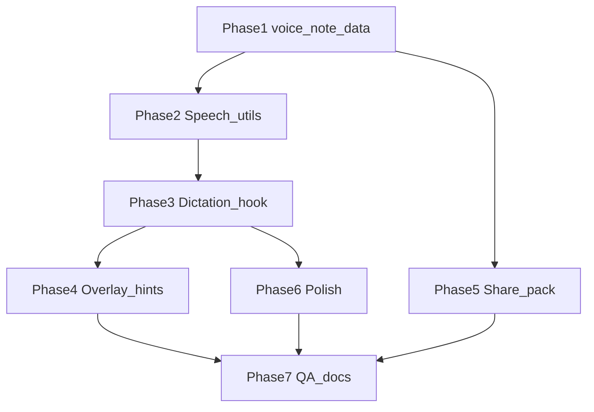

# Mark Voice Notation — Task Breakdown

**Author:** Scoper Page team  
**Date:** 2026-08-21  
**Based on:** [mark_voice_notation plan](plans/mark_voice_notation.md), [TASK_BREAKDOWN_TEMPLATE.md](TASK_BREAKDOWN_TEMPLATE.md), [TASK_BREAKDOWN_DRAWING_PDF_MARKUP.md](TASK_BREAKDOWN_DRAWING_PDF_MARKUP.md) (BDA-220–241)

**Project Focus:** **Hold Space** voice notation on any selected PDF drawing mark (stamp, text, shape, stroke): Web Speech API dictation, live preview while held, persist optional transcript on `pdf_drawing_annotations.voice_note` with share-pack round-trip — for field notes on plan markup (e.g. window takeoff commentary).

**Package manager:** pnpm

**Task ID prefix:** `BDA-242`–`BDA-258` (continues after BDA-241 drawing markup QA)

**Reference implementation:** Foundry rubric dictation — `foundry-model-eval` [`ReviewNotesField.tsx`](file:///Users/christopherkruger/Projects/Adobe/foundry-model-eval/src/components/ReviewNotesField.tsx), [`useSpeechNotes.ts`](file:///Users/christopherkruger/Projects/Adobe/foundry-model-eval/src/hooks/useSpeechNotes.ts), [`speechNotes.ts`](file:///Users/christopherkruger/Projects/Adobe/foundry-model-eval/src/utils/speechNotes.ts). **Difference:** foundry **toggles** Space; Scoper uses **hold-to-talk** (keydown start, keyup commit).

**Explicit non-goals (v1):** Whisper/WebGPU STT for marks; burn-in `voice_note` on PDF export; multi-mark batch dictation; undo/redo for voice_note; custom language picker (use `navigator.language`).

---

## UX rules (cross-cutting)

| Condition | Behavior |
|-----------|----------|
| **Mark mode off** | Dictation disabled |
| **Exactly one mark selected** | Hold Space eligible |
| **0 or 2+ marks selected** | Hold Space ignored; hint explains |
| **Focus in input/textarea** | Space not captured (use `isPdfMarkupShortcutTarget`) |
| **Chat voice session active** | Mark dictation blocked (mutual exclusion with [`chat-voice-session.ts`](../src/services/chat-voice-session.ts)) |
| **Speech API unavailable** | Hint only; no crash |
| **`text_body` vs `voice_note`** | Text tool label = typed `text_body`; dictation = spoken `voice_note` (separate fields) |

**Keyboard:** `keydown` Space → start listening + `preventDefault` (no scroll); `keyup` Space → stop + commit append to existing `voice_note`. Ignore `e.repeat`.

---

## Task dependency graph

**Recommended ship order:** Phase 1 → 2 → 3 → 4 → 5 (parallel with 4) → 6 → 7.

---

## Phase 1: `voice_note` data model and persistence

> **Purpose:** Extend drawing annotation rows with optional spoken notation — no UI yet

### **ID:** BDA-242

**Title:** voice_note on PdfDrawingAnnotation types  
**Status:** Done  
**Dependencies:** None (builds on BDA-220 types)  
**Priority:** Critical  
**Description:** Add optional `voice_note?: string` to `PdfDrawingAnnotation` and `PdfDrawingAnnotationRecord` in [`types.ts`](../src/lib/types.ts). Document semantics: append-only field notes from dictation; distinct from `text_body` on text marks. Re-export if needed from [`lib/index.ts`](../src/lib/index.ts).  
**Completed Changes:**
- ✅ Add `voice_note?: string` to domain + record types
- ✅ JSDoc on field purpose and v1 append-on-commit behavior
**Test Strategy:** `pnpm exec tsc -b`; no breaking changes to existing annotation consumers.  
**Test Results:**
- ✅ `pnpm exec tsc -b` passes
**Assigned:** Completed  
**Context/Artifacts:** [plans/mark_voice_notation.md](plans/mark_voice_notation.md) §1; BDA-220

---

### **ID:** BDA-243

**Title:** DuckDB voice_note column migration  
**Status:** Done  
**Dependencies:** BDA-242  
**Priority:** Critical  
**Description:** Add migration in [`duckdb-schema.ts`](../src/lib/duckdb-schema.ts): `ALTER TABLE pdf_drawing_annotations ADD COLUMN IF NOT EXISTS voice_note VARCHAR` in `DUCKDB_MIGRATION_STATEMENTS`. Extend schema harness (mirror BDA-221) to assert column exists after init.  
**Completed Changes:**
- ✅ Migration statement in `DUCKDB_MIGRATION_STATEMENTS`
- ✅ `voice_note` on CREATE TABLE for fresh installs
- ✅ Harness DESCRIBE includes `voice_note`; raw insert/select smoke
**Test Strategy:** Dev app load runs harness; existing sessions migrate without data loss.  
**Test Results:**
- ✅ `pnpm exec tsc -b` passes
- ✅ `runPdfDrawingAnnotationsSchemaHarness` column list + voice_note round-trip
**Assigned:** Completed  
**Context/Artifacts:** [`duckdb-schema.ts`](../src/lib/duckdb-schema.ts); BDA-221

---

### **ID:** BDA-244

**Title:** Annotation CRUD voice_note fields  
**Status:** Done  
**Dependencies:** BDA-243  
**Priority:** Critical  
**Description:** Update [`pdf-drawing-annotations.ts`](../src/services/pdf-drawing-annotations.ts): include `voice_note` in SELECT lists, `INSERT`, `UPDATE`, record mappers, `UpdatePdfDrawingAnnotationInput`. Optional `voice_note` on insert (default null). Extend existing CRUD harness with round-trip string.  
**Completed Changes:**
- ✅ Column in all SQL paths (SELECT, INSERT, UPDATE)
- ✅ `normalizeRow` / record mappers; `Insert` + `Update` input types
- ✅ CRUD harness: update voice_note → fetch → clear
**Test Strategy:** `runPdfDrawingAnnotationsCrudHarness`; `pnpm exec tsc -b`.  
**Test Results:**
- ✅ `pnpm exec tsc -b` passes
**Assigned:** Completed  
**Context/Artifacts:** BDA-223; [`pdf-drawing-annotations.ts`](../src/services/pdf-drawing-annotations.ts)

---

### **ID:** BDA-245

**Title:** Share pack voice_note round-trip  
**Status:** Done  
**Dependencies:** BDA-244  
**Priority:** High  
**Description:** Add `voice_note` to [`share-table.ts`](../src/lib/share-table.ts) registry for `pdf_drawing_annotations` (export SELECT + import column list). Verify [`share-pack-import.ts`](../src/services/share-pack-import.ts) / duckdb share path preserves field.  
**Completed Changes:**
- ✅ `voice_note` in share-table columns + SELECT for `pdf_drawing_annotations`
- ✅ `assertShareTablesShape` fills missing registry columns as null (older packs without `voice_note`)
- ✅ `runSharePackDrawingAnnotationsHarness`: export + import asserts `voice_note`
- ✅ Static QA asserts `voice_note` in share-table registry
**Test Strategy:** Export workspace with dictated mark → import in fresh session → `voice_note` intact.  
**Test Results:**
- ✅ `pnpm exec tsc -b` passes
- ✅ `pnpm qa:drawing-markup` static checks pass
**Assigned:** Completed  
**Context/Artifacts:** BDA-224 share pack v3; [`share-table.ts`](../src/lib/share-table.ts)

---

### **ID:** BDA-246

**Title:** Hook updateMarkVoiceNote  
**Status:** Done  
**Dependencies:** BDA-244  
**Priority:** Critical  
**Description:** Add `updateMarkVoiceNote(annotationId, voice_note)` to [`use-pdf-drawing-annotations.ts`](../src/hooks/use-pdf-drawing-annotations.ts): call `updatePdfDrawingAnnotation`, patch local `annotations` state. v1: **no** undo history op (same as move). Export for `DocumentViewer` dictation commit.  
**Completed Changes:**
- ✅ `updateMarkVoiceNote` callback patches local state on success (no undo op)
- ✅ Error path: `console.error` + `refresh()` fallback
**Test Strategy:** Service path covered by BDA-244 CRUD harness; hook mirrors `moveDrawingMark`.  
**Test Results:**
- ✅ `pnpm exec tsc -b` passes
**Assigned:** Completed  
**Context/Artifacts:** [`use-pdf-drawing-annotations.ts`](../src/hooks/use-pdf-drawing-annotations.ts)

---

## Phase 2: Web Speech utilities

> **Purpose:** Browser STT layer ported from foundry — separate from chat Whisper (BDA-181–195)

### **ID:** BDA-247

**Title:** speech-notes pure utilities  
**Status:** To Do  
**Dependencies:** None  
**Priority:** Critical  
**Description:** Create [`src/lib/speech-notes.ts`](../src/lib/speech-notes.ts): port `appendSpeechTranscript`, `getSpeechRecognitionCtor`, `finalTranscriptsFromEvent`, `speechNotesAvailable(win)` from foundry [`speechNotes.ts`](file:///Users/christopherkruger/Projects/Adobe/foundry-model-eval/src/utils/speechNotes.ts). Gate: `isSecureContext` + ctor present (**no** foundry `AUTH_ENABLED` check). Add `runSpeechNotesHarness()` mirroring foundry unit tests.  
**Completed Changes:**
- 🔄 Pure functions + minimal SpeechRecognition typing
- 🔄 Dev harness in markup or voice harness chain
**Test Strategy:** Harness append + availability cases; `pnpm exec tsc -b`.  
**Test Results:**
- 🔄 Pending implementation
**Assigned:** Unassigned  
**Context/Artifacts:** Foundry FME-STD-043 pattern; [plans/mark_voice_notation.md](plans/mark_voice_notation.md) §2

---

### **ID:** BDA-248

**Title:** useSpeechNotes hook  
**Status:** To Do  
**Dependencies:** BDA-247  
**Priority:** Critical  
**Description:** Create [`src/hooks/use-speech-notes.ts`](../src/hooks/use-speech-notes.ts): port foundry [`useSpeechNotes`](file:///Users/christopherkruger/Projects/Adobe/foundry-model-eval/src/hooks/useSpeechNotes.ts) with **`startListening()` / `stopListening()`** exposed separately (not toggle-only). `continuous: true`, `interimResults: true`, `onTranscript` for **final** chunks only. Cleanup on unmount (`abort`).  
**Completed Changes:**
- 🔄 Hook API for mark dictation consumer
- 🔄 Error messages for not-allowed / service-not-allowed
**Test Strategy:** Manual in dev: start/stop without React UI; optional mock ctor test.  
**Test Results:**
- 🔄 Pending implementation
**Assigned:** Unassigned  
**Context/Artifacts:** BDA-247; foundry `useSpeechNotes.ts`

---

## Phase 3: Hold-Space dictation controller

> **Purpose:** Orchestrate hold-to-talk, draft buffer, commit to DuckDB

### **ID:** BDA-249

**Title:** useMarkDictation hook  
**Status:** To Do  
**Dependencies:** BDA-246, BDA-248  
**Priority:** Critical  
**Description:** Create [`src/hooks/use-mark-dictation.ts`](../src/hooks/use-mark-dictation.ts). State: `idle | listening | error`, `targetAnnotationId`, `draftNote`, `committedPreview`. API: `handleSpaceKeyDown`, `handleSpaceKeyUp`, `onSelectionChange` (commit if listening), `onWindowBlur`. Append finals via `appendSpeechTranscript` into draft; on keyup merge draft onto existing `voice_note` from annotation row and call `updateMarkVoiceNote`.  
**Completed Changes:**
- 🔄 Hold-space lifecycle
- 🔄 Selection-change / blur commit guards
- 🔄 `runMarkDictationMergeHarness` for append-merge logic
**Test Strategy:** Harness for merge math; manual mic test in Chrome localhost.  
**Test Results:**
- 🔄 Pending implementation
**Assigned:** Unassigned  
**Context/Artifacts:** [plans/mark_voice_notation.md](plans/mark_voice_notation.md) §3; BDA-237 selection state

---

### **ID:** BDA-250

**Title:** DocumentViewer Space key wiring  
**Status:** To Do  
**Dependencies:** BDA-249  
**Priority:** Critical  
**Description:** Wire [`DocumentViewer.tsx`](../src/components/workspace/DocumentViewer.tsx): `window` `keydown`/`keyup` for Space when `markMode`; integrate `useMarkDictation`; pass `dictationTargetId`, `dictationDraft`, `isDictating` to canvas. Guard: `isPdfMarkupShortcutTarget`, `isChatVoiceSessionActive()`, exactly one `selectedDrawingAnnotationIds`. Update toolbar hint string (extend existing mark hint block).  
**Completed Changes:**
- 🔄 Key listeners with preventDefault on keydown
- 🔄 Hint: select one mark / listening / speech unavailable
**Test Strategy:** Mark mode → select stamp → hold Space → speak → release → hint clears; reload persists note.  
**Test Results:**
- 🔄 Pending implementation
**Assigned:** Unassigned  
**Context/Artifacts:** [`DocumentViewer.tsx`](../src/components/workspace/DocumentViewer.tsx); [`pdf-markup-tool-shortcuts.ts`](../src/lib/pdf-markup-tool-shortcuts.ts)

---

### **ID:** BDA-251

**Title:** PdfPageCanvas dictation props  
**Status:** To Do  
**Dependencies:** BDA-250  
**Priority:** High  
**Description:** Extend [`PdfPageCanvas.tsx`](../src/components/workspace/PdfPageCanvas.tsx) props: `dictationTargetId`, `dictationDraft`, `isDictating` (or single `dictationState` object). Pass through to [`PdfDrawingOverlay.tsx`](../src/components/workspace/PdfDrawingOverlay.tsx). No keyboard logic in canvas layer.  
**Completed Changes:**
- 🔄 Typed props + forwarding
**Test Strategy:** `pnpm exec tsc -b`; overlay receives props when dictating.  
**Test Results:**
- 🔄 Pending implementation
**Assigned:** Unassigned  
**Context/Artifacts:** BDA-225 overlay wiring pattern

---

## Phase 4: Overlay and toolbar UX

> **Purpose:** Visual feedback for listening, saved notes, and discoverability

### **ID:** BDA-252

**Title:** Listening ring and draft preview  
**Status:** To Do  
**Dependencies:** BDA-251  
**Priority:** High  
**Description:** In [`PdfDrawingOverlay.tsx`](../src/components/workspace/PdfDrawingOverlay.tsx): when `isDictating && dictationTargetId`, render animated dashed ring using `normalizedAnnotationMarqueeBounds`. Optional truncated `dictationDraft` text bubble near mark anchor (all geometry kinds).  
**Completed Changes:**
- 🔄 `DictationListeningRing` + preview graphic components
- 🔄 Uses display annotation list (respect move preview if active)
**Test Strategy:** Visual manual on `Windows_Drawing.pdf` full-page mark mode.  
**Test Results:**
- 🔄 Pending implementation
**Assigned:** Unassigned  
**Context/Artifacts:** [`pdf-drawing-geometry.ts`](../src/lib/pdf-drawing-geometry.ts) marquee bounds

---

### **ID:** BDA-253

**Title:** Voice notation badge on marks  
**Status:** To Do  
**Dependencies:** BDA-251  
**Priority:** High  
**Description:** Render small mic/speech indicator on marks where `voice_note?.trim()` is non-empty. Position using marquee bounds top-right. `title` or Tooltip with full note text (read-only v1). Visible in View and Mark modes when annotations shown.  
**Completed Changes:**
- 🔄 Badge component in overlay SVG/HTML layer
- 🔄 Does not block pointer hit-testing for select/hand
**Test Strategy:** Dictate on stamp → badge appears; hover shows full text.  
**Test Results:**
- 🔄 Pending implementation
**Assigned:** Unassigned  
**Context/Artifacts:** BDA-252 overlay patterns

---

### **ID:** BDA-254

**Title:** Toolbar tooltip dictation hint  
**Status:** To Do  
**Dependencies:** BDA-250  
**Priority:** Medium  
**Description:** Update [`PdfMarkupToolbar.tsx`](../src/components/workspace/PdfMarkupToolbar.tsx) Select tool hint: *"Select a mark, hold Space to dictate"*. Optional mic icon disabled state when `!speechNotesAvailable`. Do not add Space to tool shortcut map (conflicts with hold-to-talk).  
**Completed Changes:**
- 🔄 Tooltip copy update
**Test Strategy:** Hover Select tool in mark mode; copy matches UX rules.  
**Test Results:**
- 🔄 Pending implementation
**Assigned:** Unassigned  
**Context/Artifacts:** BDA-236 tooltips; [`PdfMarkupToolbar.tsx`](../src/components/workspace/PdfMarkupToolbar.tsx)

---

## Phase 5: Share and polish

> **Purpose:** Round-trip verification and flow shortcuts

### **ID:** BDA-255

**Title:** Auto-select mark after stamp  
**Status:** To Do  
**Dependencies:** BDA-250  
**Priority:** Low  
**Description:** After successful stamp commit in [`DocumentViewer`](../src/components/workspace/DocumentViewer.tsx) / overlay callback, set `selectedDrawingAnnotationIds` to `[newAnnotationId]` so user can immediately hold Space. Only when select/hand not required for first click.  
**Completed Changes:**
- 🔄 Return saved annotation id from commit path
- 🔄 `setSelectedDrawingAnnotationIds([id])`
**Test Strategy:** Place window stamp → hold Space without manual select → dictation works.  
**Test Results:**
- 🔄 Pending implementation
**Assigned:** Unassigned  
**Context/Artifacts:** Window takeoff UX; BDA-230 stamp tool

---

### **ID:** BDA-256

**Title:** Clear voice_note on selection  
**Status:** To Do  
**Dependencies:** BDA-246, BDA-253  
**Priority:** Low  
**Description:** When exactly one mark selected and it has `voice_note`, show compact actions in toolbar hint row or overlay popover: **Clear notation** (sets `voice_note` null). Keyboard shortcut optional (defer).  
**Completed Changes:**
- 🔄 Clear button + confirm or single-click clear
- 🔄 Updates via `updateMarkVoiceNote(id, '')`
**Test Strategy:** Dictate → clear → badge gone after reload.  
**Test Results:**
- 🔄 Pending implementation
**Assigned:** Unassigned  
**Context/Artifacts:** v1 view notation via badge tooltip; clear is minimal edit UX

---

## Phase 6: QA, harnesses, and documentation

> **Purpose:** Static checks, dev harness chain, manual checklist, index links

### **ID:** BDA-257

**Title:** Static QA and dev harnesses  
**Status:** To Do  
**Dependencies:** BDA-247, BDA-249, BDA-250  
**Priority:** High  
**Description:** Extend [`drawing-markup-dev-harnesses.ts`](../src/services/drawing-markup-dev-harnesses.ts) or new `mark-voice-notation-harness.ts`: speech-notes + merge harnesses. Extend [`run-drawing-markup-qa-static.mjs`](../scripts/run-drawing-markup-qa-static.mjs) to assert `speech-notes.ts`, `use-mark-dictation.ts`, DocumentViewer Space listener, share-table `voice_note` column. Wire into [`App.tsx`](../src/App.tsx) dev chain.  
**Completed Changes:**
- 🔄 Unit harnesses
- 🔄 Static script checks
- 🔄 `pnpm qa:drawing-markup` still passes
**Test Strategy:** `pnpm qa:drawing-markup`; dev console no `[dev-harness]` errors.  
**Test Results:**
- 🔄 Pending implementation
**Assigned:** Unassigned  
**Context/Artifacts:** BDA-240–241 QA pattern

---

### **ID:** BDA-258

**Title:** Manual QA checklist and doc index  
**Status:** To Do  
**Dependencies:** BDA-252, BDA-253, BDA-245, BDA-257  
**Priority:** Medium  
**Description:** Add **Manual QA** section to this doc (checklist below). Link from [`TASK_BREAKDOWN.md`](TASK_BREAKDOWN.md) and [`TASK_BREAKDOWN_DRAWING_PDF_MARKUP.md`](TASK_BREAKDOWN_DRAWING_PDF_MARKUP.md). Update [plans/mark_voice_notation.md](plans/mark_voice_notation.md) status. Optional one-line PRD secondary goal in [`PRD.md`](PRD.md).  
**Completed Changes:**
- 🔄 Manual checklist finalized
- 🔄 Cross-doc links
**Test Strategy:** Human runs checklist on Chrome + `Windows_Drawing.pdf` sample.  
**Test Results:**
- 🔄 Pending implementation
**Assigned:** Unassigned  
**Context/Artifacts:** BDA-241 manual checklist format

---

## Manual QA checklist (BDA-258)

Run in **Mark mode**, Chrome or Edge, `localhost` or HTTPS.

1. [ ] **Speech available** — hint does not show “requires HTTPS” on localhost.
2. [ ] **Select one stamp** — hint: “Hold Space to dictate notation”.
3. [ ] **Hold Space, speak, release** — listening ring visible while held; badge after release.
4. [ ] **Append second dictation** — new speech appends to existing `voice_note` (space between phrases).
5. [ ] **Text mark** — typed `text_body` unchanged; `voice_note` separate.
6. [ ] **Pen stroke mark** — dictation works on stroke selection.
7. [ ] **No selection** — Hold Space does not start mic (no scroll jump).
8. [ ] **Chat voice** — start chat mic → Hold Space on mark blocked (or chat stops first).
9. [ ] **Page change** — selection clears; no stuck listening state.
10. [ ] **Share pack** — export → import → `voice_note` preserved on marks.
11. [ ] **Clear notation** (BDA-256) — badge removed after clear + reload.
12. [ ] **Auto-select stamp** (BDA-255) — place stamp → immediate hold Space works.

---

## Task index (quick reference)

| ID | Title | Phase |
|----|-------|-------|
| BDA-242 | voice_note types | 1 |
| BDA-243 | DuckDB migration | 1 |
| BDA-244 | CRUD voice_note | 1 |
| BDA-245 | Share pack round-trip | 5 |
| BDA-246 | Hook updateMarkVoiceNote | 1 |
| BDA-247 | speech-notes utilities | 2 |
| BDA-248 | useSpeechNotes hook | 2 |
| BDA-249 | useMarkDictation hook | 3 |
| BDA-250 | DocumentViewer Space wiring | 3 |
| BDA-251 | PdfPageCanvas props | 3 |
| BDA-252 | Listening ring + preview | 4 |
| BDA-253 | Notation badge | 4 |
| BDA-254 | Toolbar tooltip hint | 4 |
| BDA-255 | Auto-select after stamp | 5 |
| BDA-256 | Clear voice_note | 5 |
| BDA-257 | Static QA + harnesses | 6 |
| BDA-258 | Manual QA + doc links | 6 |

---

## Document metadata

**Related documents:**
- [plans/mark_voice_notation.md](plans/mark_voice_notation.md)
- [TASK_BREAKDOWN_DRAWING_PDF_MARKUP.md](TASK_BREAKDOWN_DRAWING_PDF_MARKUP.md) (BDA-220–241)
- [TASK_BREAKDOWN_CHAT_VOICE.md](TASK_BREAKDOWN_CHAT_VOICE.md) (BDA-181–195 — separate Whisper path)
- [ARCHITECTURE.md](ARCHITECTURE.md)

**Change log:**

| Version | Date | Changes |
|---------|------|---------|
| v1.0 | 2026-08-21 | Initial breakdown BDA-242–258 from mark voice notation plan |
