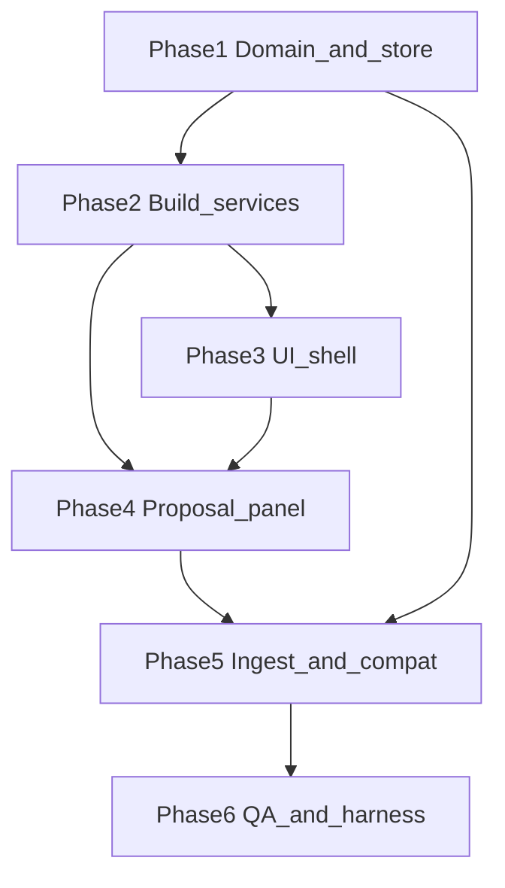
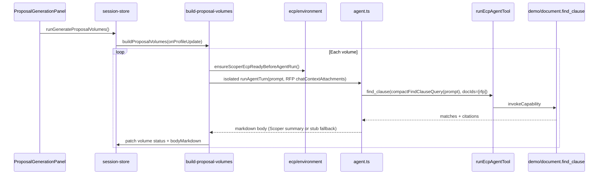

# Generate Complete Proposal — Task Breakdown

**Author:** Scoper Page team  
**Date:** 2026-07-30  
**Based on:** [Proposal mode plan](/Users/christopherkruger/.cursor/plans/proposal_mode_replaces_creep_5bdbc4a0.plan.md), [TASK_BREAKDOWN_TEMPLATE.md](TASK_BREAKDOWN_TEMPLATE.md)

**Project Focus:** Replace disabled **Scope Creep** workspace mode with enabled **Generate Complete Proposal** mode: RFP upload + responder context + RFP-derived volume profile → gated AI volume generation (standards-aligned, not generic business writing). Volume **drafting** must use the same **ECP-governed document agent path** as chat (`@demo/document.find_clause` via [`runEcpAgentTool`](../src/ecp/agent-run.ts)), not ad-hoc service bypasses.

**Package manager:** pnpm (see [TASK_BREAKDOWN.md](TASK_BREAKDOWN.md))

**Task ID prefix:** `BDA-11x` / `BDA-13x` / `BDA-14x` / `BDA-15x` (continues Browser Doc Agent numbering after v1)

**Scope creep:** Removed from product UI and ingest auto-compare; [`compare-scope.ts`](../src/services/compare-scope.ts) and creep harnesses may remain for dev-only.

---

## Task dependency graph

---

## Gating rules (acceptance reference)

Part 2 (**Generate** + volume editing) stays **disabled/grayed** until:

1. RFP doc selected (`evaluationDocId` valid in session).
2. Responder `companyContext` trimmed length ≥ 20.
3. `proposalRequirementsProfile` built (user clicked **Build proposal profile**).

Copy: tab **Generate Complete Proposal** / short **Proposal**; subtitle *AI generates all volumes tailored to standards—not generic business writing.*

---

## ECP integration (proposal generation)

Proposal mode reuses the **Browser Doc Agent ECP stack** documented in [TASK_BREAKDOWN.md](TASK_BREAKDOWN.md) Phase 7–8 (BDA-060–062). Chat and proposal generation share retrieval governance; proposal runs must not weaken registry freeze, namespace allowlists, or param validation.

### Per-volume generation flow (target)

| Step | Requirement |
|------|-------------|
| Registry | Call [`ensureScoperEcpReadyBeforeAgentRun()`](../src/ecp/environment.ts) before each volume (same as chat agent). |
| RFP scope | Attach RFP via [`createDocumentContextAttachment`](../src/lib/chat-context.ts); resolve search doc ids to **evaluation RFP only** (mirror [`resolveCitationDocIds`](../src/services/agent.ts)). |
| Retrieval | Evidence through **ECP** [`@demo/document.find_clause`](../src/ecp/extensions/document.ts) — [`runEcpAgentTool`](../src/ecp/agent-run.ts), not direct [`findClause()`](../src/services/find-clause.ts) from proposal code. |
| Query length | Use [`compactFindClauseQuery`](../src/services/document-search.ts) on volume-focused prompts ([`buildVolumePrompt`](../src/lib/proposal-prompts.ts)). |
| Chat isolation | Do **not** append proposal volume turns to the user’s main chat thread; use an isolated turn helper or Scoper send with find_clause-enriched prompt (see BDA-127). |
| Errors | Surface `EcpAgentRunDeniedError` and tool failures as per-volume `status: 'error'` + `errorMessage`; session `proposalGenerationError` for fatal loop errors. |
| Busy flags | `proposalGenerating` on store only — do not set `chatGenerating` during proposal batch runs. |

### MVP gap (current code)

[`build-proposal-volumes.ts`](../src/services/build-proposal-volumes.ts) today: DuckDB block excerpts + direct [`getScoperClient().send()`](../src/services/scoper-client.ts) after `ensureScoperEcpReadyBeforeAgentRun()`. **ECP `find_clause` and [`runAgentTurn`](../src/services/agent.ts) are not wired.** Close this gap in **BDA-127** before calling generation “ECP-complete.”

### ECP harness expectations

- Extend [`runProposalGenerationHarness`](../src/services/build-proposal-volumes.ts) (or add `runProposalEcpGenerationHarness`) to assert an **allow** audit entry for `find_clause` when RFP doc is attached (same bar as [`runEcpAgentRunHarness`](../src/ecp/agent-run.ts)).
- Optional dev-only: parity check — ECP find_clause excerpts vs direct service for the same volume query on sample RFP.

**Profile build (BDA-116)** stays in-memory from [`fetchDocumentBlocks`](../src/services/document-blocks.ts) for v1; a future `@demo/document.build_proposal_profile` ECP capability is **out of scope** unless product requires audit parity for outline extraction.

---

## Phase 1: Domain model and session store

> Types, mode rename, readiness helper, Zustand API — blocks services and UI

### **ID:** BDA-110

**Title:** Add proposal domain types  
**Status:** Done  
**Dependencies:** None  
**Priority:** Critical  
**Description:** Extend [`src/lib/types.ts`](../src/lib/types.ts) with `ProposalVolumeStatus`, `ProposalVolume`, `ProposalRequirementsProfile`. Document fields: volume title, requirement summary, optional solicitation refs, body markdown, per-volume status. No runtime behavior yet.  
**Completed Changes:**
- ✅ Added `ProposalVolumeStatus`, `ProposalVolume`, `ProposalRequirementsProfile` in `src/lib/types.ts`
- ✅ Optional `errorMessage` on volume when status is `error`
**Test Strategy:** `pnpm build` — 0 TS errors; types importable from services/components.  
**Test Results:**
- ✅ `pnpm build` completes with 0 TypeScript errors
**Assigned:** Completed  
**Context/Artifacts:** Proposal plan §1, existing `RfpResultsProfile` / `ScopeCreepProfile` patterns  

---

### **ID:** BDA-111

**Title:** Rename workspace mode to proposal  
**Status:** Done  
**Dependencies:** BDA-110  
**Priority:** Critical  
**Description:** Change `WorkspaceMode` and `ProfileMode` from `'scope_creep'` to `'proposal'`. Mechanical find-replace across `src/` (store, components, hooks, services, harnesses). Fix exhaustiveness switches. Keep legacy string handling only where share-pack import maps old manifests.  
**Completed Changes:**
- ✅ Updated `WorkspaceMode` / `ProfileMode` in `src/lib/types.ts`
- ✅ Migrated UI, hooks, chat-stub, ingest, harnesses, session-store dev harness
- ✅ `normalizeSharePackMode()` maps legacy `scope_creep` → `proposal` in share-pack import
- ✅ Removed scope-compare CTA/import paths from product surface (proposal → profiles)
**Test Strategy:** `pnpm build`; grep for `scope_creep` in `src/` — only allowed in share-pack legacy mapper or dev creep harness comments.  
**Test Results:**
- ✅ `pnpm build` passes; `scope_creep` only in `share-pack-import.ts` legacy mapper
**Assigned:** Completed  
**Context/Artifacts:** [`WorkspaceHeader.tsx`](../src/components/layout/WorkspaceHeader.tsx), [`session-store.ts`](../src/store/session-store.ts)  

---

### **ID:** BDA-112

**Title:** Proposal readiness helper  
**Status:** Done  
**Dependencies:** BDA-110  
**Priority:** High  
**Description:** Add [`src/lib/proposal-readiness.ts`](../src/lib/proposal-readiness.ts) with `getProposalSetupState()` returning `{ hasRfp, hasContext, hasProfile, readyToGenerate }`. Pure function over session slice; unit-testable thresholds (context min length 20).  
**Completed Changes:**
- ✅ Added `getProposalSetupState`, `PROPOSAL_CONTEXT_MIN_LENGTH`, slice/state types
- ✅ `runProposalReadinessHarness()` in dev chain (`App.tsx`)
**Test Strategy:** Harness or inline test: empty session → not ready; full slice → ready.  
**Test Results:**
- ✅ `runProposalReadinessHarness` passes; `pnpm build` 0 TS errors
**Assigned:** Completed  
**Context/Artifacts:** Proposal plan §1 gating  

---

### **ID:** BDA-113

**Title:** Session store proposal state  
**Status:** Done  
**Dependencies:** BDA-110, BDA-111  
**Priority:** Critical  
**Description:** In [`session-store.ts`](../src/store/session-store.ts): add `proposalRequirementsProfile`, `proposalGenerating`, `proposalGenerationError`. Wire `clearProposalGeneration` on reset/mode change. Do **not** auto-run `runRfpQualification` when `mode === 'proposal'`.  
**Completed Changes:**
- ✅ State fields + `setProposalRequirementsProfile`, `clearProposalGeneration`
- ✅ `setMode` clears proposal profile + generation flags; `resetSession` calls `clearProposalGeneration` + `initialState`
- ✅ `clearEvaluationSetup`, `removeDocument` clear proposal profile when RFP/evaluation doc removed
- ✅ `runRfpQualification` early return when `mode === 'proposal'`
- ✅ `selectProposalSetupState` / `useProposalSetupState` wired to readiness helper
- ✅ Harness asserts mode switch clears proposal state
**Test Strategy:** Dev harness or manual: switch modes; proposal state clears appropriately.  
**Test Results:**
- ✅ `runSessionStoreHarness` covers mode switch; `pnpm build` clean
**Assigned:** Completed  
**Context/Artifacts:** Existing `contractReviewProfile` / `creepProfiles` patterns  

---

### **ID:** BDA-114

**Title:** Store actions for profile and generate  
**Status:** Done  
**Dependencies:** BDA-112, BDA-113, BDA-116, BDA-118  
**Priority:** Critical  
**Description:** Implement `runProposalRequirementsProfile()` and `runGenerateProposalVolumes()` on session store; delegate to build services; update volume statuses during generation. Guard: no-op if not `readyToGenerate` (except profile build only needs RFP + context).  
**Completed Changes:**
- ✅ `runProposalRequirementsProfile` → `buildProposalRfpProfile`; gated on RFP + context
- ✅ `runGenerateProposalVolumes` → `buildProposalVolumes` with per-volume store patches; `proposalGenerating` mutex
- ✅ Supporting services: `proposal-prompts`, `build-proposal-rfp-profile`, `build-proposal-volumes`
- ✅ Dev harnesses: `runProposalRfpProfileHarness`, `runProposalGenerationHarness`, `runProposalPromptsHarness` in `App.tsx`
- ⚠️ **ECP:** store actions delegate to MVP volume builder; full ECP agent path tracked in **BDA-127**
**Test Strategy:** Harness calls actions after mock ingest; profile and volumes populate in store.  
**Test Results:**
- ✅ `pnpm build` clean; generation harness exercises store actions end-to-end
**Assigned:** Completed  
**Context/Artifacts:** [`runContractKeywordReview`](../src/store/session-store.ts) pattern  

---

## Phase 2: Build services (MVP engine)

> Extract RFP outline → volumes; generate markdown per volume via **ECP-backed agent retrieval** + on-device Scoper summary (see [ECP integration](#ecp-integration-proposal-generation))

### **ID:** BDA-115

**Title:** Proposal prompt guardrails module  
**Status:** Done  
**Dependencies:** BDA-110  
**Priority:** High  
**Description:** Add [`src/lib/proposal-prompts.ts`](../src/lib/proposal-prompts.ts): system/user templates per volume — mirror solicitation headings, forbid generic marketing copy, require section alignment and citation of RFP sections. Export `buildVolumePrompt(volume, context, excerpts)`.  
**Completed Changes:**
- ✅ `PROPOSAL_GUARDRAIL_PHRASES`, `PROPOSAL_VOLUME_SYSTEM_PROMPT`
- ✅ `buildVolumeUserPrompt`, `buildVolumePromptParts`, `buildVolumePrompt` (combined MVP string)
- ✅ `buildVolumeFindClauseQuery` → `compactFindClauseQuery` for ECP path (BDA-127)
- ✅ `runProposalPromptsHarness()` in dev chain (`App.tsx`)
**Test Strategy:** Snapshot or harness: prompt includes volume title + context snippet + guardrail phrases.  
**Test Results:**
- ✅ Harness asserts all guardrail phrases, user context, solicitation refs, find-clause query
**Assigned:** Completed  
**Context/Artifacts:** [`format-criterion-chat.ts`](../src/lib/format-criterion-chat.ts), plan §2  

---

### **ID:** BDA-116

**Title:** Build proposal RFP profile service  
**Status:** Done  
**Dependencies:** BDA-110, BDA-115  
**Priority:** Critical  
**Description:** Add [`src/services/build-proposal-rfp-profile.ts`](../src/services/build-proposal-rfp-profile.ts): input RFP `doc_id`; [`fetchDocumentBlocks`](../src/services/document-blocks.ts); derive volumes from `section_path` / heading heuristics ([`commonSectionPathPrefix`](../src/services/document-blocks.ts)); cap summary length; return `ProposalRequirementsProfile`. In-memory only (no DuckDB v1).  
**Completed Changes:**
- ✅ `buildProposalRfpProfile` — section grouping, proposal keyword ranking, `compactSectionPathLabel`
- ✅ Single-volume fallback when extraction yields no volumes; `PROPOSAL_SUMMARY_MAX` (480)
- ✅ `runProposalRfpProfileHarness` — prefers `rfp-it-services.pdf`, asserts summary cap + pending volumes
**Test Strategy:** Run against `public/sample/rfp-it-services.pdf` or harness; ≥1 volume with non-empty title.  
**Test Results:**
- ✅ Harness passes on sample RFP ingest; `pnpm build` clean
**Assigned:** Completed  
**Context/Artifacts:** [`parse-contract-checklist.ts`](../src/services/parse-contract-checklist.ts) (section heuristics), plan §2  

---

### **ID:** BDA-117

**Title:** Harness for RFP profile build  
**Status:** Done  
**Dependencies:** BDA-116  
**Priority:** Medium  
**Description:** Export `runProposalRfpProfileHarness()` from build service or dedicated harness file: ingest sample RFP, set mode proposal, run profile build, assert volumes length and store update.  
**Completed Changes:**
- ✅ [`proposal-rfp-profile-harness.ts`](../src/services/proposal-rfp-profile-harness.ts) — service + store paths
- ✅ Ingest `rfp-it-services.pdf` (fallback `minimal.pdf`); `setMode('proposal')` → `runProposalRequirementsProfile()`
- ✅ Registered in [`App.tsx`](../src/App.tsx) dev chain
**Test Strategy:** `pnpm dev` → harness passes in console.  
**Test Results:**
- ✅ Asserts volumes in store, `workspaceView: profiles`, no `proposalGenerationError`
**Assigned:** Completed  
**Context/Artifacts:** [`runContractKeywordReviewHarness`](../src/services/build-contract-keyword-review.ts)  

---

### **ID:** BDA-118

**Title:** Build proposal volumes generation (MVP loop)  
**Status:** Partial  
**Dependencies:** BDA-115, BDA-116, BDA-114  
**Priority:** Critical  
**Description:** Add [`src/services/build-proposal-volumes.ts`](../src/services/build-proposal-volumes.ts): sequential per-volume loop; patch store `bodyMarkdown` + status; mutex via `proposalGenerating`. **MVP shipped:** block excerpts + Scoper send + stub fallback. **Product target (BDA-127):** ECP `find_clause` + agent turn with RFP in `chatContextAttachments`.  
**Completed Changes:**
- ✅ Per-volume loop + `patchProposalVolume` + store `onProfileUpdate`
- ✅ Error → volume status `error` + message; stub when WebGPU/model unavailable
- 🔄 ECP retrieval + isolated `runAgentTurn` — **BDA-127**
**Test Strategy:** Harness with stub/WebGPU: each volume ends `draft` with non-empty markdown.  
**Test Results:**
- ✅ `runProposalGenerationHarness` passes on sample ingest (MVP path)
**Assigned:** Partial — ECP completion in BDA-127  
**Context/Artifacts:** [ECP integration](#ecp-integration-proposal-generation), [`agent.ts`](../src/services/agent.ts), [`ecp/agent-run.ts`](../src/ecp/agent-run.ts)  

---

### **ID:** BDA-127

**Title:** Wire proposal volume generation through ECP  
**Status:** To Do  
**Dependencies:** BDA-118, BDA-062 (main breakdown — agent via ECP)  
**Priority:** Critical  
**Description:** Refactor [`build-proposal-volumes.ts`](../src/services/build-proposal-volumes.ts) so each volume uses the **ECP-governed agent path**: RFP [`createDocumentContextAttachment`](../src/lib/chat-context.ts); [`compactFindClauseQuery`](../src/services/document-search.ts) on [`buildVolumePrompt`](../src/lib/proposal-prompts.ts) output; [`runAgentTurn`](../src/services/agent.ts) or extracted helper that routes retrieval through [`runEcpAgentTool`](../src/ecp/agent-run.ts) → `@demo/document.find_clause` with doc scope = RFP `evaluationDocId` only. Keep chat thread isolated (no proposal turns in sidebar history). Preserve stub fallback when Scoper/WebGPU unavailable after ECP deny or empty matches.  
**Completed Changes:**
- 🔄 `generateVolumeBody` (or successor) calls ECP find_clause path before/alongside Scoper summary
- 🔄 Isolated turn helper — no `chatMessages` pollution
- 🔄 Map `EcpAgentRunDeniedError` → volume error status
**Test Strategy:** `runProposalGenerationHarness` or `runProposalEcpGenerationHarness`: after generate, audit log contains allowed `find_clause` for RFP doc; volumes still reach `draft` or explicit `error`.  
**Test Results:**
- 🔄 Pending  
**Assigned:** Unassigned  
**Context/Artifacts:** [ECP integration](#ecp-integration-proposal-generation), [`runEcpAgentRunHarness`](../src/ecp/agent-run.ts), [`DOCUMENT_CAPABILITIES.find_clause`](../src/ecp/extensions/document.ts)  

---

### **ID:** BDA-119

**Title:** End-to-end proposal generation harness  
**Status:** To Do  
**Dependencies:** BDA-117, BDA-118, BDA-127  
**Priority:** Medium  
**Description:** `runProposalGenerationHarness()`: full path profile + generate (or generate stub if WebGPU unavailable). Assert `readyToGenerate` gating before generate.  
**Completed Changes:**
- 🔄 Harness
**Test Strategy:** Dev boot chain; skip or soft-fail without WebGPU with clear log.  
**Test Results:**
- 🔄 Pending  
**Assigned:** Unassigned  
**Context/Artifacts:** [`App.tsx`](../src/App.tsx) harness list  

---

## Phase 3: UI shell (replace Scope Creep surfaces)

> Header, landing, workspace routing, command input, split CTA, chat history

### **ID:** BDA-120

**Title:** Enable proposal mode header tab  
**Status:** To Do  
**Dependencies:** BDA-111  
**Priority:** High  
**Description:** [`WorkspaceHeader.tsx`](../src/components/layout/WorkspaceHeader.tsx): replace disabled Scope Creep trigger with enabled `value="proposal"`, icon (`LayersIcon` / `FileStackIcon`), labels **Proposal** / **Generate Complete Proposal**, remove Coming soon tooltip.  
**Completed Changes:**
- 🔄 Tab UI + aria labels
**Test Strategy:** Click tab; `mode === 'proposal'` in store; tab selectable while chat idle.  
**Test Results:**
- 🔄 Pending  
**Assigned:** Unassigned  
**Context/Artifacts:** Plan §3 table  

---

### **ID:** BDA-121

**Title:** Landing and upload card for proposal  
**Status:** To Do  
**Dependencies:** BDA-111  
**Priority:** High  
**Description:** [`upload-suggestions.ts`](../src/lib/upload-suggestions.ts): replace scope-creep card with **Generate Complete Proposal**, standards subtitle, enabled. [`QuickActionCards.tsx`](../src/components/workspace/QuickActionCards.tsx): `setMode('proposal')` + open RFP upload (extend `uploadIntentFromSuggestionId` if needed).  
**Completed Changes:**
- 🔄 Card copy + click handler
**Test Strategy:** Landing → card → mode proposal + upload popup.  
**Test Results:**
- 🔄 Pending  
**Assigned:** Unassigned  
**Context/Artifacts:** Plan §3  

---

### **ID:** BDA-122

**Title:** WorkspaceContent proposal profiles route  
**Status:** To Do  
**Dependencies:** BDA-111, BDA-130  
**Priority:** High  
**Description:** [`WorkspaceContent.tsx`](../src/components/workspace/WorkspaceContent.tsx): `MODE_COPY.proposal`; profiles header title/copy; replace `CreepProfileGrid` branch with `ProposalGenerationPanel`. Remove Scope Creep Analysis heading.  
**Completed Changes:**
- 🔄 Routing + copy
**Test Strategy:** Mode proposal → profiles view shows proposal panel not creep grid.  
**Test Results:**
- 🔄 Pending  
**Assigned:** Unassigned  
**Context/Artifacts:** Plan §3  

---

### **ID:** BDA-123

**Title:** CommandInputCard proposal mode  
**Status:** To Do  
**Dependencies:** BDA-111  
**Priority:** Medium  
**Description:** [`CommandInputCard.tsx`](../src/components/workspace/CommandInputCard.tsx): mode chip **Generate Proposal**; placeholder for proposal mode (responder / RFP intent).  
**Completed Changes:**
- 🔄 PLACEHOLDER_COPY + mode toggle list
**Test Strategy:** Switch mode in command card; placeholder updates.  
**Test Results:**
- 🔄 Pending  
**Assigned:** Unassigned  
**Context/Artifacts:** Plan §3  

---

### **ID:** BDA-124

**Title:** SplitDocumentView proposal CTA  
**Status:** To Do  
**Dependencies:** BDA-111  
**Priority:** Medium  
**Description:** [`SplitDocumentView.tsx`](../src/components/workspace/SplitDocumentView.tsx): `MODE_CTA.proposal` → **Open proposal workspace** (navigate to profiles); remove `compareScope` CTA branch for proposal mode.  
**Completed Changes:**
- 🔄 CTA label + handler
- 🔄 Delete or guard scope_creep compare click path
**Test Strategy:** Proposal mode + split view → CTA opens profiles; no compareScope invoke.  
**Test Results:**
- 🔄 Pending  
**Assigned:** Unassigned  
**Context/Artifacts:** Plan §3, §4  

---

### **ID:** BDA-125

**Title:** ChatHistoryMarkers proposal mode  
**Status:** To Do  
**Dependencies:** BDA-111  
**Priority:** Low  
**Description:** [`ChatHistoryMarkers.tsx`](../src/components/chat/ChatHistoryMarkers.tsx): remove creep-flag markers for proposal mode; show neutral empty state or proposal-related markers (e.g. last generated volume titles from store).  
**Completed Changes:**
- 🔄 Mode branch update
**Test Strategy:** History tab in proposal mode — no creep UI leakage.  
**Test Results:**
- 🔄 Pending  
**Assigned:** Unassigned  
**Context/Artifacts:** Plan §3  

---

### **ID:** BDA-126

**Title:** Chat stub proposal actions  
**Status:** To Do  
**Dependencies:** BDA-111  
**Priority:** Low  
**Description:** [`chat-stub.ts`](../src/lib/chat-stub.ts): replace `scope_creep` stub with proposal-oriented draft action (e.g. draft volume summary).  
**Completed Changes:**
- 🔄 Stub branch
**Test Strategy:** Agent stub in proposal mode returns proposal-relevant copy.  
**Test Results:**
- 🔄 Pending  
**Assigned:** Unassigned  
**Context/Artifacts:** Plan §5  

---

## Phase 4: Proposal generation panel

> Primary UX: setup → build profile → gated generate → preview/export

### **ID:** BDA-130

**Title:** Proposal panel setup section  
**Status:** To Do  
**Dependencies:** BDA-112, BDA-113  
**Priority:** Critical  
**Description:** Create [`ProposalGenerationPanel.tsx`](../src/components/workspace/ProposalGenerationPanel.tsx) setup card: RFP [`DocumentPickerSelect`](../src/components/workspace/DocumentPickerSelect.tsx) bound to `evaluationDocId`; responder context textarea (labels: *your company / capabilities* — not buyer qualification); wire `setCompanyContext` / `setEvaluationDocId`.  
**Completed Changes:**
- 🔄 Panel shell + setup card
**Test Strategy:** Select RFP + type context; readiness helper shows `hasRfp` / `hasContext`.  
**Test Results:**
- 🔄 Pending  
**Assigned:** Unassigned  
**Context/Artifacts:** [`RfpEvaluationPanel.tsx`](../src/components/workspace/RfpEvaluationPanel.tsx) patterns  

---

### **ID:** BDA-131

**Title:** Build proposal profile button UX  
**Status:** To Do  
**Dependencies:** BDA-130, BDA-114  
**Priority:** High  
**Description:** **Build proposal profile** CTA → `runProposalRequirementsProfile()`; [`AiSupportLoadingCard`](../src/components/ui/ai-support-loading-card.tsx) while running; show profile summary + volume count on success; surface errors inline.  
**Completed Changes:**
- 🔄 Button states + loading
**Test Strategy:** Click build with valid RFP; volumes appear in panel.  
**Test Results:**
- 🔄 Pending  
**Assigned:** Unassigned  
**Context/Artifacts:** Plan §3 ProposalGenerationPanel  

---

### **ID:** BDA-132

**Title:** Volume list with gating visuals  
**Status:** To Do  
**Dependencies:** BDA-131, BDA-112  
**Priority:** High  
**Description:** Render volume list from profile; **muted/disabled** styling until `readyToGenerate`; checklist UI for three gating conditions (RFP, context, profile built). Optional [`ProposalVolumeRow.tsx`](../src/components/workspace/ProposalVolumeRow.tsx) for title + status icon.  
**Completed Changes:**
- 🔄 List + gate checklist
**Test Strategy:** Before profile built, generate button disabled; after all three, enabled.  
**Test Results:**
- 🔄 Pending  
**Assigned:** Unassigned  
**Context/Artifacts:** Plan gating spec  

---

### **ID:** BDA-133

**Title:** Generate complete proposal CTA  
**Status:** To Do  
**Dependencies:** BDA-132, BDA-118, BDA-127  
**Priority:** Critical  
**Description:** Primary **Generate complete proposal** button calls `runGenerateProposalVolumes()`; disable while `proposalGenerating`; per-volume status spinners (`generating` → `draft` / `error`).  
**Completed Changes:**
- 🔄 CTA + progress UI
**Test Strategy:** Full flow produces draft bodies for all volumes.  
**Test Results:**
- 🔄 Pending  
**Assigned:** Unassigned  
**Context/Artifacts:** Plan §3, BDA-127 (ECP-backed generation)  

---

### **ID:** BDA-134

**Title:** Volume markdown preview  
**Status:** To Do  
**Dependencies:** BDA-133  
**Priority:** Medium  
**Description:** Accordion or expandable rows showing `bodyMarkdown` per volume (Streamdown or simple pre/markdown view consistent with workspace). Empty state before generation.  
**Completed Changes:**
- 🔄 Preview component
**Test Strategy:** After generate, expand volume → readable markdown.  
**Test Results:**
- 🔄 Pending  
**Assigned:** Unassigned  
**Context/Artifacts:** [`AnnotatedMarkdownView`](../src/components/workspace/AnnotatedMarkdownView.tsx) (optional reuse)  

---

### **ID:** BDA-135

**Title:** Export assembled proposal markdown  
**Status:** To Do  
**Dependencies:** BDA-134  
**Priority:** Medium  
**Description:** **Export .md** downloads single file: `# Volume: {title}` sections assembled from all drafts; reuse [`beginBlobSave`](../src/lib/download-blob.ts) pattern from split view exports.  
**Completed Changes:**
- 🔄 Assembler + download button
**Test Strategy:** Export after generate; file contains all volume headers and bodies.  
**Test Results:**
- 🔄 Pending  
**Assigned:** Unassigned  
**Context/Artifacts:** Plan §3  

---

## Phase 5: Ingest, navigation, compatibility

> Wire uploads to proposal workspace; share pack; stop creep auto-compare

### **ID:** BDA-140

**Title:** Ingest pipeline proposal branch  
**Status:** To Do  
**Dependencies:** BDA-111, BDA-113  
**Priority:** High  
**Description:** [`use-ingest-pipeline.ts`](../src/hooks/use-ingest-pipeline.ts): replace `scope_creep` block with `proposal` — set `evaluationDocId` if unset, `setWorkspaceView('profiles')`, **no** `compareScope`.  
**Completed Changes:**
- 🔄 Branch logic
**Test Strategy:** Upload in proposal mode → lands on profiles, not creep compare.  
**Test Results:**
- 🔄 Pending  
**Assigned:** Unassigned  
**Context/Artifacts:** Plan §4  

---

### **ID:** BDA-141

**Title:** Command ingest proposal landing  
**Status:** To Do  
**Dependencies:** BDA-140  
**Priority:** Medium  
**Description:** Align [`use-command-ingest.ts`](../src/hooks/use-command-ingest.ts) / commit paths so proposal mode post-ingest matches upload popup behavior (profiles view, evaluation doc).  
**Completed Changes:**
- 🔄 Mode check parity
**Test Strategy:** Command card upload in proposal mode → same landing as BDA-140.  
**Test Results:**
- 🔄 Pending  
**Assigned:** Unassigned  
**Context/Artifacts:** Plan §4  

---

### **ID:** BDA-142

**Title:** Share pack proposal mode compat  
**Status:** To Do  
**Dependencies:** BDA-111  
**Priority:** Low  
**Description:** [`share-pack-import.ts`](../src/services/share-pack-import.ts): accept `manifest.mode === 'proposal'`; map legacy `scope_creep` to proposal with empty proposal profile (ignore creep payloads). Export side if share pack writes mode — use `proposal`.  
**Completed Changes:**
- 🔄 Import mapper
**Test Strategy:** Import old/new manifests without throw.  
**Test Results:**
- 🔄 Pending  
**Assigned:** Unassigned  
**Context/Artifacts:** Plan §5  

---

## Phase 6: QA, harness, sign-off

### **ID:** BDA-150

**Title:** Register proposal dev harnesses  
**Status:** To Do  
**Dependencies:** BDA-117, BDA-119  
**Priority:** Medium  
**Description:** Wire `runProposalRfpProfileHarness` and `runProposalGenerationHarness` in [`App.tsx`](../src/App.tsx) dev chain; after **BDA-127**, register ECP proposal harness; keep creep harnesses optional/env-gated so CI unchanged.  
**Completed Changes:**
- ✅ `App.tsx` registration for profile + generation + prompts harnesses
- 🔄 ECP proposal harness when BDA-127 lands
**Test Strategy:** Dev load runs new harnesses without uncaught errors.  
**Test Results:**
- 🔄 Partial (MVP harnesses registered)  
**Assigned:** Unassigned  
**Context/Artifacts:** Plan §5, [ECP integration](#ecp-integration-proposal-generation)  

---

### **ID:** BDA-151

**Title:** Manual QA and production build  
**Status:** To Do  
**Dependencies:** BDA-120 through BDA-135, BDA-140, BDA-141  
**Priority:** Critical  
**Description:** Execute manual script: Landing → **Generate Complete Proposal** → upload sample RFP → responder context → Build profile → Generate → export .md. Toggle RFP ↔ Proposal without crash. Confirm proposal mode does not show bidder qualification grid or creep grid. **After BDA-127:** DevTools harness shows ECP `find_clause` allow during generate; generation still works offline after model/cache warm (same as chat).  
**Completed Changes:**
- 🔄 QA notes in this doc or QA_RESULTS append
**Test Strategy:** `pnpm build` pass; manual checklist pass.  
**Test Results:**
- 🔄 Pending  
**Assigned:** Unassigned  
**Context/Artifacts:** Plan §6, [`sample/rfp-it-services.pdf`](../sample/rfp-it-services.pdf), [ECP integration](#ecp-integration-proposal-generation)  

---

## Recommended sprint order

| Order | ID | Title | Est. |
|-------|-----|-------|------|
| 1 | BDA-110 | Proposal domain types | 1h |
| 2 | BDA-111 | Rename mode to proposal | 1.5h |
| 3 | BDA-112 | Proposal readiness helper | 1h |
| 4 | BDA-113 | Session store proposal state | 1.5h |
| 5 | BDA-115 | Proposal prompt guardrails | 1.5h |
| 6 | BDA-116 | Build RFP profile service | 3h |
| 7 | BDA-117 | RFP profile harness | 1h |
| 8 | BDA-114 | Store profile/generate actions | 2h |
| 9 | BDA-118 | Build volumes generation (MVP loop) | 4h |
| 9b | BDA-127 | ECP-backed volume generation | 3h |
| 10 | BDA-130 | Proposal panel setup | 2h |
| 11 | BDA-131 | Build profile button UX | 1.5h |
| 12 | BDA-132 | Volume list gating | 2h |
| 13 | BDA-133 | Generate CTA + progress | 2h |
| 14 | BDA-120 | Header tab | 0.5h |
| 15 | BDA-121 | Landing/upload cards | 1h |
| 16 | BDA-122 | WorkspaceContent routing | 1h |
| 17 | BDA-124 | Split view CTA | 1h |
| 18 | BDA-134 | Volume preview | 2h |
| 19 | BDA-135 | Export markdown | 1h |
| 20 | BDA-140 | Ingest proposal branch | 1h |
| 21 | BDA-141 | Command ingest | 0.5h |
| 22 | BDA-123 | CommandInputCard | 0.5h |
| 23 | BDA-125 | ChatHistoryMarkers | 0.5h |
| 24 | BDA-126 | Chat stub | 0.5h |
| 25 | BDA-142 | Share pack compat | 1h |
| 26 | BDA-119 | E2E proposal harness | 1.5h |
| 27 | BDA-150 | Harness registration | 0.5h |
| 28 | BDA-151 | Manual QA + build | 2h |

**Estimated total:** ~38 hours (~4–5 dev days, includes BDA-127 ECP)

---

## Traceability (plan → tasks)

| Plan section | Tasks |
|--------------|-------|
| §1 Domain model and session API | BDA-110–114, BDA-112 |
| §2 Build services + ECP generation | BDA-115–119, **BDA-127**, [ECP integration](#ecp-integration-proposal-generation) |
| §3 UI replace Scope Creep | BDA-120–126, BDA-130–135 |
| §4 Ingest wiring | BDA-140–141 |
| §5 Compatibility | BDA-142, BDA-126, BDA-150 |
| §6 Verification | BDA-151, BDA-117, BDA-119, BDA-127 harness |
| ECP (main BDA-060–062) | BDA-127 — proposal consumes same `@demo/document.find_clause` path as chat |

---

## Out of scope (explicit deferrals)

- Federal L/M/N fixed volume templates (RFP-derived outline only for v1)
- Persist proposal drafts in share pack / IndexedDB
- Studio/Personal fine-tuned model handoff CTA
- Remove [`compare-scope.ts`](../src/services/compare-scope.ts) or creep harness code (dev-only retention OK)
- PRD/README wholesale rewrite (optional one-line README later)

---

## Document metadata

**Related documents:**

- [Proposal mode plan](/Users/christopherkruger/.cursor/plans/proposal_mode_replaces_creep_5bdbc4a0.plan.md)
- [TASK_BREAKDOWN.md](TASK_BREAKDOWN.md) (BDA series)
- [TASK_BREAKDOWN_TEMPLATE.md](TASK_BREAKDOWN_TEMPLATE.md)

**Change log:**

| Version | Date | Changes |
|---------|------|---------|
| v1.0 | 2026-07-30 | Initial atomic breakdown from proposal mode plan |
| v1.1 | 2026-07-30 | ECP integration section; BDA-127; BDA-118 MVP vs ECP target; traceability to BDA-062 |
