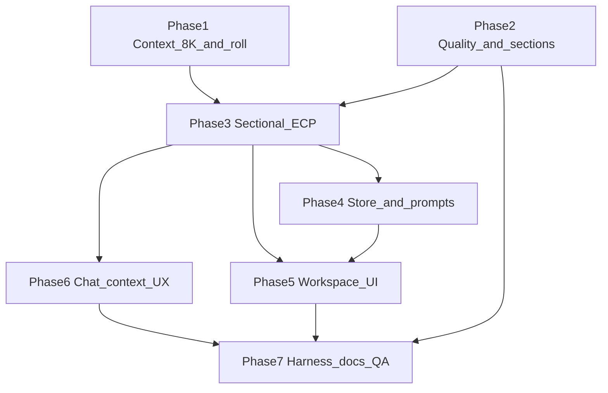

# Complete Proposal — Sectional ECP, 8K UCW, Chat Context UX

**Author:** Scoper Page team  
**Date:** 2026-07-30  
**Based on:** [proposal_sectional_ecp_ucw plan](/Users/christopherkruger/.cursor/plans/proposal_sectional_ecp_ucw_039a2b30.plan.md), [TASK_BREAKDOWN_TEMPLATE.md](TASK_BREAKDOWN_TEMPLATE.md), [TASK_BREAKDOWN_PROPOSAL_MODE.md](TASK_BREAKDOWN_PROPOSAL_MODE.md) (BDA-110–151)

**Project Focus:** Ship **real** multi-volume proposal exports on a **small browser context window** (8K tokens): guardrails and package classification, **section-by-section** ECP `find_clause` + isolated Scoper sends, **mandatory context rolls** between sections, and **chat-column visibility** (Context Usage breakdown, Agent Activity Markers, compacting shimmer).

**Package manager:** pnpm

**Task ID prefix:** `BDA-15x` / `BDA-16x` / `BDA-17x` (continues after BDA-151)

**Explicit non-goals (this pass):** 32K bitgpu on page; Turso/KG roll persistence; parallel section generation; e-sign blocks in export.

---

## Task dependency graph

**Agent build order (from plan):** context-8k → quality/sections → sectional-ecp (+ activities) → chat-context-ux → store/ui gates → harness/docs.

---

## Gating rules (acceptance reference)

- **Generate Complete Proposal** tab: disabled until RFP analysis baseline exists (existing `selectCanSwitchToProposalMode`).
- **Generate volumes:** profile built + responder context + ECP ready (unchanged from BDA-132).
- **Export .md:** all volumes `draft` with **export-quality** pass (no meta-outline, no placeholder-only bodies, package-appropriate content) — **BDA-176**.

---

## 🏗️ Phase 1: Context — 8K window and proposal rolls

> **Purpose:** Physical 8K `maxSeqLen`, page UCW policy module, handoff + micro-roll between sections

### **ID:** BDA-152

**Title:** Raise Scoper maxSeqLen to 8K  
**Status:** Done  
**Dependencies:** None  
**Priority:** Critical  
**Description:** Update [`src/lib/scoper-model.ts`](../src/lib/scoper-model.ts) to `maxSeqLen: 8192` while keeping `kvCache: 'q8'` and `overflow: 'sinks'`. Add optional env override `VITE_SCOPER_MAX_SEQ_LEN` (default 8192; allow 4096 fallback). On engine load failure with 8192, retry or surface readable error via scoper client / [`WebGpuBanner`](../src/components/layout/WebGpuBanner.tsx).  
**Completed Changes:**
- ✅ Default context window 8192 via `getScoperEngineOptions()` / `getScoperMaxSeqLenFromEnv()`
- ✅ `VITE_SCOPER_MAX_SEQ_LEN` validated to 4096 | 8192 (`src/vite-env.d.ts`)
- ✅ Worker retries load at 4096 after 8K failure; posts `engine-config` with notice
- ✅ Client state `maxSeqLen` + `maxSeqLenNotice`; banner shows fallback copy
**Test Strategy:** `pnpm build`; dev load model with WebGPU; confirm worker accepts 8192 or falls back per env; harness/chat still send.  
**Test Results:**
- ✅ `pnpm build` — 0 TypeScript errors  
- 👤 WebGPU 8K vs 4K fallback — verify in browser after model load  
**Assigned:** Completed  
**Context/Artifacts:** Plan Workstream B1; Studio `CONTEXT_WINDOW_ARCHITECTURE.md` (reference only)

---

### **ID:** BDA-153

**Title:** Add page context manager module  
**Status:** Done  
**Dependencies:** BDA-152  
**Priority:** Critical  
**Description:** New [`src/lib/page-context-manager.ts`](../src/lib/page-context-manager.ts): export `PAGE_CONTEXT_CONFIG` (`contextSize: 8192`, `softRecallThreshold: 0.55`, `hardRollThreshold: 0.85`), `checkContextThreshold(charsUsed, config) → 'none' | 'soft' | 'hard'`, and `kvBar(used, total)` for UI. Port **policy** from Studio `context-manager.ts`; do not port llama.cpp internals. Config `contextSize` must follow effective `maxSeqLen` when fallback is 4096.  
**Completed Changes:**
- ✅ `page-context-manager.ts` — `getPageContextConfig(effectiveMaxSeqLen)`, thresholds, `checkContextThreshold`, `kvBar`
- ✅ `runPageContextManagerHarness()` wired in `runProposalUnitHarnesses`
**Test Strategy:** Import in harness or vitest-style dev assert: at 55% → soft, at 85% → hard; `kvBar` returns sane percentages.  
**Test Results:**
- ✅ `pnpm build` — 0 TypeScript errors
- ✅ Dev harness asserts soft/hard tiers (8K + 4K config) and `kvBar`  
**Assigned:** Completed  
**Context/Artifacts:** Plan Workstream B2; [`scoper_studio/.../context-manager.ts`](file:///Users/christopherkruger/Projects/Scoper/scoper_studio/services/bun-server/src/utils/context-manager.ts)

---

### **ID:** BDA-154

**Title:** Proposal handoff and context roll  
**Status:** Done  
**Dependencies:** BDA-153  
**Priority:** Critical  
**Description:** New [`src/lib/proposal-context-roll.ts`](../src/lib/proposal-context-roll.ts): `ProposalHandoffState` (`activeGoal`, `completedSections[]`, `topicMemory` max 4 bullets, `pendingSections[]`, `packageKind`); `buildProposalHandoffBlock(handoff, chunkIndex)` (Studio-shaped markdown); `rollProposalContext(resetConversation)` — **always** after each successful section (empty KV + handoff only). Export helpers to update handoff after section complete.  
**Completed Changes:**
- ✅ `ProposalHandoffState`, `buildProposalHandoffBlock`, `rollProposalContext`
- ✅ `applySectionCompletion`, `recordProposalHandoffFailure`, `truncateTopicMemory` (max 4)
- ✅ `runProposalContextRollHarness()` in unit harness chain
**Test Strategy:** Dev harness or unit: build handoff from mock state; block contains goal, completed, pending, do-not-repeat; roll invokes reset mock once.  
**Test Results:**
- ✅ `pnpm build` — 0 TypeScript errors
- ✅ `runProposalContextRollHarness` on dev load  
**Assigned:** Completed  
**Context/Artifacts:** Plan Workstream B3; Studio `managed-llm-session.ts` `buildHandoffBlock`

---

### **ID:** BDA-155

**Title:** Orchestrator context char tracking  
**Status:** Done  
**Dependencies:** BDA-153, BDA-154  
**Priority:** High  
**Description:** In sectional orchestrator (see BDA-164), track `proposalContextCharsUsed` per section send (`prompt.length / 4` estimate). If **hard** tier mid-section, abort section with recoverable error message on volume section. Wire `contextSize` from `PAGE_CONTEXT_CONFIG` tied to effective seq len.  
**Completed Changes:**
- ✅ `proposal-context-tracker.ts` — `ProposalContextTracker`, `ProposalContextOverflowError`, snapshot + reset
- ✅ `proposal-volume-ecp.ts` records find query + prompts; `assertNotHard()` before send
- ✅ `build-proposal-volumes.ts` batch tracker (reset per volume); overflow → volume `error`
**Test Strategy:** Harness with artificially low threshold (test-only config) triggers abort; normal run stays under hard tier per section.  
**Test Results:**
- ✅ `runProposalContextTrackerHarness` (tiny contextSize hard abort + reset)
- ✅ `pnpm build`  
**Assigned:** Completed  
**Context/Artifacts:** Plan B3; BDA-164

---

## 🧩 Phase 2: Quality libs and section model

> **Purpose:** Package classification, context/export quality gates, derive ordered sections per volume

### **ID:** BDA-156

**Title:** Proposal package classifier  
**Status:** Done  
**Dependencies:** None  
**Priority:** High  
**Description:** New [`src/lib/proposal-package-classifier.ts`](../src/lib/proposal-package-classifier.ts): classify RFP/package as solicitation vs contract_framework (and related kinds); drive volume themes and warnings. Pure functions + tests via harness.  
**Completed Changes:**
- ✅ `classifyProposalPackage()` — weighted filename + block/text heuristics
- ✅ `ProposalPackageKind`, `packageWarnings`, scores; `runProposalPackageClassifierHarness()`
- ✅ `proposal-context-roll` re-exports kind from classifier
**Test Strategy:** Fixture: IT services RFP → solicitation; MSA-style doc → contract_framework; harness asserts kind.  
**Test Results:**
- ✅ Harness: IT RFP → solicitation; MSA → contract_framework + warning; sparse → unknown
- ✅ `pnpm build`  
**Assigned:** Completed  
**Context/Artifacts:** Plan Workstream A; prior guardrails plans

---

### **ID:** BDA-157

**Title:** Proposal context quality checks  
**Status:** Done  
**Dependencies:** BDA-156  
**Priority:** High  
**Description:** New [`src/lib/proposal-context-quality.ts`](../src/lib/proposal-context-quality.ts): validate trimmed company/responder context is substantive (not placeholder lorem); return issues for UI gates.  
**Completed Changes:**
- ✅ `assessProposalContextQuality()` — min length, placeholder regexes, distinct words, repeated-char filler
- ✅ `runProposalContextQualityHarness()` in unit harness chain
**Test Strategy:** Harness: good context passes; `"TBD"` / empty fails.  
**Test Results:**
- ✅ Harness: substantive pass; TBD, empty, short, repeated filler fail  
- ✅ `pnpm build`  
**Assigned:** Completed  
**Context/Artifacts:** Plan Workstream A

---

### **ID:** BDA-158

**Title:** Proposal export quality validator  
**Status:** Done  
**Dependencies:** None  
**Priority:** High  
**Description:** New [`src/lib/proposal-export-quality.ts`](../src/lib/proposal-export-quality.ts): meta-outline detection, min length, forbidden writer-instruction leakage, volume-level checks reused for **sections** (same rules as volume validator). Export gate consumes this for full profile.  
**Completed Changes:**
- ✅ `validateProposalVolumeDraft()` — min length, placeholders, meta-outline, prompt leak, outline-only
- ✅ `canExportProposalProfile()` — all volumes `draft` + per-body validation
- ✅ `runProposalExportQualityHarness()`
**Test Strategy:** Known bad DPR/MSA export samples fail; synthetic good section passes.  
**Test Results:**
- ✅ Harness: good draft pass; meta-outline, prompt leak, stub fail; profile gate cases  
- ✅ `pnpm build`  
**Assigned:** Completed  
**Context/Artifacts:** Plan Workstream A, D; user-reported bad export

---

### **ID:** BDA-159

**Title:** Profile packageKind and warnings  
**Status:** Done  
**Dependencies:** BDA-156, BDA-116  
**Priority:** High  
**Description:** Extend [`src/services/build-proposal-rfp-profile.ts`](../src/services/build-proposal-rfp-profile.ts): set `packageKind`, `packageWarnings` on profile; contract vs solicitation volume outlines (contract may use 6–12 theme sections). Persist on `ProposalRequirementsProfile` in types/store.  
**Completed Changes:**
- ✅ `ProposalRequirementsProfile.packageKind` + `packageWarnings` in types
- ✅ `classifyProposalPackage` during profile build; contract → 10 theme volumes (6–12 cap)
- ✅ `runBuildProposalRfpProfilePackageHarness`; RFP integration harness asserts `solicitation`
**Test Strategy:** Build profile on sample RFP + MSA fixture; store reflects kind.  
**Test Results:**
- ✅ Unit harness + `pnpm build`; IT sample RFP profile → `solicitation`  
**Assigned:** Completed  
**Context/Artifacts:** Plan Workstream A; BDA-116

---

### **ID:** BDA-160

**Title:** ProposalVolumeSection types  
**Status:** Done  
**Dependencies:** None  
**Priority:** Critical  
**Description:** Extend [`src/lib/types.ts`](../src/lib/types.ts): `ProposalVolumeSection` (`id`, `title`, `findClauseQuery`, `status`, `bodyMarkdown?`, `errorMessage?`); optional `sections?: ProposalVolumeSection[]` on `ProposalVolume`; profile/volume `generationProgress` (`completedSections`, `totalSections`) for UI.  
**Completed Changes:**
- ✅ `ProposalVolumeSection`, `ProposalVolumeGenerationProgress`, optional fields on `ProposalVolume`
- ✅ `computeVolumeGenerationProgress()` + `runProposalVolumeSectionTypesHarness()`
**Test Strategy:** Types import from services/components without circular deps.  
**Test Results:**
- ✅ `pnpm build` — 0 TypeScript errors  
**Assigned:** Completed  
**Context/Artifacts:** Plan Workstream C1

---

### **ID:** BDA-161

**Title:** Derive proposal sections service  
**Status:** Done  
**Dependencies:** BDA-160, BDA-159  
**Priority:** Critical  
**Description:** New [`src/services/derive-proposal-sections.ts`](../src/services/derive-proposal-sections.ts): input volume + RFP `BlockRecord[]` + `packageKind`; output ordered `ProposalVolumeSection[]` (cap **8 sections/volume**, **6–12** themes for contract_framework). Use `groupBlocksBySection` / regex (Section N, insurance, bonds); fallback **1 section = whole volume**. Run at profile build or lazily at generate start; patch sections onto volume in store.  
**Completed Changes:**
- ✅ `deriveProposalSectionsForVolume`, `attachProposalSectionsToProfile`, `buildSectionFindClauseQuery`
- ✅ Lazy attach in `build-proposal-volumes` before each volume generate
- ✅ `runDeriveProposalSectionsHarness()`
**Test Strategy:** Harness: multi-section RFP → >1 section; empty blocks → single section; count ≤ cap.  
**Test Results:**
- ✅ Harness passes; `pnpm build`  
**Assigned:** Completed  
**Context/Artifacts:** Plan Workstream C1; [`document-search`](../src/services/document-search.ts)

---

## 🔌 Phase 3: Sectional ECP orchestration

> **Purpose:** Replace monolithic volume generate with per-section ECP retrieve → draft → validate → roll

### **ID:** BDA-162

**Title:** Section-level proposal prompts  
**Status:** Done  
**Dependencies:** BDA-160  
**Priority:** High  
**Description:** Extend [`src/lib/proposal-prompts.ts`](../src/lib/proposal-prompts.ts): `buildSectionUserPrompt(section, volume, handoff, excerpts)`; system line instructs **only this section**, no other volumes or writer meta. Package-aware tone via `packageKind`.  
**Completed Changes:**
- ✅ `buildSectionSystemPrompt`, `buildSectionUserPrompt`, `buildSectionPromptParts`, `buildSectionPrompt`
- ✅ Handoff block via `buildProposalHandoffBlock`; contract vs solicitation tone
- ✅ Harness asserts section-only guardrails and 8K char budget estimate
**Test Strategy:** Snapshot prompt length under 8K budget with mocked excerpts; no "write all volumes" phrasing.  
**Test Results:**
- ✅ `runProposalPromptsHarness` section cases; `pnpm build`  
**Assigned:** Completed  
**Context/Artifacts:** Plan C2; BDA-115

---

### **ID:** BDA-163

**Title:** ECP section markdown generator  
**Status:** Done  
**Dependencies:** BDA-162, BDA-127  
**Priority:** Critical  
**Description:** Refactor [`src/services/proposal-volume-ecp.ts`](../src/services/proposal-volume-ecp.ts): add `generateProposalSectionMarkdownViaEcp({ section, volume, packageKind, handoff, excerpts })` — **single** `scoper.send([{ role: 'user', content }])`, no chat thread. Keep volume-level API as thin wrapper or deprecate in favor of sectional only.  
**Completed Changes:**
- ✅ `generateProposalSectionMarkdownViaEcp` — `buildSectionPrompt`, optional find_clause, one send
- ✅ `generateProposalVolumeMarkdownViaEcp` delegates to synthetic whole-volume section
- ✅ `runProposalSectionEcpHarness` (sendOverride asserts single send)
**Test Strategy:** Mock scoper; harness verifies one send per section call.  
**Test Results:**
- ✅ Async unit harness; `pnpm build`  
**Assigned:** Completed  
**Context/Artifacts:** Plan C2; BDA-127 ECP path

---

### **ID:** BDA-164

**Title:** Sectional loop in build-proposal-volumes  
**Status:** Done  
**Dependencies:** BDA-154, BDA-161, BDA-163, BDA-158, BDA-155  
**Priority:** Critical  
**Description:** Refactor [`src/services/build-proposal-volumes.ts`](../src/services/build-proposal-volumes.ts) per volume: ensure sections; init handoff; **for each section** (sequential): `rollProposalContext()` → ECP `find_clause` (limit 6, RFP doc only) → optional review retrieve (max 2 ECP calls/section) → generate → `validateProposalVolumeDraft` → append to `volume.bodyMarkdown` → update handoff → `onProfileUpdate` with section label. Volume `draft` only if all sections draft. Emit hooks for activity log (BDA-174).  
**Completed Changes:**
- ✅ Per-volume sectional loop with handoff across run
- ✅ Review retrieve (2nd find_clause) + roll on validation failure
- ✅ `onSectionActivity` hook; section + volume progress patches
**Test Strategy:** `runProposalGenerationHarness`: allow audit count ≥ section count; no monolithic single-send for whole volume.  
**Test Results:**
- ✅ Harness expectations updated; `pnpm build`  
**Assigned:** Completed  
**Context/Artifacts:** Plan C2, D; [ECP integration](TASK_BREAKDOWN_PROPOSAL_MODE.md#ecp-integration-proposal-generation)

---

### **ID:** BDA-165

**Title:** Store generate preflight and handoff reset  
**Status:** Done  
**Dependencies:** BDA-154, BDA-164  
**Priority:** High  
**Description:** Update [`src/store/session-store.ts`](../src/store/session-store.ts) `runGenerateProposalVolumes`: preflight `ensureScoperEcpReadyBeforeAgentRun()` + readiness/context gates; clear `proposalHandoffState` at batch start; **one** initial `resetConversation()`; **do not** set `chatGenerating`; set `proposalGenerating` only.  
**Completed Changes:**
- ✅ `proposalHandoffState` slice; cleared on batch start + `clearProposalGeneration`
- ✅ Context quality + `chatGenerating` gates; ECP preflight + batch `resetConversation`
- ✅ `onHandoffUpdate` from `buildProposalVolumes`
**Test Strategy:** Generate proposal: chat thread unchanged; `chatGenerating` false; one reset at start + per-section rolls.  
**Test Results:**
- ✅ `runProposalStoreGeneratePreflightHarness`; generation harness chat assertions  
**Assigned:** Completed  
**Context/Artifacts:** Plan C3; BDA-114

---

### **ID:** BDA-175

**Title:** Package-aware section find_clause queries  
**Status:** Done  
**Dependencies:** BDA-161, BDA-156  
**Priority:** Medium  
**Description:** Section-level query builder (volume + section title + packageKind) ensuring compact queries and contract vs solicitation vocabulary. Integrate into derive-proposal-sections or shared helper used by orchestrator.  
**Completed Changes:**
- ✅ [`proposal-section-find-clause.ts`](../src/lib/proposal-section-find-clause.ts) — primary + review intents
- ✅ Used in `derive-proposal-sections`; review retrieve in `build-proposal-volumes`
**Test Strategy:** Queries ≤ max length; harness samples differ by packageKind.  
**Test Results:**
- ✅ `runProposalSectionFindClauseHarness`; `pnpm build`  
**Assigned:** Completed  
**Context/Artifacts:** Plan Workstream D

---

### **ID:** BDA-176

**Title:** Export gate on full profile quality  
**Status:** Done  
**Dependencies:** BDA-158, BDA-164  
**Priority:** High  
**Description:** Wire export action (BDA-135) to `canExportProposalProfile`: block export with inline reasons if any volume/section invalid or placeholder-only. SetupGateList surfaces same checks where applicable.  
**Completed Changes:**
- ✅ Export button + handler use `canExportProposalProfile`; inline reasons in gate list + tooltip
- ✅ `hasExportableProposalContent` delegates to full-profile quality gate
- ✅ `ProposalSetupGateList` export row + reason list (setup + volumes card)
**Test Strategy:** Export after failed section → blocked; after full good run → downloads .md.  
**Test Results:**
- ✅ `runAssembleProposalMarkdownHarness` + export quality harness; `pnpm build`  
**Assigned:** Completed  
**Context/Artifacts:** Plan Workstream A, D; BDA-135

---

## 🎨 Phase 4: Workspace UI — section progress and gates

> **Purpose:** Visible sectional progress in proposal panel; align gates with quality libs

### **ID:** BDA-166

**Title:** SetupGateList quality integration  
**Status:** Done  
**Dependencies:** BDA-157, BDA-159  
**Priority:** Medium  
**Description:** Extend proposal setup gate UI (panel checklist) with `packageWarnings` and context quality issues from BDA-157; link copy to build profile / responder context fixes.  
**Completed Changes:**
- ✅ Context row uses `assessProposalContextQuality`; blocking reasons + edit hint
- ✅ `packageWarnings` advisory panel with rebuild-profile copy
- ✅ `getProposalContextGateState` + harness
**Test Strategy:** MSA fixture shows contract warning; weak context shows gate item.  
**Test Results:**
- ✅ `runProposalSetupQualityGatesHarness`; `pnpm build`  
**Assigned:** Completed  
**Context/Artifacts:** Plan Workstream A; BDA-132

---

### **ID:** BDA-167

**Title:** ProposalGenerationPanel section progress  
**Status:** To Do  
**Dependencies:** BDA-164, BDA-160  
**Priority:** High  
**Description:** Update [`ProposalGenerationPanel.tsx`](../src/components/workspace/ProposalGenerationPanel.tsx): while generating, show active section title and `completedSections/totalSections` (e.g. "Section 3/7 — Insurance") from store/profile.  
**Completed Changes:**
- 🔄 Subscribe to generation progress fields
- 🔄 Status line during `proposalGenerating`
**Test Strategy:** Manual: start generate on multi-section volume; label updates per section.  
**Test Results:**
- 🔄 Pending implementation  
**Assigned:** Unassigned  
**Context/Artifacts:** Plan C4

---

### **ID:** BDA-168

**Title:** ProposalVolumeRow section status  
**Status:** To Do  
**Dependencies:** BDA-167  
**Priority:** Medium  
**Description:** Update [`ProposalVolumeRow.tsx`](../src/components/workspace/ProposalVolumeRow.tsx) and optional [`proposal-history.ts`](../src/lib/proposal-history.ts): nested section labels when generating; per-section status icons when expanded.  
**Completed Changes:**
- 🔄 Row shows current section when volume `generating`
- 🔄 History list optional section subtitles
**Test Strategy:** UI reflects store section statuses pending → generating → draft/error.  
**Test Results:**
- 🔄 Pending implementation  
**Assigned:** Unassigned  
**Context/Artifacts:** Plan C4; BDA-125

---

## 💬 Phase 5: Chat context UX — usage, markers, shimmer

> **Purpose:** Context Usage breakdown and live agent activity during chat **and** proposal runs

### **ID:** BDA-169

**Title:** Context usage accounting module  
**Status:** To Do  
**Dependencies:** BDA-153, BDA-154  
**Priority:** High  
**Description:** New [`src/lib/context-usage.ts`](../src/lib/context-usage.ts): `computeContextUsage(snapshot)` → `{ percentFull, totalTokens, segments[] }` with segments (system, ECP/tool, RFP label, handoff, active turn, reserved). Integrate `checkContextThreshold`. Update estimates after each send, ECP call, roll.  
**Completed Changes:**
- 🔄 Segment model + compute function
- 🔄 Token estimate from chars (consistent with orchestrator)
**Test Strategy:** Harness: segment sum ≤ contextSize; percent matches manual calc.  
**Test Results:**
- 🔄 Pending implementation  
**Assigned:** Unassigned  
**Context/Artifacts:** Plan Workstream F1

---

### **ID:** BDA-170

**Title:** Store activity log and context phase  
**Status:** To Do  
**Dependencies:** BDA-169  
**Priority:** High  
**Description:** Extend session store: `agentActivityLog: AgentActivityEntry[]`, `contextUsageSnapshot`, `contextPhase: 'idle' | 'generating' | 'find_clause' | 'soft_recall' | 'compacting'`; helpers `pushAgentActivity`, `clearAgentActivity` (clear on new chat thread / proposal batch start). Types in [`agent-activity.ts`](../src/lib/agent-activity.ts) or `types.ts`.  
**Completed Changes:**
- 🔄 Store slice + actions
- 🔄 `AgentActivityKind` union per plan
**Test Strategy:** Push/clear from harness; log length bounded (optional tail trim).  
**Test Results:**
- 🔄 Pending implementation  
**Assigned:** Unassigned  
**Context/Artifacts:** Plan F3; [`session-store.ts`](../src/store/session-store.ts)

---

### **ID:** BDA-171

**Title:** Context Usage sheet UI  
**Status:** To Do  
**Dependencies:** BDA-169, BDA-170  
**Priority:** Medium  
**Description:** New [`ContextUsageSheet.tsx`](../src/components/chat/ContextUsageSheet.tsx) or composer popover: header **Context Usage**, `~X% Full`, `~used / max Tokens`, segmented bar + legend. Open via chip in [`ChatComposer`](../src/components/chat/ChatComposer.tsx) footer when `chatGenerating || proposalGenerating || contextPhase !== 'idle'`. Scale labels for 4K fallback.  
**Completed Changes:**
- 🔄 Sheet/popover UI matching Cursor-style breakdown
- 🔄 Read-only v1 (no manual compact button)
**Test Strategy:** Open during proposal generate; segments update after each section.  
**Test Results:**
- 🔄 Pending implementation  
**Assigned:** Unassigned  
**Context/Artifacts:** Plan F2; user screenshot reference in docs

---

### **ID:** BDA-172

**Title:** Add shimmer for Marker labels  
**Status:** To Do  
**Dependencies:** None  
**Priority:** Medium  
**Description:** If missing, add shadcn **shimmer** utility (`pnpm dlx shadcn@latest add shimmer`); wire [`MarkerContent`](../src/components/ui/marker.tsx) with shimmer class for streaming/compacting labels per [shadcn Marker docs](https://ui.shadcn.com/docs/components/base/marker).  
**Completed Changes:**
- 🔄 Shimmer component/tailwind plugin in repo
- 🔄 Document class name for AgentActivityMarkers
**Test Strategy:** Visual: compacting label animates; a11y `role="status"` preserved.  
**Test Results:**
- 🔄 Pending implementation  
**Assigned:** Unassigned  
**Context/Artifacts:** Plan F3; existing `marker.tsx`

---

### **ID:** BDA-173

**Title:** Agent activity markers in transcript  
**Status:** To Do  
**Dependencies:** BDA-170, BDA-172  
**Priority:** High  
**Description:** New [`AgentActivityMarkers.tsx`](../src/components/chat/AgentActivityMarkers.tsx): render tail of `agentActivityLog` in [`ChatTranscript.tsx`](../src/components/chat/ChatTranscript.tsx) — status+shimmer (**Compacting conversation** / **Compacting proposal context**), border rows (ECP, section write), separators. Replace plain "Generating…" when busy. Show strip when `chatGenerating || proposalGenerating || contextPhase === 'compacting'` even without user chat message.  
**Completed Changes:**
- 🔄 Marker variants per plan
- 🔄 ChatTranscript integration
**Test Strategy:** Proposal-only generate shows markers; chat generate shows ECP rows.  
**Test Results:**
- 🔄 Pending implementation  
**Assigned:** Unassigned  
**Context/Artifacts:** Plan F3–F4; [`ChatHistoryMarkers`](TASK_BREAKDOWN_PROPOSAL_MODE.md) stays separate for completed volumes

---

### **ID:** BDA-174

**Title:** Wire activity emissions agent and orchestrator  
**Status:** To Do  
**Dependencies:** BDA-170, BDA-164  
**Priority:** High  
**Description:** Emit `pushAgentActivity` + update `contextUsageSnapshot` from [`agent.ts`](../src/services/agent.ts) (find_clause start/complete, soft recall, hard roll) and [`build-proposal-volumes.ts`](../src/services/build-proposal-volumes.ts) (roll → find_clause → writing → validated). Set `contextPhase: 'compacting'` during `rollProposalContext()`. Optional mirror strings to proposal panel status.  
**Completed Changes:**
- 🔄 All plan emission points
- 🔄 Snapshot refresh after each milestone
**Test Strategy:** Dev harness asserts log contains roll + section entries after mock generate.  
**Test Results:**
- 🔄 Pending implementation  
**Assigned:** Unassigned  
**Context/Artifacts:** Plan F3; BDA-164

---

## 🧪 Phase 6: Harness, docs, and QA

> **Purpose:** Document architecture; extend harnesses; sign-off checklist

### **ID:** BDA-177

**Title:** PROPOSAL_CONTEXT_AND_SECTIONS doc  
**Status:** To Do  
**Dependencies:** BDA-154, BDA-164  
**Priority:** Medium  
**Description:** New [`docs/PROPOSAL_CONTEXT_AND_SECTIONS.md`](PROPOSAL_CONTEXT_AND_SECTIONS.md): 8K policy, handoff shape, ECP call budget (max 2/section), sequential sectional pipeline, difference from Studio 32K / Turso rolls.  
**Completed Changes:**
- 🔄 Short architecture doc with diagram reference
**Test Strategy:** Peer review: matches implemented behavior after BDA-164.  
**Test Results:**
- 🔄 Pending implementation  
**Assigned:** Unassigned  
**Context/Artifacts:** Plan Workstream E

---

### **ID:** BDA-178

**Title:** Cross-link proposal mode breakdown  
**Status:** To Do  
**Dependencies:** BDA-177  
**Priority:** Low  
**Description:** Update [`TASK_BREAKDOWN_PROPOSAL_MODE.md`](TASK_BREAKDOWN_PROPOSAL_MODE.md): add § ECP + **sectional generation** + **context roll between sections**; link to this doc and `PROPOSAL_CONTEXT_AND_SECTIONS.md`; note MVP monolithic path superseded by BDA-164.  
**Completed Changes:**
- 🔄 Traceability row for sectional UCW plan
**Test Strategy:** Links resolve; ECP integration section mentions per-section audit count.  
**Test Results:**
- 🔄 Pending implementation  
**Assigned:** Unassigned  
**Context/Artifacts:** Plan Workstream E

---

### **ID:** BDA-179

**Title:** Extend proposal generation harness  
**Status:** To Do  
**Dependencies:** BDA-164, BDA-174  
**Priority:** High  
**Description:** Extend [`proposal-generation-harness.ts`](../src/services/proposal-generation-harness.ts) (or dev harness entry): assert ECP allow per section; placeholder context blocks still generate; contract MSA fixture → multiple volumes/sections; activity log receives roll + section entries; context segments sum ≤ contextSize.  
**Completed Changes:**
- 🔄 Sectional + ECP audit assertions
- 🔄 Optional MSA fixture path
**Test Strategy:** `pnpm dev` dev chain passes; failure logs `[dev-harness]`.  
**Test Results:**
- 🔄 Pending implementation  
**Assigned:** Unassigned  
**Context/Artifacts:** Plan Workstream D, E, F5; BDA-150

---

### **ID:** BDA-180

**Title:** Manual QA sectional and chat UX  
**Status:** To Do  
**Dependencies:** BDA-164, BDA-173, BDA-171, BDA-176  
**Priority:** Critical  
**Description:** Execute manual script: build profile on sample RFP + contract fixture → generate → observe chat markers + Context Usage updates between sections → export gated until quality pass. Confirm no `chatGenerating` during proposal batch. Re-run BDA-151 checklist where still applicable.  
**Completed Changes:**
- 🔄 Checklist appendix in this doc or PROPOSAL_MODE
- 🔄 `pnpm build` + `pnpm qa:proposal`
**Test Strategy:** All manual steps recorded; automated QA green.  
**Test Results:**
- 🔄 Pending implementation  
**Assigned:** Unassigned  
**Context/Artifacts:** Plan F5; BDA-151

#### Manual UI checklist (BDA-180)

| Step | Expected | Record |
|------|----------|--------|
| Upload contract-style doc → build profile | `packageKind` contract + warnings if applicable | |
| Generate complete proposal | Chat shows sectional markers without user message | |
| Between sections | **Compacting proposal context** shimmer visible | |
| Context Usage chip | Segments update per section; ~% ≤ 100 | |
| Failed section | Volume error; export blocked with reason | |
| Successful run | Export .md; volumes substantive (no meta-outline) | |
| DevTools harness | ECP allow count ≥ total sections | |

---

## Recommended sprint order

| Order | ID | Title | Est. |
|-------|-----|-------|------|
| 1 | BDA-152 | Raise Scoper maxSeqLen to 8K | 1h |
| 2 | BDA-153 | Page context manager | 1.5h |
| 3 | BDA-154 | Proposal handoff and roll | 2h |
| 4 | BDA-160 | ProposalVolumeSection types | 0.5h |
| 5 | BDA-156 | Package classifier | 2h |
| 6 | BDA-158 | Export quality validator | 2h |
| 7 | BDA-157 | Context quality checks | 1h |
| 8 | BDA-159 | Profile packageKind | 1.5h |
| 9 | BDA-161 | Derive proposal sections | 3h |
| 10 | BDA-162 | Section-level prompts | 1.5h |
| 11 | BDA-163 | ECP section generator | 2h |
| 12 | BDA-155 | Orchestrator char tracking | 1h |
| 13 | BDA-164 | Sectional loop | 4h |
| 14 | BDA-175 | Section find_clause queries | 1h |
| 15 | BDA-165 | Store preflight + handoff | 1h |
| 16 | BDA-170 | Store activity + context phase | 1.5h |
| 17 | BDA-169 | Context usage module | 2h |
| 18 | BDA-174 | Wire activity emissions | 2h |
| 19 | BDA-172 | Shimmer utility | 0.5h |
| 20 | BDA-173 | Agent activity markers | 2.5h |
| 21 | BDA-171 | Context Usage sheet | 2h |
| 22 | BDA-167 | Panel section progress | 1.5h |
| 23 | BDA-168 | Volume row section status | 1h |
| 24 | BDA-166 | SetupGateList quality | 1h |
| 25 | BDA-176 | Export quality gate | 1h |
| 26 | BDA-179 | Harness extension | 2h |
| 27 | BDA-177 | Architecture doc | 1h |
| 28 | BDA-178 | Cross-link breakdown | 0.5h |
| 29 | BDA-180 | Manual QA sign-off | 2h |

**Estimated total:** ~42 hours (~5–6 dev days)

---

## Traceability (plan → tasks)

| Plan workstream / todo | Tasks |
|------------------------|-------|
| `context-8k-roll` | BDA-152, BDA-153, BDA-154, BDA-155 |
| `quality-sections` | BDA-156, BDA-157, BDA-158, BDA-159, BDA-160, BDA-161 |
| `sectional-ecp` | BDA-162, BDA-163, BDA-164, BDA-175 |
| `prompts-store` | BDA-162, BDA-165 |
| `ui-gates` | BDA-166, BDA-167, BDA-168, BDA-176 |
| `chat-context-ux` | BDA-169, BDA-170, BDA-171, BDA-172, BDA-173, BDA-174 |
| `harness-docs` | BDA-177, BDA-178, BDA-179, BDA-180 |

---

## Document metadata

**Related documents:**

- [proposal_sectional_ecp_ucw plan](/Users/christopherkruger/.cursor/plans/proposal_sectional_ecp_ucw_039a2b30.plan.md)
- [TASK_BREAKDOWN_PROPOSAL_MODE.md](TASK_BREAKDOWN_PROPOSAL_MODE.md)
- [TASK_BREAKDOWN_TEMPLATE.md](TASK_BREAKDOWN_TEMPLATE.md)
- [ARCHITECTURE.md](ARCHITECTURE.md)

**Change log:**

| Version | Date | Changes |
|---------|------|---------|
| v1.0 | 2026-07-30 | Atomic breakdown from sectional ECP UCW plan (BDA-152–180) |
