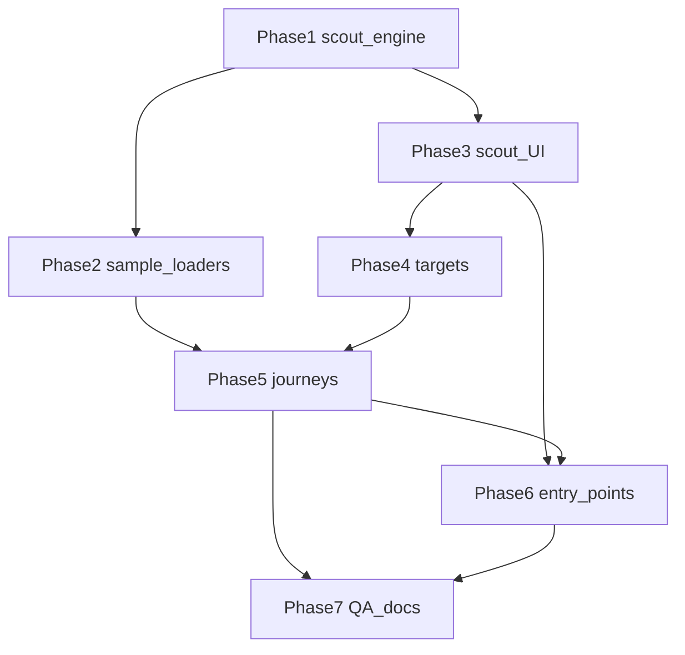

# Scoper Scout — Onboarding Task Breakdown

**Author:** Scoper Page team  
**Date:** 2026-08-21  
**Based on:** [scoper_scout_onboarding plan](/Users/christopherkruger/.cursor/plans/scoper_scout_onboarding_d4383604.plan.md), [TASK_BREAKDOWN_TEMPLATE.md](TASK_BREAKDOWN_TEMPLATE.md), [PRD.md](PRD.md) §6.3, [docs/gtm/tam.md](gtm/tam.md) Stage 1 wedge

**Project Focus:** **Scoper Scout** — active, spotlight-guided onboarding for first-time site visitors: three journeys (Evaluate RFP, Generate Proposal, Mark/takeoff) with “Do this” actions, bundled samples, and persistent resume state. Not get_scoper integration Scout or Studio Data Scout.

**Package manager:** pnpm

**Task ID prefix:** `BDA-277`–`BDA-299` (continues after BDA-276 compliance matrix / takeoff)

**Status:** **To Do** — planning complete; implementation not started

**Sequence:** Foundation → sample loaders → Scout UI → target instrumentation → journey wiring → entry points → QA/docs.

**Explicit non-goals (v1):** Server analytics; Driver.js / third-party tour libs; full share-pack demo import for Journey A (optional v1.1); Tauri-only Scout; translating get_scoper `scout-chat`; LLM-driven tour narration; i18n.

---

## Product rules (cross-cutting)

| Rule | Behavior |
|------|----------|
| **Journey-based** | Checklist steps map to user outcomes (qualify, export CSV), not a feature dictionary. |
| **Active coach** | Primary button runs real app actions (`runRfpQualification`, navigate, export). |
| **Spotlight optional fallback** | If `[data-scout-target]` missing (wrong view), panel shows copy + action button. |
| **No silent session wipe** | Starting a journey calls `resetSession()` only after confirm when docs exist. |
| **Workspace column only** | Scout panel does not live in chat sidebar. |
| **localStorage** | Key `scoper.scout.v1` — resume tour after reload; “Don’t show again” respected. |
| **Reuse help styling** | [`brand-menu.tsx`](../src/components/ui/brand-menu.tsx) accents (emerald / sky / rose per journey). |
| **Sample-first** | Each journey loads bundled assets under [`public/sample/`](../public/sample/) — no upload required to finish tour. |

---

## Task dependency graph

**Recommended ship order:** Phase 1 → 2 ∥ 3 → 4 → 5 (A → B → C) → 6 → 7.

---

## Phase 1: Scout engine (store, types, journeys, completion)

> **Purpose:** Declarative journey model and persistence without UI

### **ID:** BDA-277

**Title:** Scout Zustand store and persistence  
**Status:** To Do  
**Dependencies:** None  
**Priority:** Critical  
**Description:** New [`src/store/scout-store.ts`](../src/store/scout-store.ts): `activeJourney`, `stepIndex`, `completedJourneys[]`, `panelOpen`, `dismissed`, `awaitingManualContinue`, optional `exportTriggered` flags for CSV/md steps. Persist to `localStorage` key `scoper.scout.v1` on change; hydrate on init. Actions: `startJourney(id)`, `advanceStep()`, `completeJourney()`, `dismissScout()`, `setPanelOpen()`, `resetScoutProgress()`. Export selectors for React hooks.  
**Completed Changes:**
- 🔄 Create scout-store with types `ScoutJourneyId`
- 🔄 localStorage read/write with try/catch (private mode safe)
- 🔄 Storage sync across tabs via `storage` event optional
**Test Strategy:** Unit-style dev harness or `runScoutStoreHarness`: start journey → advance → reload state from serialized JSON → `tsc -b`.  
**Test Results:**
- 🔄 Pending implementation  
**Assigned:** Unassigned  
**Context/Artifacts:** Plan § Architecture; [`session-store.ts`](../src/store/session-store.ts) pattern; `.github/copilot-instructions.md` §State Management

---

### **ID:** BDA-278

**Title:** Scout types and target ID registry  
**Status:** To Do  
**Dependencies:** BDA-277  
**Priority:** Critical  
**Description:** New [`src/lib/scout/types.ts`](../src/lib/scout/types.ts): `ScoutStep` (`id`, `title`, `body`, `target?`, `action?`, `accent`), `ScoutJourney`, `ScoutActionId` union, `ScoutTargetId` const object (all `data-scout-target` string literals). Single source of truth exported for instrumentation + journeys + QA script.  
**Completed Changes:**
- 🔄 Define step/journey shapes
- 🔄 Export `SCOUT_TARGETS` registry (landing, evalPanel, matrixCsv, markToolbar, takeoffPill, etc.)
- 🔄 Barrel export from [`src/lib/scout/index.ts`](../src/lib/scout/index.ts) if used elsewhere
**Test Strategy:** `pnpm exec tsc -b`; QA script can import registry and assert DOM files reference each id.  
**Test Results:**
- 🔄 Pending implementation  
**Assigned:** Unassigned  
**Context/Artifacts:** Plan § Spotlight contract; [`brand-accent.ts`](../src/lib/brand-accent.ts)

---

### **ID:** BDA-279

**Title:** Evaluate RFP journey definition  
**Status:** To Do  
**Dependencies:** BDA-278  
**Priority:** Critical  
**Description:** [`src/lib/scout/journeys/evaluate-rfp.ts`](../src/lib/scout/journeys/evaluate-rfp.ts) — 9 steps from plan: welcome (privacy + model download note), load sample, open evaluation, run qualification, read criterion/citation, compliance matrix, instructions card, export matrix CSV, done. Each step references `SCOUT_TARGETS` and `ScoutActionId` where applicable. Copy aligned with construction bid wedge (qualify subs, cited evidence).  
**Completed Changes:**
- 🔄 Step list with titles and body copy
- 🔄 Wire accent `emerald` (or project convention for RFP journey)
- 🔄 Export `evaluateRfpJourney` from [`journeys/index.ts`](../src/lib/scout/journeys/index.ts)
**Test Strategy:** Harness asserts step count === 9, all target ids ∈ `SCOUT_TARGETS`, no duplicate step ids.  
**Test Results:**
- 🔄 Pending implementation  
**Assigned:** Unassigned  
**Context/Artifacts:** Plan § Journey A; [`RfpEvaluationPanel.tsx`](../src/components/workspace/RfpEvaluationPanel.tsx); [`ComplianceMatrix.tsx`](../src/components/workspace/ComplianceMatrix.tsx)

---

### **ID:** BDA-280

**Title:** Proposal and mark journey definitions  
**Status:** To Do  
**Dependencies:** BDA-278  
**Priority:** Critical  
**Description:** [`src/lib/scout/journeys/generate-proposal.ts`](../src/lib/scout/journeys/generate-proposal.ts) — 6 steps (load sample, setup panel, build requirements profile, generate one volume, export markdown, done). [`src/lib/scout/journeys/mark-takeoff.ts`](../src/lib/scout/journeys/mark-takeoff.ts) — 7 steps (load drawing, mark mode, place/view stamps, takeoff panel, jump to mark, export takeoff CSV, done). Register in journeys index + [`src/lib/scout/journeys.ts`](../src/lib/scout/journeys.ts) map by `ScoutJourneyId`.  
**Completed Changes:**
- 🔄 Proposal journey 6 steps, accent sky
- 🔄 Mark/takeoff journey 7 steps, accent rose
- 🔄 `getJourney(id)` helper
**Test Strategy:** Harness: proposal 6 steps, mark 7 steps; target ids valid.  
**Test Results:**
- 🔄 Pending implementation  
**Assigned:** Unassigned  
**Context/Artifacts:** Plan § Journey B/C; [`ProposalGenerationPanel.tsx`](../src/components/workspace/ProposalGenerationPanel.tsx); [`drawing-takeoff-panel.tsx`](../src/components/workspace/drawing-takeoff-panel.tsx)

---

### **ID:** BDA-281

**Title:** Step completion predicates  
**Status:** To Do  
**Dependencies:** BDA-277, BDA-279, BDA-280  
**Priority:** Critical  
**Description:** [`src/lib/scout/completion.ts`](../src/lib/scout/completion.ts): pure functions `isStepComplete(stepId, sessionState, scoutState) → boolean` for each journey step (e.g. `documents.length >= 2`, `profiles.length > 0`, `selectedCitation != null`, `rfpRequirements.length > 0`, `pdfMarkDrawingMode`, stamp count ≥ 2, scout export flags). Used by ScoutProvider to auto-advance when user completes action manually.  
**Completed Changes:**
- 🔄 Predicate map keyed by `${journeyId}:${stepId}`
- 🔄 Dev harness with mocked session snapshots
**Test Strategy:** `runScoutCompletionHarness` — known states pass/fail per step; `tsc -b`.  
**Test Results:**
- 🔄 Pending implementation  
**Assigned:** Unassigned  
**Context/Artifacts:** [`session-store.ts`](../src/store/session-store.ts) `SessionState`; plan completion table

---

### **ID:** BDA-282

**Title:** Scout action handlers skeleton  
**Status:** To Do  
**Dependencies:** BDA-277, BDA-281  
**Priority:** High  
**Description:** [`src/lib/scout/actions.ts`](../src/lib/scout/actions.ts): `runScoutAction(actionId, context)` dispatching to session store + services. Initial stubs: `continue`, `navigateProfiles`, `navigateSplit`, `openTakeoffPanel`, `markExportTriggered`. Sample loaders wired in BDA-283–285. No UI — callable from panel buttons and Provider.  
**Completed Changes:**
- 🔄 Action dispatch switch
- 🔄 Error surface as toast or panel inline error
**Test Strategy:** Harness invokes each action id without throw in empty session where safe.  
**Test Results:**
- 🔄 Pending implementation  
**Assigned:** Unassigned  
**Context/Artifacts:** Plan § Session interaction rules

---

## Phase 2: Bundled sample loaders

> **Purpose:** One-click demo workspaces per journey

### **ID:** BDA-283

**Title:** loadSampleEvaluationWorkspace  
**Status:** To Do  
**Dependencies:** BDA-282  
**Priority:** Critical  
**Description:** Extend [`src/services/load-sample-documents.ts`](../src/services/load-sample-documents.ts): `loadSampleEvaluationWorkspace()` fetches [`rfp-it-services.pdf`](../public/sample/rfp-it-services.pdf) + [`demo-bidder-response.pdf`](../public/sample/demo-bidder-response.pdf), ingests both, sets evaluation baseline (RFP role + `evaluationDocId`), runs `syncRfpComplianceMatrixForQualification` path via `runRfpQualification`, sets `workspaceView` to `profiles`, `mode` `rfp`. Refactor existing `loadSampleBidderResponse` to reuse shared fetch helper.  
**Completed Changes:**
- 🔄 Shared `fetchSampleFile(url, filename)`
- 🔄 Full evaluation orchestration
- 🔄 `runLoadSampleEvaluationHarness` in dev chain
**Test Strategy:** Harness in browser/dev: after call, `documents.length >= 2`, `evaluationDocId` set, optionally profiles if WebGPU up.  
**Test Results:**
- 🔄 Pending implementation  
**Assigned:** Unassigned  
**Context/Artifacts:** [`ingest-router.ts`](../src/services/ingest-router.ts); [`ResultsProfileGrid.tsx`](../src/components/workspace/ResultsProfileGrid.tsx) existing demo button

---

### **ID:** BDA-284

**Title:** loadSampleProposalWorkspace  
**Status:** To Do  
**Dependencies:** BDA-282  
**Priority:** High  
**Description:** New [`src/services/load-sample-proposal.ts`](../src/services/load-sample-proposal.ts): ingest RFP sample + [`public/sample/files/buyer-rubric.md`](../public/sample/files/buyer-rubric.md) as context attachment; `setMode('proposal')`, `setWorkspaceView('profiles')`. Pre-fill minimal company context string for readiness if needed. Export `runLoadSampleProposalHarness`.  
**Completed Changes:**
- 🔄 Ingest RFP + markdown context
- 🔄 Mode/view/mode switch
- 🔄 Harness wired
**Test Strategy:** Harness: mode `proposal`, docs include RFP + context, readiness helper not blocking stub path.  
**Test Results:**
- 🔄 Pending implementation  
**Assigned:** Unassigned  
**Context/Artifacts:** [`getProposalSetupState`](../src/lib/proposal-readiness.ts); [`use-command-ingest.ts`](../src/hooks/use-command-ingest.ts)

---

### **ID:** BDA-285

**Title:** Plan sample PDF and markup workspace loader  
**Status:** To Do  
**Dependencies:** BDA-282  
**Priority:** High  
**Description:** Add `plan-windows-sample.pdf` to [`scripts/generate-sample-pdfs.mjs`](../scripts/generate-sample-pdfs.mjs) (multi-page minimal plan text) → `sample/` + `public/sample/` via existing copy pipeline. New [`src/services/load-sample-markup.ts`](../src/services/load-sample-markup.ts): ingest plan PDF, open split view, optionally seed 2–3 window stamps via DuckDB insert or small dev-only share slice for reliable takeoff demo (prefer pre-seeded stamps for QA; optional sub-copy “place one yourself”). Wire `loadSampleMarkupWorkspace` action.  
**Completed Changes:**
- 🔄 Generator script + `pnpm copy:samples` output
- 🔄 Loader + optional stamp seed harness
- 🔄 `runLoadSampleMarkupHarness`
**Test Strategy:** Static: PDF exists in `public/sample/`; harness: doc ingested, stamp count ≥ 2 when pre-seed enabled.  
**Test Results:**
- 🔄 Pending implementation  
**Assigned:** Unassigned  
**Context/Artifacts:** [`pdf-drawing-annotations.ts`](../src/services/pdf-drawing-annotations.ts); TASK_BREAKDOWN_COMPLIANCE_MATRIX_TAKEOFF BDA-276 fixture note

---

## Phase 3: Scout UI (panel, provider, spotlight)

> **Purpose:** Visible coach chrome and step engine

### **ID:** BDA-286

**Title:** ScoutPanel checklist component  
**Status:** To Do  
**Dependencies:** BDA-277, BDA-279, BDA-280  
**Priority:** Critical  
**Description:** [`src/components/scout/ScoutPanel.tsx`](../src/components/scout/ScoutPanel.tsx): collapsible panel (workspace column, fixed width ~320px or bottom sheet on narrow). Shows journey title, step list with done/current/upcoming states, current step body copy, primary **Do this** button (calls `runScoutAction`), secondary Skip step / End tour. Uses [`BrandMenuSection`](../src/components/ui/brand-menu.tsx) styling. Keyboard: Escape closes panel.  
**Completed Changes:**
- 🔄 Panel layout + step list UI
- 🔄 Primary/secondary actions
- 🔄 Collapse toggle
**Test Strategy:** Storybook-less manual: mount in AppShell stub with mock store; `tsc -b`.  
**Test Results:**
- 🔄 Pending implementation  
**Assigned:** Unassigned  
**Context/Artifacts:** [`ExtractViewHelpButton`](../src/components/workspace/SplitDocumentView.tsx) copy pattern

---

### **ID:** BDA-287

**Title:** ScoutProvider and step engine  
**Status:** To Do  
**Dependencies:** BDA-281, BDA-282, BDA-286  
**Priority:** Critical  
**Description:** [`src/components/scout/ScoutProvider.tsx`](../src/components/scout/ScoutProvider.tsx): subscribe to `useSessionStore` + scout store; on session change re-evaluate `isStepComplete` and auto-advance; mount `ScoutPanel` + `ScoutSpotlight`; expose context for header launcher. Handle `awaitingManualContinue` for welcome/done steps. Integrate in [`App.tsx`](../src/App.tsx) or [`AppShell.tsx`](../src/components/layout/AppShell.tsx) inside workspace column wrapper.  
**Completed Changes:**
- 🔄 Session subscription + auto-advance
- 🔄 Provider context
- 🔄 AppShell integration point
**Test Strategy:** Dev: start journey → complete predicates fire → step index increments; no infinite loop.  
**Test Results:**
- 🔄 Pending implementation  
**Assigned:** Unassigned  
**Context/Artifacts:** Plan § Architecture flowchart

---

### **ID:** BDA-288

**Title:** ScoutSpotlight overlay  
**Status:** To Do  
**Dependencies:** BDA-287, BDA-278  
**Priority:** High  
**Description:** [`src/components/scout/ScoutSpotlight.tsx`](../src/components/scout/ScoutSpotlight.tsx): full-viewport dim (`pointer-events-none` on overlay except optional tooltip card); cutout via `getBoundingClientRect` on `[data-scout-target="…"]`; reposition on resize/scroll (ResizeObserver + scroll listener); hide when target missing. Optional pulsing ring. `aria-hidden` on overlay; step instructions remain in ScoutPanel for a11y.  
**Completed Changes:**
- 🔄 Rect tracking + SVG/box-shadow cutout
- 🔄 Scroll/resize listeners with cleanup
- 🔄 Graceful null-target (panel-only mode)
**Test Strategy:** Manual Chrome: spotlight aligns on eval panel, matrix CSV button, mark toolbar; no console errors on view change.  
**Test Results:**
- 🔄 Pending implementation  
**Assigned:** Unassigned  
**Context/Artifacts:** Plan § Spotlight contract; avoid Driver.js per non-goals

---

### **ID:** BDA-289

**Title:** Journey start confirm and reset guard  
**Status:** To Do  
**Dependencies:** BDA-282, BDA-287  
**Priority:** High  
**Description:** [`src/lib/scout/session-guard.ts`](../src/lib/scout/session-guard.ts) + dialog component: `confirmStartJourney(journeyId)` — if `documents.length > 0` or chat messages exist, show confirm before `resetSession()` + start; else start immediately. Wire into journey picker and header “Switch journey”.  
**Completed Changes:**
- 🔄 Confirm dialog (shadcn AlertDialog or existing pattern)
- 🔄 `startJourneySafe()` used by all entry points
**Test Strategy:** Manual: docs loaded → start new journey prompts; empty session → no prompt.  
**Test Results:**
- 🔄 Pending implementation  
**Assigned:** Unassigned  
**Context/Artifacts:** [`session-store.ts`](../src/store/session-store.ts) `resetSession`

---

## Phase 4: data-scout-target instrumentation

> **Purpose:** Spotlight anchors on real controls

### **ID:** BDA-290

**Title:** Scout targets — landing and evaluation  
**Status:** To Do  
**Dependencies:** BDA-278, BDA-286  
**Priority:** High  
**Description:** Add `data-scout-target={SCOUT_TARGETS.*}` to: [`WorkspaceLanding.tsx`](../src/components/workspace/WorkspaceLanding.tsx) / journey picker, [`QuickActionCards.tsx`](../src/components/workspace/QuickActionCards.tsx), [`UploadFab.tsx`](../src/components/layout/UploadFab.tsx), [`RfpEvaluationPanel.tsx`](../src/components/workspace/RfpEvaluationPanel.tsx) (setup + run qualify), [`ResultsProfileGrid.tsx`](../src/components/workspace/ResultsProfileGrid.tsx) (first card / criterion), [`ResultsProfileCard.tsx`](../src/components/workspace/ResultsProfileCard.tsx) if needed.  
**Completed Changes:**
- 🔄 Targets for landing + eval journey steps 1–5
- 🔄 No visual change when Scout inactive
**Test Strategy:** QA script greps each target id in expected files; manual spotlight hit-test.  
**Test Results:**
- 🔄 Pending implementation  
**Assigned:** Unassigned  
**Context/Artifacts:** BDA-279 step targets

---

### **ID:** BDA-291

**Title:** Scout targets — matrix, instructions, export  
**Status:** To Do  
**Dependencies:** BDA-290  
**Priority:** High  
**Description:** Targets on [`ComplianceMatrix.tsx`](../src/components/workspace/ComplianceMatrix.tsx) (grid + CSV button), instructions card in [`RfpEvaluationPanel.tsx`](../src/components/workspace/RfpEvaluationPanel.tsx) / [`InstructionsCard`](../src/components/workspace/) if separate file, [`ShareWorkspaceSheet.tsx`](../src/components/layout/ShareWorkspaceSheet.tsx) export section, split view Export menu in [`SplitDocumentView.tsx`](../src/components/workspace/SplitDocumentView.tsx) as needed for journey A step 8–9.  
**Completed Changes:**
- 🔄 Matrix + CSV + instructions targets
- 🔄 Share/export targets for “save session” done step
**Test Strategy:** Static grep + manual Journey A steps 6–9.  
**Test Results:**
- 🔄 Pending implementation  
**Assigned:** Unassigned  
**Context/Artifacts:** BDA-279 steps 6–9

---

### **ID:** BDA-292

**Title:** Scout targets — proposal, mark, takeoff  
**Status:** To Do  
**Dependencies:** BDA-290  
**Priority:** High  
**Description:** Targets on [`ProposalGenerationPanel.tsx`](../src/components/workspace/ProposalGenerationPanel.tsx) (context, readiness, build profile, generate volume, export), [`PdfMarkupToolbar.tsx`](../src/components/workspace/PdfMarkupToolbar.tsx) / mark mode toggle, [`SplitDocumentView.tsx`](../src/components/workspace/SplitDocumentView.tsx) footer takeoff pill, [`drawing-takeoff-panel.tsx`](../src/components/workspace/drawing-takeoff-panel.tsx) rows + CSV export.  
**Completed Changes:**
- 🔄 Proposal journey targets
- 🔄 Mark toolbar + takeoff targets
**Test Strategy:** Static grep registry ⊆ codebase; manual B/C spotlight checks.  
**Test Results:**
- 🔄 Pending implementation  
**Assigned:** Unassigned  
**Context/Artifacts:** BDA-280 journeys B/C

---

## Phase 5: Journey wiring and landing

> **Purpose:** End-to-end tours

### **ID:** BDA-293

**Title:** ScoutJourneyPicker and landing hero  
**Status:** To Do  
**Dependencies:** BDA-287, BDA-289, BDA-283  
**Priority:** Critical  
**Description:** [`src/components/scout/ScoutJourneyPicker.tsx`](../src/components/scout/ScoutJourneyPicker.tsx): three journey cards + “I'll upload my own files” → existing QuickActionCards. Update [`WorkspaceLanding.tsx`](../src/components/workspace/WorkspaceLanding.tsx) hero copy (construction-friendly: qualify subs, mark plans, export CSV). Primary CTA = picker; secondary = quick actions below fold or tertiary link.  
**Completed Changes:**
- 🔄 Journey picker UI
- 🔄 Landing hero + layout
- 🔄 Picker calls `startJourneySafe`
**Test Strategy:** First visit: picker visible; card starts Journey A and opens panel.  
**Test Results:**
- 🔄 Pending implementation  
**Assigned:** Unassigned  
**Context/Artifacts:** [gtm/tam.md](gtm/tam.md); plan § Landing

---

### **ID:** BDA-294

**Title:** Wire Evaluate RFP journey actions  
**Status:** To Do  
**Dependencies:** BDA-283, BDA-290, BDA-291, BDA-293  
**Priority:** Critical  
**Description:** Connect evaluate-rfp steps to actions: welcome continue, `loadSampleEvaluationWorkspace`, navigate profiles, run qualify (or rely on loader), focus citation helper optional, matrix/instructions spotlight-only steps, trigger matrix CSV export + set scout export flag, done step with links to share pack / upload. Fill gaps in BDA-282 dispatch.  
**Completed Changes:**
- 🔄 All 9 steps actionable or auto-complete
- 🔄 WebGPU/model download copy in step 1
**Test Strategy:** Manual Journey A < 10 min on Chrome; automated loader harness pass.  
**Test Results:**
- 🔄 Pending implementation  
**Assigned:** Unassigned  
**Context/Artifacts:** Plan § Journey A table

---

### **ID:** BDA-295

**Title:** Wire Generate Proposal journey actions  
**Status:** To Do  
**Dependencies:** BDA-284, BDA-292, BDA-293  
**Priority:** High  
**Description:** Wire proposal journey: `loadSampleProposalWorkspace`, spotlight setup + `runProposalRequirementsProfile`, `runGenerateProposalVolume` (single volume id — pick smallest section set), export markdown via existing export gate with stub/degraded copy when WebGPU unavailable ([`WebGpuBanner`](../src/components/layout/WebGpuBanner.tsx) message reuse).  
**Completed Changes:**
- 🔄 All 6 steps wired
- 🔄 Degraded path copy when model unavailable
**Test Strategy:** Manual Journey B; harness loader pass.  
**Test Results:**
- 🔄 Pending implementation  
**Assigned:** Unassigned  
**Context/Artifacts:** [`build-proposal-volumes.ts`](../src/services/build-proposal-volumes.ts)

---

### **ID:** BDA-296

**Title:** Wire Mark and takeoff journey actions  
**Status:** To Do  
**Dependencies:** BDA-285, BDA-292, BDA-293  
**Priority:** High  
**Description:** Wire mark journey: `loadSampleMarkupWorkspace`, enable `pdfMarkDrawingMode` + stamp tool, pre-seeded stamps or guided placement step, open takeoff sheet, programmatic or user jump-to-mark, export takeoff CSV + flag, done. Connect [`export-drawing-takeoff-csv.ts`](../src/services/export-drawing-takeoff-csv.ts).  
**Completed Changes:**
- 🔄 All 7 steps wired
- 🔄 Pre-seeded stamp path documented in harness
**Test Strategy:** Manual Journey C with `plan-windows-sample.pdf`; takeoff CSV downloads.  
**Test Results:**
- 🔄 Pending implementation  
**Assigned:** Unassigned  
**Context/Artifacts:** [`drawing-takeoff.ts`](../src/lib/drawing-takeoff.ts)

---

## Phase 6: Entry points and polish

> **Purpose:** Discoverability and resume

### **ID:** BDA-297

**Title:** Header Scout launcher and resume  
**Status:** To Do  
**Dependencies:** BDA-287, BDA-293  
**Priority:** High  
**Description:** Compass/map-pin icon in [`WorkspaceHeader.tsx`](../src/components/layout/WorkspaceHeader.tsx) (not bot icon): toggle panel, show “Resume tour” when `activeJourney` incomplete, journey switcher submenu optional. “Don't show again” in panel footer sets `dismissed` — suppress first-visit auto-open only, not manual launcher.  
**Completed Changes:**
- 🔄 Header button + tooltip
- 🔄 Resume + dismiss behavior
**Test Strategy:** Reload mid-journey → Resume continues step index; dismiss stops auto-open.  
**Test Results:**
- 🔄 Pending implementation  
**Assigned:** Unassigned  
**Context/Artifacts:** Plan § Header entry points

---

### **ID:** BDA-298

**Title:** First-visit auto-open Scout panel  
**Status:** To Do  
**Dependencies:** BDA-297  
**Priority:** Medium  
**Description:** On first load (`!localStorage scoper.scout.v1` and `!dismissed`), auto-open Scout panel with journey picker content (or inline welcome on landing). Skip when user deep-links with docs already ingested. Do not block interaction — panel is dismissible.  
**Completed Changes:**
- 🔄 First-visit detection in ScoutProvider
- 🔄 Auto-open panel once per browser profile
**Test Strategy:** Incognito: landing opens panel; dismiss + reload does not auto-open.  
**Test Results:**
- 🔄 Pending implementation  
**Assigned:** Unassigned  
**Context/Artifacts:** Plan § Landing first visit

---

## Phase 7: QA, harnesses, and documentation

> **Purpose:** Ship confidence and maintainability

### **ID:** BDA-299

**Title:** Scout dev harnesses  
**Status:** To Do  
**Dependencies:** BDA-281, BDA-283, BDA-284, BDA-285  
**Priority:** High  
**Description:** [`src/services/scout-dev-harnesses.ts`](../src/services/scout-dev-harnesses.ts): store round-trip, completion predicates matrix, journey registry integrity, sample loader smoke (mock fetch where needed). Chain in [`App.tsx`](../src/App.tsx) dev harness block after existing QA chains.  
**Completed Changes:**
- 🔄 Harness functions + throws on mismatch
- 🔄 App.tsx wiring
**Test Strategy:** `pnpm dev` console — no `[dev-harness]` throw from scout chain.  
**Test Results:**
- 🔄 Pending implementation  
**Assigned:** Unassigned  
**Context/Artifacts:** [`compliance-matrix-dev-harnesses.ts`](../src/services/compliance-matrix-dev-harnesses.ts) pattern

---

### **ID:** BDA-300

**Title:** Static QA script and pnpm qa:scout  
**Status:** To Do  
**Dependencies:** BDA-290, BDA-291, BDA-292, BDA-299  
**Priority:** High  
**Description:** [`scripts/run-scout-qa-static.mjs`](../scripts/run-scout-qa-static.mjs): verify all `SCOUT_TARGETS` appear in `src/`, journey step counts, files exist (`ScoutPanel`, loaders, store). Add `"qa:scout"` to [`package.json`](../package.json) running static script + `tsc -b`. Update [`run-qa-automation.mjs`](../scripts/run-qa-automation.mjs) optional inclusion.  
**Completed Changes:**
- 🔄 Static script
- 🔄 package.json script
**Test Strategy:** `pnpm qa:scout` exit 0.  
**Test Results:**
- 🔄 Pending implementation  
**Assigned:** Unassigned  
**Context/Artifacts:** [`run-compliance-matrix-qa-static.mjs`](../scripts/run-compliance-matrix-qa-static.mjs)

---

### **ID:** BDA-301

**Title:** Product spec and PRD links  
**Status:** To Do  
**Dependencies:** BDA-294, BDA-295, BDA-296  
**Priority:** Medium  
**Description:** Create [`docs/plans/scoper_scout.md`](plans/scoper_scout.md) (journeys, copy, naming, non-goals). Update [PRD.md](PRD.md) §6.3 Empty → Loaded + §7 P1 user story for guided onboarding. Link from [TASK_BREAKDOWN.md](TASK_BREAKDOWN.md) Related documents and [ARCHITECTURE.md](ARCHITECTURE.md). Update cursor plan todo statuses when phases complete.  
**Completed Changes:**
- 🔄 plans/scoper_scout.md
- 🔄 PRD + TASK_BREAKDOWN + ARCHITECTURE links
**Test Strategy:** Docs review only.  
**Test Results:**
- 🔄 Pending implementation  
**Assigned:** Unassigned  
**Context/Artifacts:** Plan § Docs and QA

---

### **ID:** BDA-302

**Title:** Manual QA checklist and sign-off  
**Status:** To Do  
**Dependencies:** BDA-294, BDA-295, BDA-296, BDA-300  
**Priority:** Critical  
**Description:** Peer manual QA: Chrome desktop, incognito first visit, each journey end-to-end < 10 min. Fill checklist below; update this file status to **Implemented** when automated + manual pass. Append results to [QA_RESULTS.md](QA_RESULTS.md) optional section.  
**Completed Changes:**
- 🔄 Automated preflight recorded
- 🔄 Manual checklist below
- 🔄 Sign-off table
**Test Strategy:** Checklist in **Manual QA** section.  
**Test Results:**
- 🔄 Pending implementation  
**Assigned:** Unassigned  
**Context/Artifacts:** Sample fixtures per BDA-283–285

---

## Manual QA checklist (BDA-302)

**Fixtures:** `public/sample/rfp-it-services.pdf`, `demo-bidder-response.pdf`, `files/buyer-rubric.md`, `plan-windows-sample.pdf` (after BDA-285).

**Automated preflight (before manual pass):**

| Step | Command / action | Expected | Result |
|------|------------------|----------|--------|
| Types + build | `pnpm exec tsc -b` | Exit 0 | Pending |
| Static Scout QA | `pnpm qa:scout` | Exit 0; targets + journeys wired | Pending |
| Runtime harness | `pnpm dev` → console | No uncaught `[dev-harness]` from scout chain | Pending peer |

**Manual UI — Journey A (Evaluate RFP):**

1. [ ] Incognito first visit — Scout panel auto-opens (unless dismissed).
2. [ ] Journey picker — “Evaluate RFP” starts tour; sample loads without manual upload.
3. [ ] Qualification cards appear after qualify step.
4. [ ] Spotlight highlights eval panel, criterion, matrix, instructions, CSV button in sequence.
5. [ ] Matrix CSV downloads; tour completes with done step.

**Manual UI — Journey B (Generate Proposal):**

6. [ ] Sample RFP + context load; proposal mode active.
7. [ ] Setup panel spotlight; requirements profile builds (or degraded banner if no WebGPU).
8. [ ] At least one volume section reaches draft; markdown export triggers.

**Manual UI — Journey C (Mark / takeoff):**

9. [ ] Plan PDF loads; mark mode enables; stamps visible (pre-seeded or user-placed).
10. [ ] Takeoff panel opens; jump-to-mark focuses viewer.
11. [ ] Takeoff CSV exports from Drawing marks menu or scout action.

**Cross-cutting:**

12. [ ] Header Scout icon reopens panel; Resume mid-journey after reload.
13. [ ] Starting new journey with existing docs shows confirm before reset.
14. [ ] “Don't show again” stops auto-open; launcher still works.
15. [ ] Non-regression — upload own files path unchanged; chat sidebar unaffected.

**Sign-off**

| Field | Value |
|-------|-------|
| Task | BDA-302 |
| Automated | `pnpm exec tsc -b` + `pnpm qa:scout` — Pending |
| Manual UI | Pending peer (3 journeys × Chrome) |
| Executor | — |
| Date | — |

---

## Task index (quick reference)

| ID | Title | Phase |
|----|-------|-------|
| BDA-277 | Scout Zustand store and persistence | 1 |
| BDA-278 | Scout types and target ID registry | 1 |
| BDA-279 | Evaluate RFP journey definition | 1 |
| BDA-280 | Proposal and mark journey definitions | 1 |
| BDA-281 | Step completion predicates | 1 |
| BDA-282 | Scout action handlers skeleton | 1 |
| BDA-283 | loadSampleEvaluationWorkspace | 2 |
| BDA-284 | loadSampleProposalWorkspace | 2 |
| BDA-285 | Plan sample PDF and markup loader | 2 |
| BDA-286 | ScoutPanel checklist component | 3 |
| BDA-287 | ScoutProvider and step engine | 3 |
| BDA-288 | ScoutSpotlight overlay | 3 |
| BDA-289 | Journey start confirm and reset guard | 3 |
| BDA-290 | Scout targets — landing and evaluation | 4 |
| BDA-291 | Scout targets — matrix, instructions, export | 4 |
| BDA-292 | Scout targets — proposal, mark, takeoff | 4 |
| BDA-293 | ScoutJourneyPicker and landing hero | 5 |
| BDA-294 | Wire Evaluate RFP journey actions | 5 |
| BDA-295 | Wire Generate Proposal journey actions | 5 |
| BDA-296 | Wire Mark and takeoff journey actions | 5 |
| BDA-297 | Header Scout launcher and resume | 6 |
| BDA-298 | First-visit auto-open Scout panel | 6 |
| BDA-299 | Scout dev harnesses | 7 |
| BDA-300 | Static QA script and pnpm qa:scout | 7 |
| BDA-301 | Product spec and PRD links | 7 |
| BDA-302 | Manual QA checklist and sign-off | 7 |

---

## Changelog

| Version | Date | Notes |
|---------|------|-------|
| v1.0 | 2026-08-21 | Initial atomic breakdown BDA-277–302 from scoper_scout onboarding plan |
