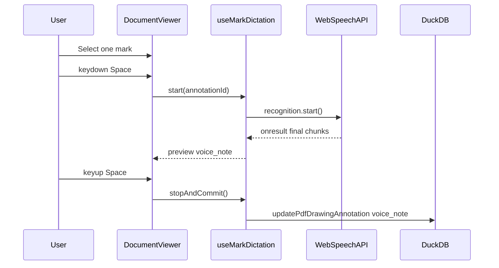

# Mark dictation notation (hold Space)

**Status:** Planned — see [TASK_BREAKDOWN_MARK_VOICE_NOTATION.md](TASK_BREAKDOWN_MARK_VOICE_NOTATION.md) (BDA-242–258)  
**Created:** 2026-08-21  
**Overview:** Hold-Space voice notation for any selected PDF mark, using the foundry rubric dictation pattern (Web Speech API + append transcript). Persist transcripts on `pdf_drawing_annotations.voice_note` with share-pack round-trip.

## Todos

See atomic tasks **BDA-242–258** in [TASK_BREAKDOWN_MARK_VOICE_NOTATION.md](../TASK_BREAKDOWN_MARK_VOICE_NOTATION.md).

---

## Reference implementation

Foundry rubric dictation (`foundry-model-eval`):

- `ReviewQueue.tsx` — Space toggles dictation on active rubric question
- `ReviewNotesField.tsx`, `useSpeechNotes.ts`, `utils/speechNotes.ts`

Patterns:

- **Web Speech API** (`SpeechRecognition` / `webkitSpeechRecognition`), not Whisper
- `continuous: true`, append **final** phrases via `appendSpeechTranscript(existing, chunk)`

**Confirmed UX:** **hold-to-talk** on **any mark type**, with a **single selected mark** as the target.

**Why Web Speech (not chat Whisper):** Matches the reference, no WebGPU contention with Scoper/bitgpu, no ~290MB model load, better for short field notes. Chat voice (`src/services/chat-voice-session.ts`) stays composer-only.

---

## 1. Data model and persistence

Add optional **`voice_note`** to marks (separate from `text_body` on text labels).

| Layer | Change |
|-------|--------|
| `src/lib/types.ts` | `voice_note?: string` on `PdfDrawingAnnotation` + record type |
| `src/lib/duckdb-schema.ts` | Migration: `ALTER TABLE pdf_drawing_annotations ADD COLUMN IF NOT EXISTS voice_note VARCHAR` |
| `src/services/pdf-drawing-annotations.ts` | SELECT/INSERT/UPDATE/map `voice_note`; extend `UpdatePdfDrawingAnnotationInput` |
| `src/lib/share-table.ts` | Add column to share export/import |
| `src/hooks/use-pdf-drawing-annotations.ts` | `updateMarkVoiceNote(annotationId, voice_note)` |

**Undo:** v1 skip history op for voice_note edits (same as move); append-only on commit.

---

## 2. Port speech utilities (from foundry)

Create `src/lib/speech-notes.ts` — adapt from foundry `speechNotes.ts`:

- `appendSpeechTranscript`, `getSpeechRecognitionCtor`, `finalTranscriptsFromEvent`
- `speechNotesAvailable(win)` → `isSecureContext` + ctor present (no foundry `AUTH_ENABLED` gate)
- Unit harness

Create `src/hooks/use-speech-notes.ts` — port `useSpeechNotes` with:

- `startListening()` / `stopListening()` exposed separately
- `onTranscript` callback for final chunks

---

## 3. Hold-Space dictation controller

New `src/hooks/use-mark-dictation.ts`:

**State:** `idle | listening | error`, `targetAnnotationId`, `draftNote` (live append during hold)

**Rules:**

- Active only when `markMode === true`
- Requires **exactly one** id in `selectedDrawingAnnotationIds`
- Ignore when `isPdfMarkupShortcutTarget(activeElement)`
- Ignore if chat voice session active — mutual exclusion
- **`keydown` Space:** `preventDefault()`, start recognition if eligible
- **`keyup` Space:** stop recognition, commit `draftNote` to DuckDB
- **`keydown` repeat** (`e.repeat`): ignore
- **Window `blur` / `visibilitychange`:** stop + commit if any text
- **Selection change while listening:** stop and commit to previous mark first

Wire keyboard listeners in `DocumentViewer.tsx`. Use `keyup` on `window`.

---

## 4. Overlay and toolbar UX

`PdfDrawingOverlay.tsx`:

- **Listening ring:** pulse around selected mark while dictating
- **Notation indicator:** mic/speech badge when `voice_note` is set
- **Preview bubble:** truncated `draftNote` during hold

Toolbar hints in `DocumentViewer.tsx`:

- 1 mark selected: *"Hold Space to dictate notation"*
- Listening: *"Listening… release Space to save"*
- Unavailable: *"Voice notation requires HTTPS + Chrome/Edge speech support"*

`PdfMarkupToolbar.tsx`: Select tool tooltip — *"Select a mark, hold Space to dictate"*.

---

## 5. Integration points

| File | Wiring |
|------|--------|
| `DocumentViewer.tsx` | Hold key handlers, dictation hook, pass preview to canvas |
| `PdfPageCanvas.tsx` | Pass through to overlay |

**Nice-to-have:** Auto-select mark after stamp place so user can immediately hold Space.

---

## 6. Out of scope (v1)

- Whisper / WebGPU STT for marks
- Burn-in `voice_note` on PDF export — metadata only in session/share
- Multi-mark batch dictation
- Undo/redo for voice_note
- Non-English model picker (use `navigator.language`)

---

## 7. QA and docs

- Harness: `appendSpeechTranscript`, `speechNotesAvailable`, mock `finalTranscriptsFromEvent`
- Manual: select stamp → hold Space → speak → release → reload → share pack preserves `voice_note`
- Add section to `docs/TASK_BREAKDOWN_DRAWING_PDF_MARKUP.md` (BDA-242+)

**Browser:** Web Speech works in Chrome/Edge over HTTPS/localhost; gate UI with `speechNotesAvailable`.
